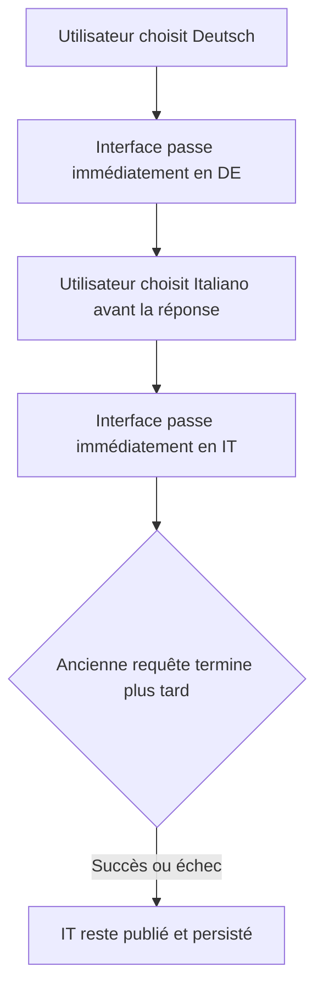
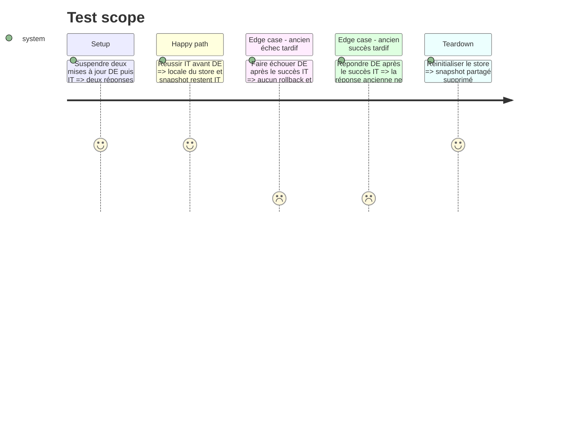

# Instruction: Dernier choix de langue gagnant sur iOS

## Architecture projection

> Tree of the final files. ✅ create · ✏️ modify · ❌ delete

```txt
.
└── ios/
    ├── Pulpe/Domain/Store/UserSettingsStore.swift    ✏️ ignore les complétions obsolètes de changement de langue
    └── PulpeTests/Domain/Store/UserSettingsStoreTests.swift ✏️ contrôle l’ordre inverse des réponses
```

Aucun fichier à créer ou supprimer ; le double contrôlable reste local au fichier de test.

## User Journey



## Test Scope



## Tasks to do

### `1)` Versionner les mutations de locale

> Seule la mutation la plus récente peut publier un résultat, une erreur ou un rollback.

1. Ajouter un compteur de génération privé dédié aux changements de locale.
2. L’incrémenter au début de `updateLocale` et capturer la génération de l’appel.
3. Après chaque suspension réseau, vérifier que l’appel est encore le plus récent avant d’appliquer la locale retournée, `lastLoadTime`, un rollback ou `error`.
4. Invalider aussi la génération dans `reset` afin qu’une réponse de l’ancien compte ne puisse pas restaurer son choix après déconnexion.
5. Ne pas dépendre de `saveTask.cancel()` pour la correction : l’annulation reste une optimisation de la vue, pas la garantie d’ordre du store.

### `2)` Ajouter un service de test à complétions contrôlées

> Le test décide explicitement quelle requête répond en premier.

1. Définir dans `UserSettingsStoreTests.swift` un actor minimal conforme à `UserSettingsServicing` qui enregistre les payloads et suspend les réponses `updateSettings`.
2. Exposer uniquement ce qu’il faut au test pour attendre deux appels puis terminer chacun par succès ou erreur.

### `3)` Couvrir les deux branches obsolètes

> Une ancienne erreur et un ancien succès ne peuvent plus écraser le choix récent.

1. Lancer `.de`, puis `.it` avant la fin du premier appel.
2. Terminer `.it` en succès, puis `.de` en erreur ; vérifier `store.locale == .it`, `AppLocale.current == .it` et `store.error == nil`.
3. Répéter avec un succès `.de` tardif et vérifier que `.it` reste publié et persisté.
4. Appeler `reset` en fin de chaque scénario pour isoler le `UserDefaults` partagé.

### `4)` Vérifier la phase

> La preuve requiert que Swift Testing exécute réellement la suite.

1. Générer le projet avec XcodeGen.
2. Exécuter `UserSettingsStoreLocaleTests` sur le simulateur `Pulpe Tests` via le scheme `PulpeLocal`.
3. Considérer la vérification réussie uniquement si le log contient la suite avec ses tests et `** TEST SUCCEEDED **`.

## Test acceptance criteria

| Task | Acceptance criteria |
| ---- | ------------------- |
| 1 | Aucune complétion appartenant à une génération ancienne ne modifie `locale`, `AppLocale`, `error` ou le timestamp du store. |
| 2 | Les tests peuvent terminer deux requêtes dans un ordre arbitraire sans attente temporelle fragile. |
| 3 | Dans les scénarios ancien succès et ancien échec, le dernier choix `.it` reste publié et persisté sans erreur obsolète. |
| 4 | Swift Testing exécute la suite ciblée et Xcode termine par `** TEST SUCCEEDED **`. |
