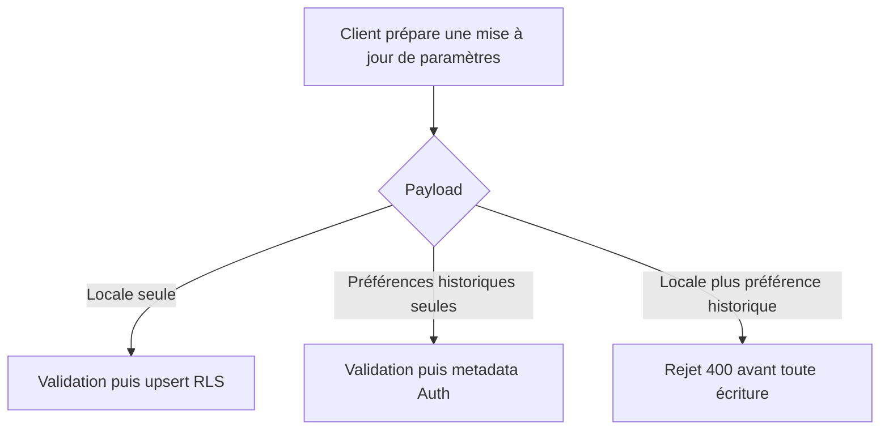
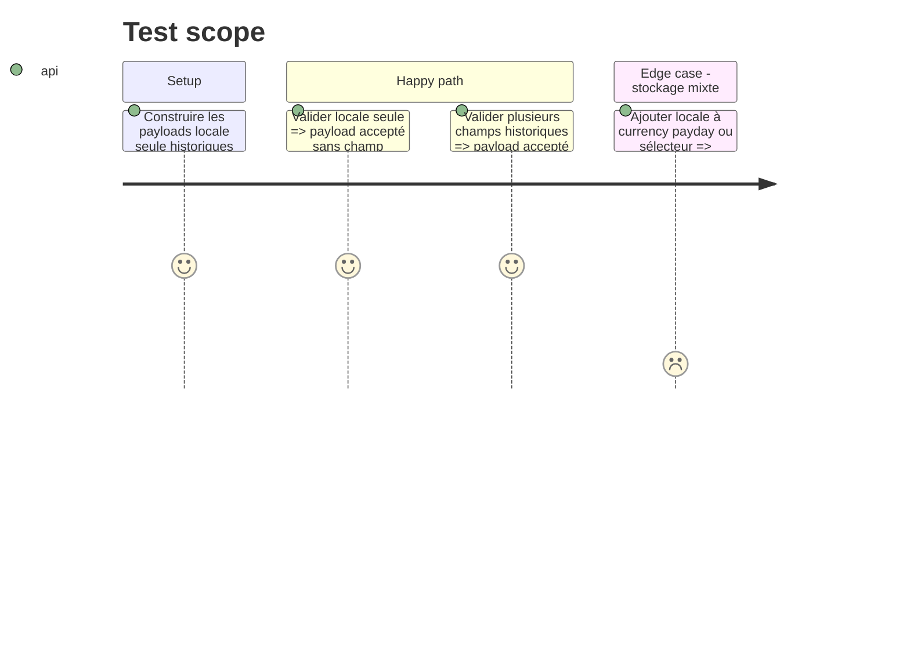

# Instruction: Contrat atomique des mises à jour de paramètres

## Architecture projection

> Tree of the final files. ✅ create · ✏️ modify · ❌ delete

```txt
.
└── shared/
    ├── schemas.ts                                   ✏️ refuse les payloads répartis sur deux stockages
    └── src/locale.spec.ts                           ✏️ verrouille les combinaisons autorisées et refusées
```

Aucun fichier à créer ou supprimer ; le DTO Nest consomme déjà `updateUserSettingsSchema`.

## User Journey



## Test Scope



## Tasks to do

### `1)` Encoder la limite atomique dans le schéma partagé

> Le contrat public n’accepte plus une opération que le backend exécuterait en deux écritures séquentielles.

1. Conserver les quatre champs et leurs validations actuelles.
2. Ajouter une contrainte au schéma : si `locale` est défini, `payDayOfMonth`, `currency` et `showCurrencySelector` doivent être absents.
3. Garder autorisés un patch `locale` seul et un patch combinant plusieurs préférences historiques.
4. Utiliser un message de validation anglais et ne configurer aucune locale Zod.

### `2)` Verrouiller le contrat par des tests de schéma

> La correction est testée au point d’entrée réellement utilisé par le DTO Nest et le client Angular.

1. Conserver le test `locale` seul.
2. Ajouter un test paramétré qui refuse `locale` avec chacun des trois champs historiques, y compris `payDayOfMonth: null`.
3. Ajouter un cas positif avec les trois préférences historiques ensemble et sans `locale`.

### `3)` Vérifier l’absence de régression client

> Les appelants actuels restent dans les deux formes autorisées.

1. Vérifier que `LanguageService` web et `UserSettingsStore` iOS envoient `locale` seul.
2. Vérifier que la page de réglages web n’envoie que `payDayOfMonth`, `currency` et `showCurrencySelector` ensemble.
3. Construire `pulpe-shared`, exécuter `locale.spec.ts`, puis les tests backend `UpdateUserSettingsUseCase` et `SupabaseUserRepository` contre le package reconstruit.

## Test acceptance criteria

| Task | Acceptance criteria |
| ---- | ------------------- |
| 1 | Tout payload mêlant `locale` à une préférence historique échoue à la validation avant qu’une écriture backend ne commence. |
| 2 | `locale` seul et les trois préférences historiques sans `locale` restent valides. |
| 3 | Les payloads émis par les clients actuels restent acceptés et les suites shared/backend terminent sans échec. |
