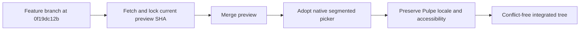
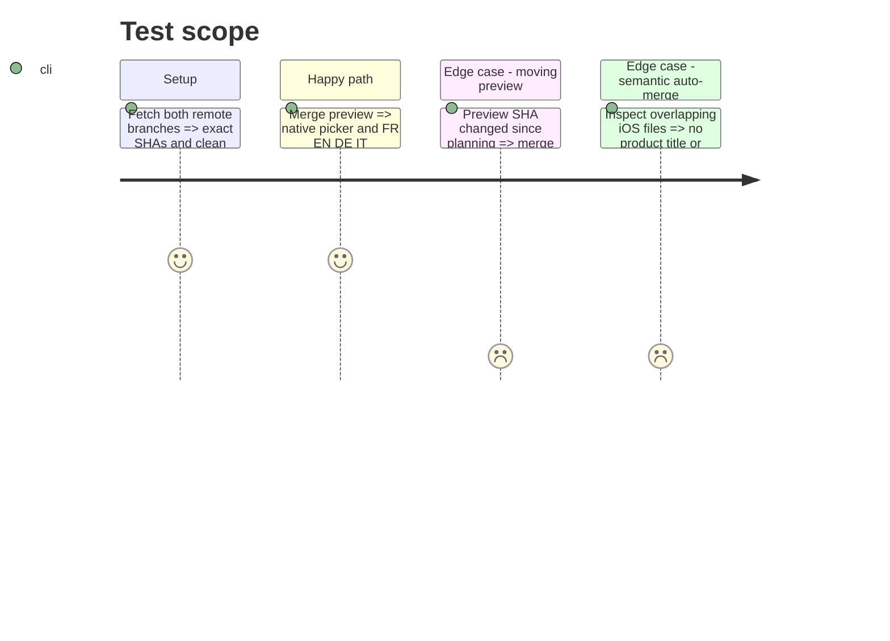

# Instruction: Integrate preview and reconcile iOS picker changes

## Architecture projection

> Tree of the final files. ✅ create · ✏️ modify · ❌ delete

```txt
.
├── ✏️ aidd_docs/memory/mobile.md
├── ✅ aidd_docs/tasks/2026_08/2026_08_14_ios-segmented-capsule-picker/
│   ├── plan.md
│   └── review.md
└── ios/
    ├── ✏️ DESIGN.md
    ├── Pulpe/
    │   ├── Features/
    │   │   ├── Account/ (5 incoming preview files)
    │   │   ├── Budgets/BudgetDetails/ (4 incoming preview files)
    │   │   ├── CurrentMonth/
    │   │   │   ├── Components/ (5 modified, 2 created)
    │   │   │   └── ✏️ CurrentMonthView.swift
    │   │   ├── Onboarding/ (3 incoming preview files)
    │   │   ├── SavingsGoals/
    │   │   │   └── ✏️ SavingsGoalFormSheet.swift
    │   │   ├── Templates/TemplateList/
    │   │   │   └── ✏️ TemplateListView.swift
    │   │   └── Tips/
    │   │       └── ✏️ ProductTips.swift
    │   └── Shared/
    │       ├── Components/
    │       │   ├── ❌ CapsulePicker.swift
    │       │   ├── ✏️ CurrencyAmountPicker.swift
    │       │   ├── ✏️ KindToggle.swift
    │       │   └── ✅ SegmentedPicker.swift
    │       ├── Design/
    │       │   ├── ✅ DesignTokens+Deck.swift
    │       │   └── ✏️ DesignTokens.swift
    │       └── Extensions/ (2 incoming preview files)
    └── PulpeTests/Features/CurrentMonth/
        └── ✅ UncheckedOperationsCardDeckTests.swift
```

## User Journey



## Test Scope



## Tasks to do

### `1)` Lock and integrate the real remote tips

> Resolve the current branches, not the planning snapshot.

1. Require a clean worktree, fetch `origin/preview` and `origin/feat/i18n-en-de-it`, and record both SHAs.
2. If either SHA moved from `3f8181e3d` or `0f19dc12b`, rerun `git merge-tree --write-tree` and update the conflict projection before merging.
3. Merge `origin/preview` into the local feature branch without rebasing or discarding either side.

### `2)` Resolve both content conflicts at their shared intent

> Keep the native control from preview and the explicit Pulpe locale from the i18n branch.

1. In `SavingsGoalFormSheet`, replace `CapsulePicker` with `SegmentedPicker`, retain `AppLocale.string("Statut")`, and adapt the label closure to the one-argument API.
2. In `CurrencyAmountPicker`, use `SegmentedPicker`, retain `AppLocale.string("Devise")`, return the plain `Text` required by `UISegmentedControl`, and preserve the `.contain` accessibility boundary.
3. Accept the removal of `CapsulePicker.swift`; confirm no runtime reference to `CapsulePicker` remains.

### `3)` Review every overlapping auto-merge

> A clean textual merge must also preserve product behavior.

1. Inspect the merge delta across the account, budget, current-month, onboarding, savings, templates, tips and shared-component files touched by both histories.
2. Preserve preview's deck fixes, native segmented controls, settings surfaces and accessibility modifiers.
3. Verify that the only new visible picker titles, `Statut` and `Devise`, resolve through `AppLocale`, and that their catalog entries already cover EN/DE/IT with French as source language.
4. Reject conflict markers, duplicate components, stale comments referring to `CapsulePicker`, and accidental edits outside the merge delta.

## Test acceptance criteria

| Task | Acceptance criteria                                                                                                                                                                                               |
| ---- | ----------------------------------------------------------------------------------------------------------------------------------------------------------------------------------------------------------------- |
| 1    | `origin/preview` is an ancestor of the resulting branch, the remote feature tip used as input is recorded, and no local work was lost.                                                                            |
| 2    | Both conflicts are resolved with `SegmentedPicker`; `Statut` and `Devise` follow the selected Pulpe locale; each segment keeps its own VoiceOver name; `CapsulePicker.swift` and its runtime references are gone. |
| 3    | The preview deck and design changes remain present, all product-facing additions in the overlapping files respect FR/EN/DE/IT, and `rg` finds no conflict marker.                                                 |
