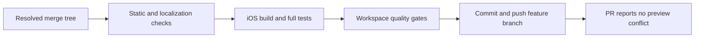
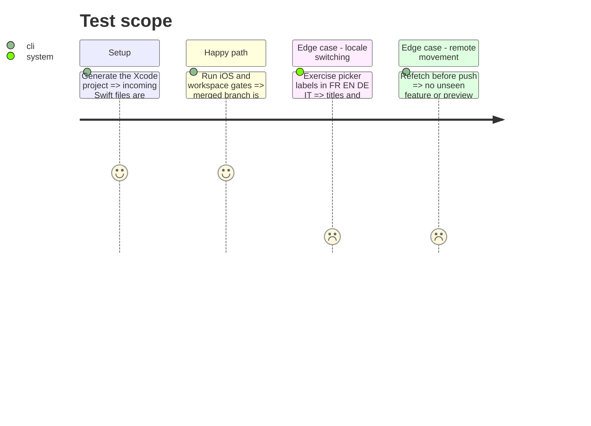

# Instruction: Prove merge readiness and publish the resolution

## Architecture projection

> Tree of the final files. ✅ create · ✏️ modify · ❌ delete

```txt
.
└── ✏️ aidd_docs/tasks/2026_08/2026_08_16_resolve-preview-conflicts-i18n/
    ├── plan.md
    ├── phase-1.md
    └── phase-2.md
```

## User Journey



## Test Scope



## Tasks to do

### `1)` Run focused merge assertions

> Catch the smallest failures before the expensive suites.

1. Run `git diff --check`, conflict-marker search, stale `CapsulePicker` reference search and String Catalog coverage checks for the reconciled titles.
2. Generate the Xcode project and run strict SwiftLint on the touched Swift files.
3. Build the iOS app with code signing disabled so the new and deleted component files are proven in the compiled graph.

### `2)` Run regression and production gates

> Validate both the incoming preview behavior and the complete i18n branch.

1. Run the full iOS unit suite and assert the executed test count, including the incoming deck regression tests and existing locale tests.
2. Run the existing i18n assertions for FR/EN/DE/IT and verify the two reconciled picker surfaces under an explicit app locale rather than only the device locale.
3. Run root `pnpm quality` and any PR-required checks affected by the final diff.

### `3)` Record and publish the resolved merge

> Leave the remote branch demonstrably mergeable into preview.

1. Review the final diff against both parents and update the plan lifecycle after successful validation.
2. Refetch both remote branches; if either moved, stop publication and repeat the merge simulation and affected gates.
3. Commit the resolution with Conventional Commits metadata, push to `origin/feat/i18n-en-de-it`, and confirm the PR conflict state and required CI checks.

## Test acceptance criteria

| Task | Acceptance criteria                                                                                                                                                  |
| ---- | -------------------------------------------------------------------------------------------------------------------------------------------------------------------- |
| 1    | No conflict marker or stale runtime `CapsulePicker` reference remains; String Catalog coverage is complete; SwiftLint and the iOS build pass.                        |
| 2    | The full iOS suite, locale coverage and root quality gates pass with no new failure or skipped required suite.                                                       |
| 3    | The pushed remote points to the validated merge commit, contains the latest verified preview tip, and GitHub reports the PR as conflict-free with required CI green. |
