# Task [android-auth-resume-corrections]

Diagnose why Android reopens a PIN creation screen after a background/cold
resume, sends an existing Google user into onboarding, and omits password
visibility on sign-in.

## Root cause

The router trusts a persisted onboarding draft before the authenticated vault
state: Google success is always recorded as a new social signup, and a draft
left on a completed `pinSetup` step is restored on that same step; separately,
the sign-in password input hardcodes masking without a trailing reveal action.

## Action paths

```mermaid
---
title: Android auth and resume action paths
---
flowchart TD
  subgraph ResumeFlow["Resume flow"]
    ResumeApp["App returns or process restarts"]
    RestoreDraft["Restore onboarding draft"]
    BootstrapVault["Fetch authenticated vault status"]
    RouteDecision["Evaluate route gates"]
    SetupScreen["PIN creation screen"]
    UnlockScreen["PIN or biometric unlock screen"]
  end
  subgraph GoogleFlow["Google flow"]
    GoogleAction["Continue with Google"]
    GoogleSession["Supabase session established"]
    SocialSetup["Configure social onboarding"]
    OnboardingScreen["Onboarding questions"]
  end
  subgraph PasswordFlow["Password flow"]
    SignInScreen["Returning-user sign-in"]
    PasswordField["Masked password input"]
    RevealAction["Password reveal action"]
  end
  ResumeApp --> RestoreDraft
  ResumeApp --> BootstrapVault
  RestoreDraft --> RouteDecision
  BootstrapVault --> RouteDecision
  RouteDecision -- "current behavior" --> SetupScreen
  RouteDecision -. "configured vault" .-> UnlockScreen
  GoogleAction --> GoogleSession
  GoogleSession --> SocialSetup
  SocialSetup --> OnboardingScreen
  SignInScreen --> PasswordField
  PasswordField -. "missing" .-> RevealAction
  classDef defect fill:#FDECEC,stroke:#B42318,color:#50110C
  classDef expected fill:#EAF7ED,stroke:#238636,color:#12351A
  class SetupScreen,SocialSetup,PasswordField defect
  class UnlockScreen,RevealAction expected
```

## Why chain

1. The user sees “Choisis ton code” because the onboarding `pinSetup` screen,
   not the returning-user unlock contract, still owns navigation.
2. It still owns navigation because `isFlowActive` outranks authenticated vault
   status in both `landingRoute` and `openGroups`.
3. `isFlowActive` survives a process restart because any onboarding draft is
   restored as active, including `currentStep: "pinSetup"` with
   `hasCompletedPinSetup: true`.
4. That completed step is shown again because restoration does not normalize a
   step that `isStepNavigable` already considers finished.
5. Existing Google users enter the same state because the welcome handler calls
   `configureSocialUser` after every successful Google exchange without first
   consulting the already authoritative vault bootstrap result.

## Inspection tools

- `rg` and source inspection for Expo Router guards, Zustand persistence,
  Supabase Google auth, vault bootstrap, and React Native Paper inputs.
- Focused Jest run for onboarding, route gates, auto-lock, and vault store.
- Existing Maestro `login-vault.yaml` and `onboarding.yaml` journeys for the
  missing device-level regression coverage.

## Hypotheses

| #   | Status      | Confidence | Analysis                                                                                    | Evidence                                                                                                                                                |
| --- | ----------- | ---------- | ------------------------------------------------------------------------------------------- | ------------------------------------------------------------------------------------------------------------------------------------------------------- |
| 1   | Invalidated | 9/10       | Auto-lock fires immediately on every background transition.                                 | `AUTO_LOCK_DELAY_MS` is five minutes; focused tests prove short background trips do not lock.                                                           |
| 2   | Invalidated | 9/10       | A configured cold-start vault is classified as needing a new PIN.                           | `bootstrapVault` maps `pinCodeConfigured: true` to `locked`, and its tests pass.                                                                        |
| 3   | Validated   | 10/10      | A completed onboarding PIN draft reopens the creation step and hides the unlock group.      | `restoreOnboardingDraft` restores `pinSetup` verbatim; `landingRoute` returns onboarding before reading `vaultStatus`; no test covers this combination. |
| 4   | Validated   | 10/10      | Google success from the welcome screen cannot distinguish a returning client from a signup. | `continueWithGoogle` unconditionally calls `configureSocialUser` and `startAfterWelcome`; the existing vault bootstrap is not consulted.                |
| 5   | Validated   | 10/10      | The sign-in password field has no reveal affordance.                                        | `sign-in.tsx` uses bare `secureTextEntry`; the already-correct registration field uses `TextInput.Icon` with accessible eye/eye-off labels.             |

## Hypothesis tasks

- [x] H1 — inspect and run the auto-lock delay policy tests.
- [x] H2 — inspect and run configured/unconfigured vault bootstrap tests.
- [x] H3 — trace draft restoration through both route-gate functions.
- [x] H4 — trace Google success from both welcome and returning-user sign-in.
- [x] H5 — compare every Android password input with the registration pattern.

## Conclusion

The auto-lock and biometric implementation already provide the intended secure
behavior. The correction belongs at the routing/state boundaries: a configured
vault must lead to unlock, an interrupted completed PIN ceremony must resume
after unlock instead of being repeated, and Google must classify the account
before activating onboarding. The password fix can reuse the existing
React Native Paper eye-button pattern with no dependency or abstraction.
