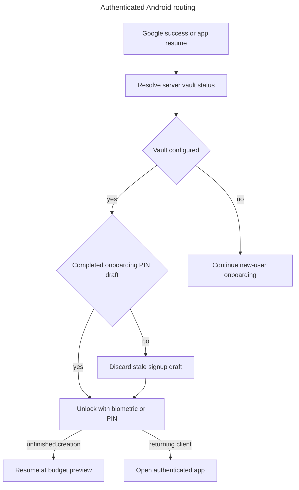
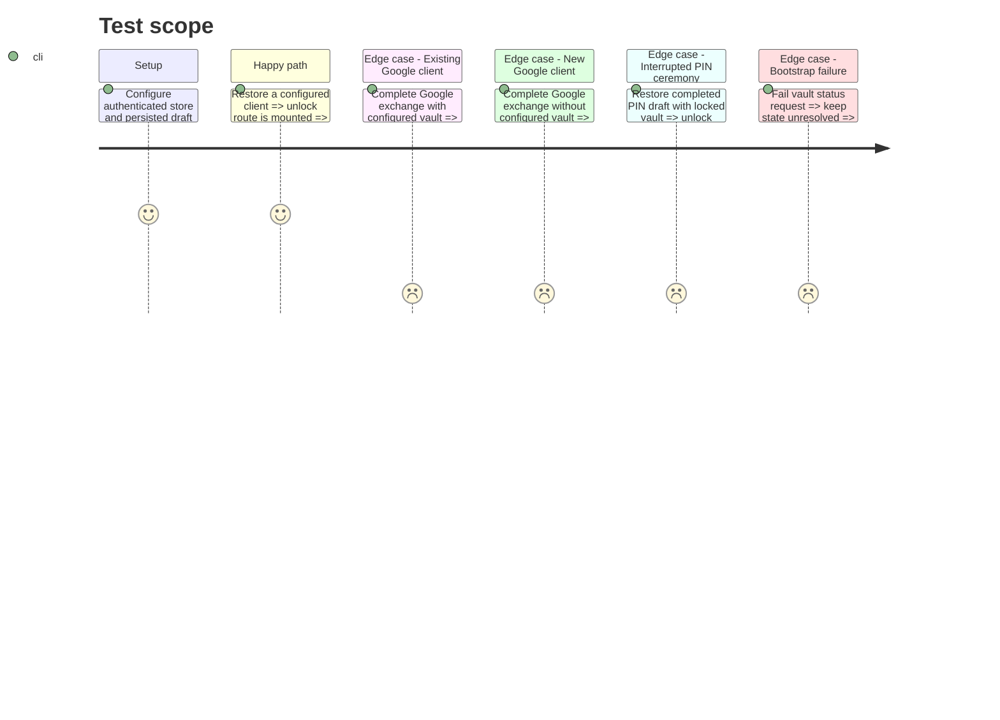

# Instruction: Make vault state authoritative across Google auth and resume

## Architecture projection

> Tree of the final files. ✅ create · ✏️ modify · ❌ delete

```txt
android/src/
├── app/
│   └── _layout.tsx                                      ✏️ reconcile authenticated vault bootstrap with stale onboarding state
├── core/
│   ├── navigation/
│   │   ├── route-gates.ts                              ✏️ route a locked configured vault through the unlock group before resuming a flow
│   │   └── route-gates.spec.ts                         ✏️ cover configured-vault and interrupted-onboarding combinations
│   └── vault/
│       ├── vault-store.ts                              ✏️ expose the stable bootstrap result to the Google decision path
│       └── vault-store.spec.ts                         ✏️ prove each bootstrap result remains fail-closed
└── features/onboarding/
    ├── onboarding-store.ts                             ✏️ normalize a completed PIN draft away from PIN creation
    ├── onboarding-store.spec.ts                        ✏️ reproduce cold restoration after PIN and stale Google onboarding
    └── steps/
        └── welcome-step.tsx                            ✏️ activate onboarding only for an account whose vault still needs setup
```

## User Journey



## Test Scope



## Tasks to do

### `1)` Classify Google auth with existing vault state

> A successful provider exchange must not imply a new signup.

1. Reuse the existing vault bootstrap request as the post-auth server check.
2. Activate social onboarding only when the vault is genuinely unconfigured.
3. Clear an obsolete onboarding draft for a configured returning client.
4. Keep bootstrap failures on the existing retry path instead of guessing.

### `2)` Resume an interrupted PIN ceremony through unlock

> A PIN already configured on the server is entered or unlocked biometrically, never recreated.

1. Give a locked configured vault precedence over an active onboarding route.
2. Preserve an unfinished onboarding draft while the vault unlocks.
3. Normalize `pinSetup` plus `hasCompletedPinSetup` back to the budget preview so the existing submission path can be retried.
4. Reopen onboarding only after the client key is back in memory.

### `3)` Lock the state transitions with focused tests

> The missing state combinations must fail before the fix and pass after it.

1. Add returning Google, new Google, interrupted PIN, stale draft, and bootstrap-error cases.
2. Preserve the current five-minute warm-background policy and configured-vault bootstrap assertions.
3. Run the focused Jest suites, then Android type-check, lint, and formatting checks.

## Test acceptance criteria

| Task | Acceptance criteria                                                                                                                                               |
| ---- | ----------------------------------------------------------------------------------------------------------------------------------------------------------------- |
| 1    | A configured Google client reaches vault unlock and never activates onboarding; a genuinely unconfigured client continues onboarding with provider name metadata. |
| 2    | A cold restart after PIN setup first requests biometric or the existing PIN, then resumes at budget preview; “Choisis ton code” is not shown again.               |
| 3    | Route-gate, onboarding-store, vault-store, and auto-lock suites pass with explicit coverage for every reported state transition.                                  |
