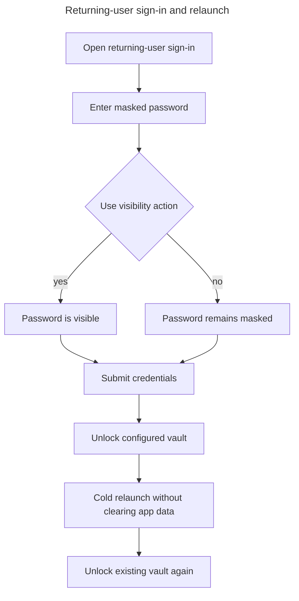
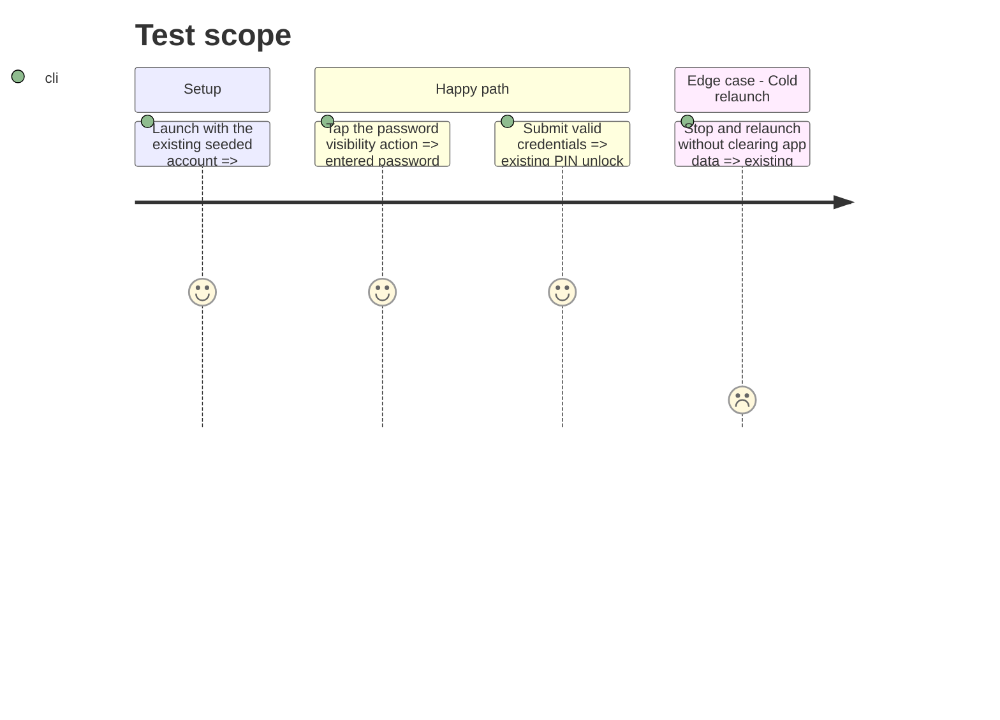

# Instruction: Add password reveal and device-level regression coverage

## Architecture projection

> Tree of the final files. ✅ create · ✏️ modify · ❌ delete

```txt
android/
├── maestro/
│   └── login-vault.yaml                     ✏️ assert the reveal control and configured-vault cold restart path
└── src/
    └── app/
        └── (auth)/
            └── sign-in.tsx                  ✏️ reuse the accessible eye and eye-off pattern already used during registration
```

## User Journey



## Test Scope



## Wireframe

```txt
┌──────────────────────────────────────┐
│ (1) Returning-user sign-in           │
│                                      │
│ (2) E-mail input                     │
│ (3) Password input            (4) ◉  │
│ (5) Recovery action                  │
│ (6) Primary sign-in action           │
│ (7) Alternative provider action      │
└──────────────────────────────────────┘
```

1. Sign-in region: identifies the returning-user entry screen.
2. E-mail input: account identifier.
3. Password input: secret entry region.
4. Visibility affordance: trailing control inside the password field.
5. Recovery action: access to the existing recovery flow.
6. Primary action: submits the password path.
7. Alternative action: keeps Google available without changing layout.

## Tasks to do

### `1)` Add the sign-in password visibility action

> Match the already-correct registration field without introducing a component or dependency.

1. Track local visibility state in the sign-in screen.
2. Toggle `secureTextEntry` with a trailing Paper `TextInput.Icon`.
3. Reuse the eye and eye-off icons and accessible French labels from registration.
4. Keep autofill, validation, busy state, and Maestro field identifiers unchanged.

### `2)` Extend the existing Android login journey

> One device journey protects both the visible affordance and the relaunch contract.

1. Assert the password visibility action exists and can be operated.
2. Complete the existing password and PIN login path.
3. Stop and relaunch without clearing state.
4. Assert “Ton code” is shown, “Choisis ton code” is absent, and the same PIN unlocks the app.

## Test acceptance criteria

| Task | Acceptance criteria                                                                                                                                        |
| ---- | ---------------------------------------------------------------------------------------------------------------------------------------------------------- |
| 1    | The sign-in password is masked by default; an accessible eye action reveals it and a second action masks it again without changing its value.              |
| 2    | The Maestro login journey reaches home, cold-relaunches with retained state, and unlocks the configured vault without entering PIN creation or onboarding. |
