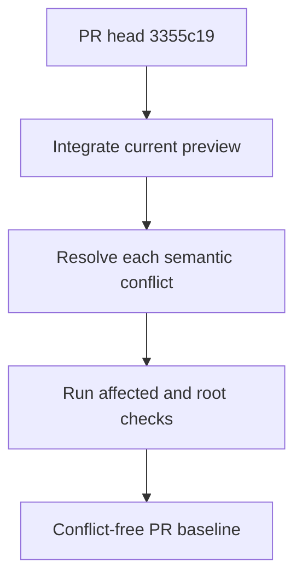
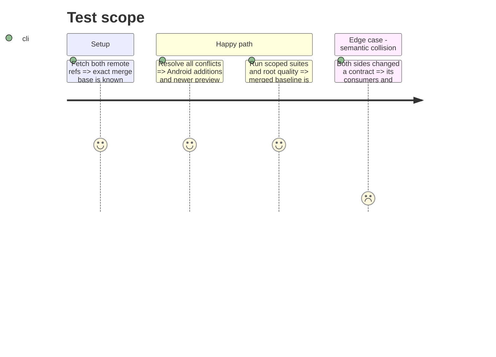

# Instruction: Reconcile the branch with `preview`

## Architecture projection

> Tree of the final files. ✅ create · ✏️ modify · ❌ delete

```txt
.
├── .github/scripts/ci-security.test.mjs ✏️
├── .github/scripts/lexicon.test.mjs ✏️
├── CLAUDE.md ✏️
├── aidd_docs/memory/mobile.md ✏️
├── aidd_docs/memory/testing.md ✏️
├── backend-nest/src/modules/whats-new/
│   ├── domain/releases-data.parity.spec.ts ✏️
│   ├── domain/releases-data.ts ✏️
│   ├── domain/whats-new-payload.spec.ts ✏️
│   ├── domain/whats-new-payload.ts ✏️
│   ├── infrastructure/http/whats-new.controller.spec.ts ✏️
│   └── infrastructure/http/whats-new.controller.ts ✏️
├── docs/VERSIONING.md ✏️
├── frontend/e2e/utils/auth-bypass.ts ✏️
├── ios/Pulpe/Features/Onboarding/OnboardingState.swift ✏️
└── shared/
    ├── index.ts ✏️
    ├── schemas.ts ✏️
    └── src/feature-flags.ts ✏️
```

## User Journey



## Test Scope



## Tasks to do

### `1)` Integrate without choosing a side wholesale

> Preserve the intent of both branches in every current conflict.

1. Merge `preview` into the feature branch and resolve the listed files semantically.
2. Re-run the whats-new, shared schema, CI-script, frontend bypass and iOS onboarding tests closest to each conflict.

### `2)` Establish the new baseline

> Separate integration failures from the fixes in later phases.

1. Run `pnpm quality`, Android tests, shared tests and the focused backend whats-new suites.
2. Push the conflict resolution only after the working tree and merge index are clean.

## Test acceptance criteria

| Task | Acceptance criteria                                                                                            |
| ---- | -------------------------------------------------------------------------------------------------------------- |
| 1    | GitHub reports the PR mergeable and every merged contract retains its Android and current-`preview` consumers. |
| 2    | Quality and all focused suites pass on the post-merge commit before behavioral fixes begin.                    |
