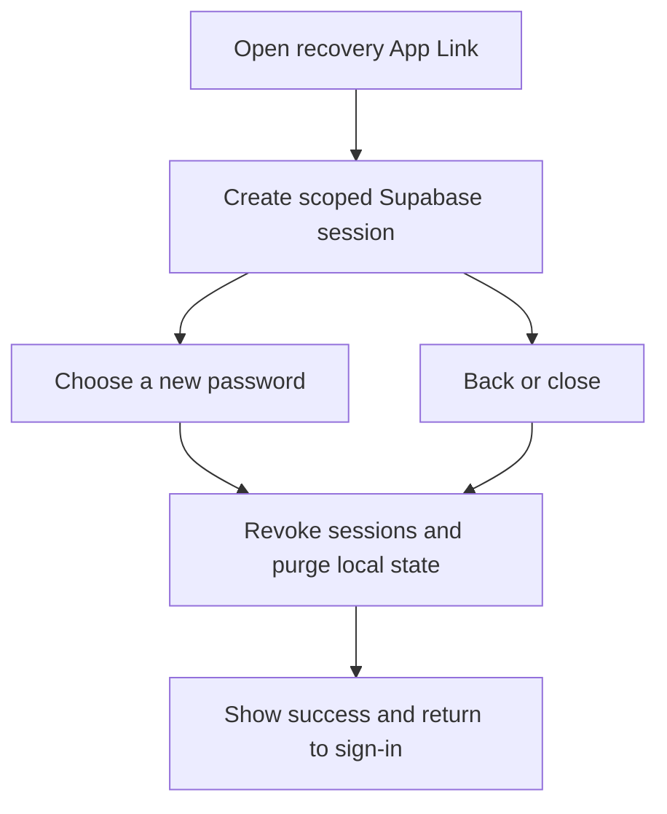
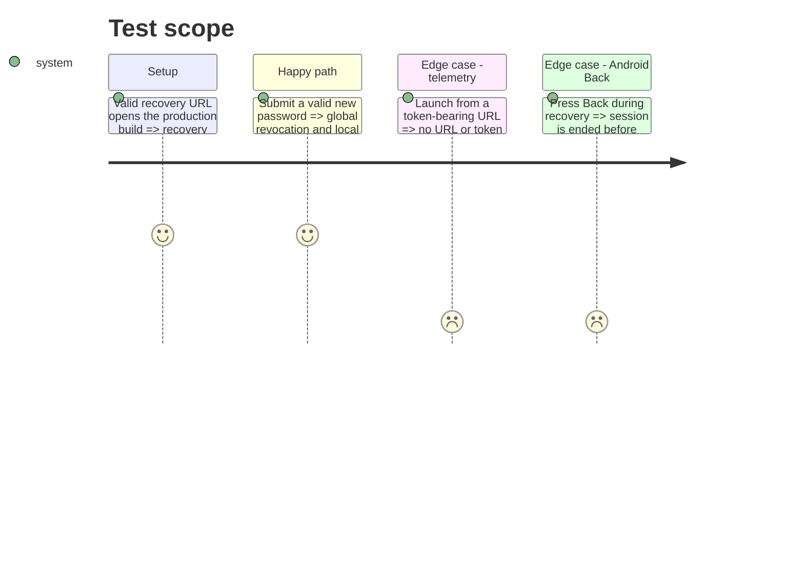

# Instruction: Secure the password-recovery boundary

## Architecture projection

> Tree of the final files. ✅ create · ✏️ modify · ❌ delete

```txt
android/src/
├── app/reset-password.tsx ✏️
└── core/
    ├── auth/reset-password-route.spec.ts ✅
    ├── auth/session-store.spec.ts ✏️
    ├── auth/session-store.ts ✏️
    └── observability/
        ├── analytics.spec.ts ✏️
        └── analytics.ts ✏️
```

## User Journey



## Test Scope



## Tasks to do

### `1)` Keep recovery tokens out of analytics

> Disable PostHog's unsanitized lifecycle URL capture.

1. Set `captureAppLifecycleEvents: false`; keep existing manual, sanitized events only.
2. Lock the option and default-consent behavior in `analytics.spec.ts`.

### `2)` End recovery before any exit

> Treat revocation, not the success screen, as the security boundary.

1. Await `endRecoverySession()` immediately after `updatePassword()` and before the done state.
2. Intercept Back/close during an active recovery session; handle Supabase sign-out errors explicitly while always clearing local account state.
3. Add route-contract and session-store regression coverage.

## Test acceptance criteria

| Task | Acceptance criteria                                                                                                        |
| ---- | -------------------------------------------------------------------------------------------------------------------------- |
| 1    | A recovery launch emits no PostHog event containing its initial URL or Supabase tokens.                                    |
| 2    | Success, Back and close all leave no persisted recovery session; success appears only after the revocation path completes. |
