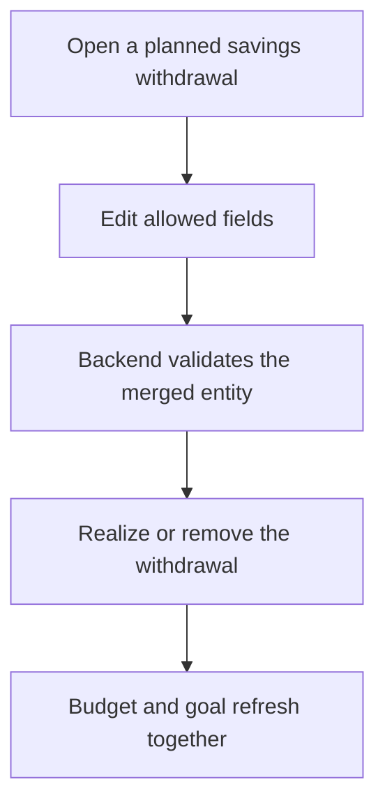
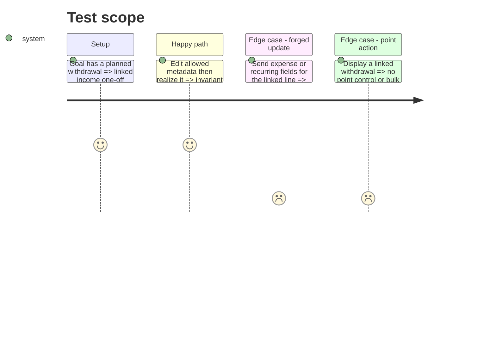

# Instruction: Preserve savings invariants and query truth

## Architecture projection

> Tree of the final files. ✅ create · ✏️ modify · ❌ delete

```txt
android/src/features/
├── budget-details/
│   ├── components/budget-line-row.tsx ✏️
│   ├── components/budget-line-sheet.tsx ✏️
│   └── savings-withdrawal/withdrawal-mutations.ts ✏️
├── current-month/
│   ├── current-month-view-model.spec.ts ✏️
│   └── current-month-view-model.ts ✏️
├── savings-goals/goal-cache-invalidation.spec.ts ✅
└── transactions/transaction-mutations.ts ✏️
backend-nest/src/modules/budget-line/
├── application/update-budget-line.use-case.spec.ts ✏️
├── application/update-budget-line.use-case.ts ✏️
└── domain/
    ├── budget-line.invariants.spec.ts ✏️
    └── budget-line.invariants.ts ✏️
```

## User Journey



## Test Scope



## Tasks to do

### `1)` Enforce the invariant at both boundaries

> A savings withdrawal remains `income + one_off` regardless of client behavior.

1. Lock kind and recurrence controls for a line with `sourceSavingsGoalId`.
2. Validate the fully merged entity in `UpdateBudgetLineUseCase`; cover accepted metadata and rejected structural changes.

### `2)` Remove impossible point actions

> Do not offer an operation the backend deliberately rejects.

1. Exclude linked withdrawals from unchecked selectors/counts and hide their row point control.
2. Extend the current-month view-model cases.

### `3)` Refresh both affected aggregates

> A write linked to a goal invalidates budget and goal query prefixes.

1. Invalidate `goalKeys.all` after transaction and planned-withdrawal mutations.
2. Add one focused source/query-client contract covering both mutation families.

## Test acceptance criteria

| Task | Acceptance criteria                                                                                         |
| ---- | ----------------------------------------------------------------------------------------------------------- |
| 1    | Neither Android UI nor a forged API update can change a planned withdrawal's required kind or recurrence.   |
| 2    | Linked withdrawals never appear pointable and never inflate the home unchecked count.                       |
| 3    | Realizing, editing, deleting or restoring linked data refreshes the mounted goal screen without navigation. |
