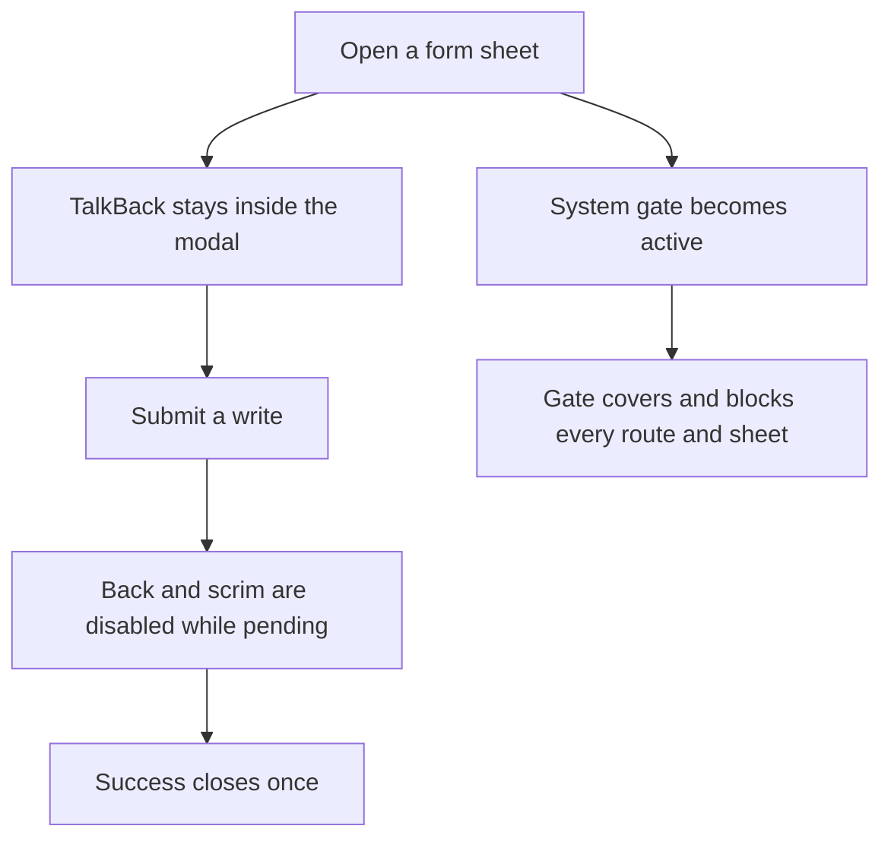
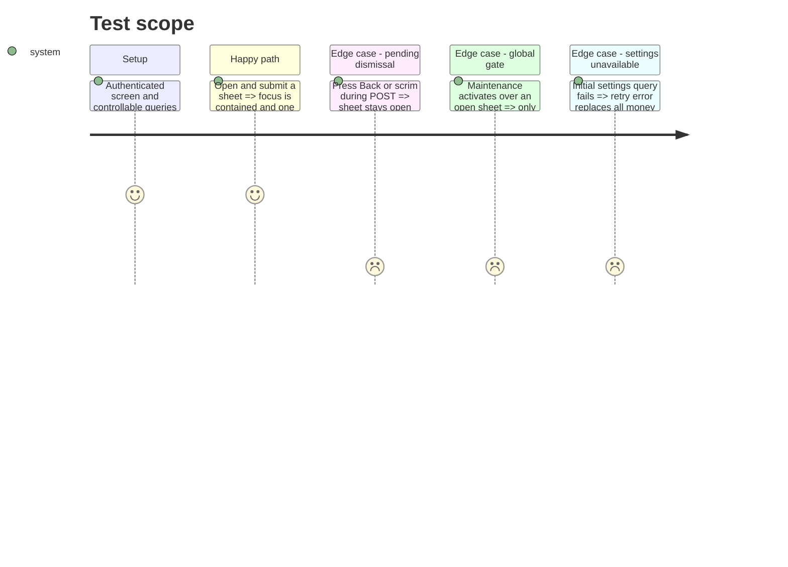

# Instruction: Make modal and settings failure states trustworthy

## Architecture projection

> Tree of the final files. ✅ create · ✏️ modify · ❌ delete

```txt
android/src/
├── app/(main)/_layout.tsx ✏️
├── core/system/
│   ├── root-provider-order.spec.ts ✏️
│   └── system-gate-screen.tsx ✏️
├── core/ui/
│   ├── sheet.spec.ts ✏️
│   └── sheet.tsx ✏️
├── core/user-settings/
│   ├── required-settings-gate.spec.ts ✅
│   └── required-settings-gate.tsx ✅
└── features/
    ├── account/components/*-sheet.tsx ✏️
    ├── budget-details/**/*-sheet.tsx ✏️
    ├── savings-goals/components/**/*sheet.tsx ✏️
    ├── templates/components/*-sheet.tsx ✏️
    └── transactions/components/transaction-sheet.tsx ✏️
```

## User Journey



## Test Scope



## Tasks to do

### `1)` Replace the pseudo-modal once

> Keep the current sheet surface, but host it in React Native `Modal`.

1. Preserve layout, keyboard inset and animation; wire Android Back through `onRequestClose`.
2. Add a dismissability/busy contract and pass pending state from every mutating sheet.
3. Cover the native-modal and pending-dismissal contract, then verify TalkBack on-device.

### `2)` Put system and settings gates above their consumers

> Missing global prerequisites must never look like valid app data.

1. Render the non-dismissible system gate in a native modal mounted after app sheets.
2. Add one authenticated-layout gate that waits for required user settings and reuses the existing retry error state when no cached data exists.

## Test acceptance criteria

| Task | Acceptance criteria                                                                                            |
| ---- | -------------------------------------------------------------------------------------------------------------- |
| 1    | TalkBack cannot traverse background content, and Back/scrim cannot dismiss any pending mutating sheet.         |
| 2    | Maintenance always outranks sheets; absent settings never produce CHF, pay-day 1 or editable fallback content. |
