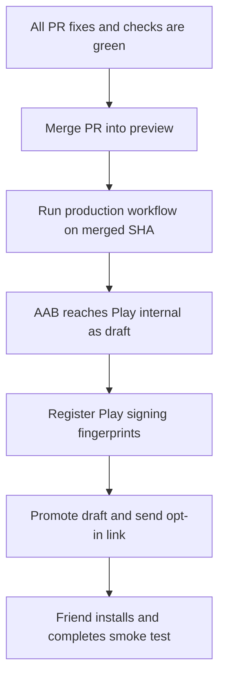
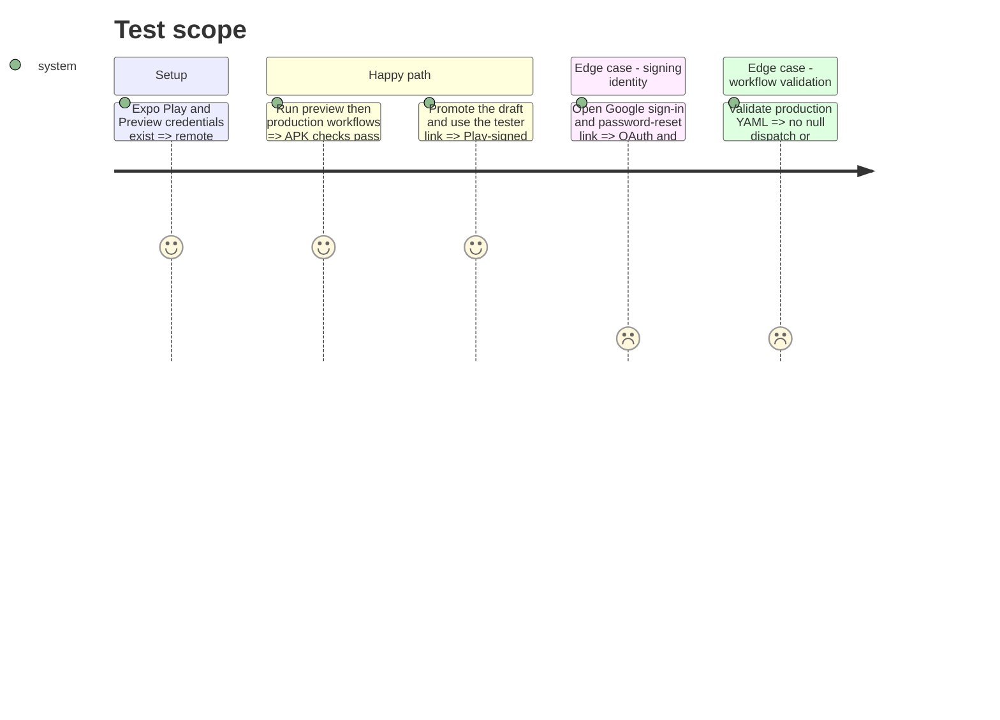

# Instruction: Prove the delivery path and publish internally

## Architecture projection

> Tree of the final files. ✅ create · ✏️ modify · ❌ delete

```txt
android/
├── .eas/workflows/deploy-production.yml ✏️
├── app.json ✏️
├── docs-android/RELEASE.md ✏️
└── package.json ✏️
frontend/projects/webapp/public/.well-known/assetlinks.json ✅
```

## User Journey



## Test Scope



## Tasks to do

### `1)` Repair and document the release configuration

> Make the checked-in workflow valid before spending a remote build.

1. Use `workflow_dispatch: {}` and remove the production `concurrency` block.
2. Align Android app/package versions with the root version current at release time.
3. Correct `RELEASE.md`: distinguish upload and Play app-signing keys, list the real PostHog/Supabase Data safety inventory, and retain the internal draft gate.

### `2)` Clear external check prerequisites

> Turn infrastructure noise into deterministic signals.

1. Restrict GitHub default CodeQL to repository languages instead of Python.
2. Configure the EAS Play service account and the protected preview Maestro fixture/secrets.
3. Obtain one green EAS preview APK and one green GitHub Maestro smoke run on the final PR head.

### `3)` Merge and distribute the exact reviewed commit

> Test the Play-signed artifact without promoting `main`.

1. Mark the PR ready, obtain required approval/checks, and merge into `preview`.
2. Manually run the fixed production workflow from that merged SHA; keep the internal release as a draft until Play processing completes.
3. Register every Play app-signing SHA required by OAuth and `assetlinks.json`, deploy the association file, then promote the draft to the one-friend tester list.
4. Run login, password recovery, create/edit/delete, offline and force-update smoke checks on the Play-installed build.

## Test acceptance criteria

| Task | Acceptance criteria                                                                                                                                                |
| ---- | ------------------------------------------------------------------------------------------------------------------------------------------------------------------ |
| 1    | EAS accepts the workflow, and the AAB reports the same user-facing version as the repository release.                                                              |
| 2    | PR checks represent applicable code, preview build and device smoke results with no pending or irrelevant Python gate.                                             |
| 3    | The exact merged `preview` build installs through the friend's Play opt-in link; OAuth, App Links and the critical smoke journey pass before any `main` promotion. |

## Execution result

- Release workflow syntax, Android version alignment, release documentation, CodeQL language selection and Expo SDK patch alignment are complete.
- The PR is ready and conflict-free; its preview APK and Maestro checks were relaunched from the final Android commit.
- Merge is blocked by the required approval from another GitHub reviewer.
- Play publication is blocked until the account holder completes identity verification and validates the account from a physical, non-root Android 10+ device. App creation, the Play service account, app-signing fingerprints, tester enrollment and the Play-installed smoke test follow that verification.
