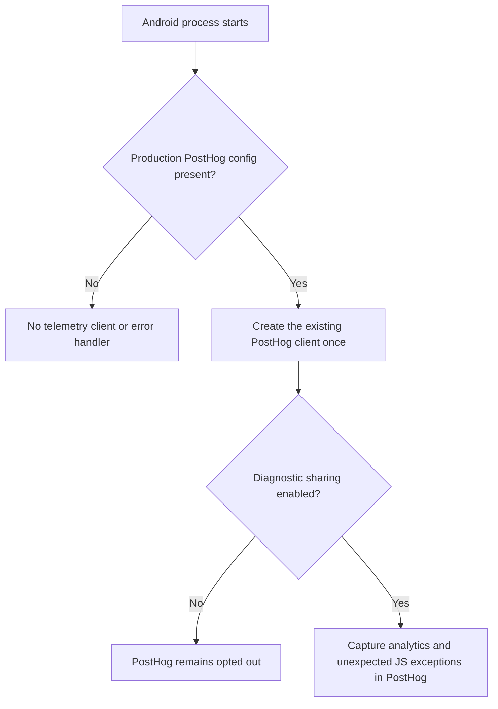
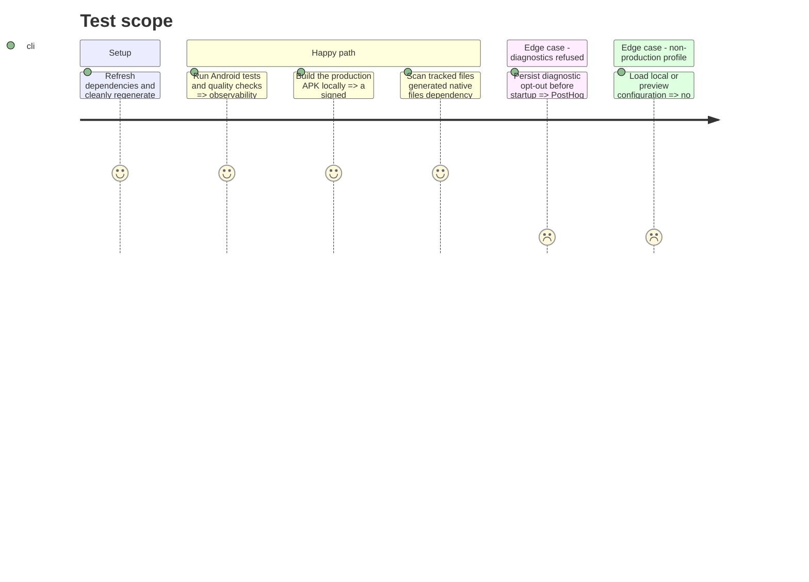

# Instruction: Remove Sentry and validate PostHog-only Android observability

## Architecture projection

> Tree of the final files. ✅ create · ✏️ modify · ❌ delete

```txt
.
├── .claude/rules/05-workflows-and-processes/error-handling.md          ✏️ state PostHog as the sole error vendor without a stale Sentry reference
├── .github/workflows/android-e2e.yml                                   ✏️ remove the obsolete Sentry build variable
├── aidd_docs/tasks/2026_08/
│   ├── 2026_08_04_claude-docs-cleanup/phase-2.md                       ✏️ remove the obsolete vendor example
│   ├── 2026_08_11_android-expo-port/
│   │   ├── plan.md                                                     ✏️ make the target stack PostHog-only
│   │   └── phase-2.md                                                  ✏️ remove the deleted observability module from the target tree
│   └── 2026_08_14_android-hardening/
│       ├── phase-5.md                                                  ✏️ describe PostHog as the single Android observability SDK
│       └── phase-9.md                                                  ✏️ remove obsolete Sentry environment setup
├── android/
│   ├── .env.example                                                    ✏️ remove the unused DSN documentation
│   ├── .gitignore                                                      ✏️ keep the generated local APK outside version control
│   ├── app.json                                                        ✏️ remove the Sentry Expo plugin
│   ├── docs-android/RELEASE.md                                         ✏️ make release prerequisites describe PostHog only
│   ├── eas.json                                                        ✏️ remove Sentry upload flags while preserving OAuth and APK profiles
│   ├── package.json                                                    ✏️ remove `@sentry/react-native`
│   └── src/
│       ├── app/_layout.tsx                                             ✏️ remove Sentry startup and wrapper
│       └── core/
│           ├── config/env.ts                                           ✏️ remove the DSN runtime setting
│           └── observability/
│               ├── analytics.spec.ts                                  ✅ verify PostHog error and consent gates
│               ├── analytics.ts                                       ✏️ enable safe PostHog JavaScript exception autocapture
│               ├── diagnostics-consent.ts                             ✏️ describe one SDK instead of two
│               └── sentry.ts                                          ❌ delete the unused client
├── backend-nest/src/modules/account-deletion/application/
│   └── cleanup-expired-deletions.use-case.ts                           ✏️ remove the stale vendor name from logging guidance
├── pnpm-lock.yaml                                                      ✏️ remove the Sentry dependency graph
└── pnpm-workspace.yaml                                                 ✏️ remove the Sentry CLI build allowlist entry
```

## User Journey



## Test Scope



## Tasks to do

### `1)` Move Android error capture to the existing PostHog client

> Remove the inert Sentry bootstrap and let one consent-aware PostHog client own analytics and JavaScript errors.

1. Delete `core/observability/sentry.ts`, its root-layout imports, module-scope startup, conditional wrapper, and the DSN entry in `core/config/env.ts`.
2. Configure the existing PostHog construction with uncaught-exception and unhandled-rejection autocapture; keep console capture and native crash capture disabled.
3. Preserve the current production-only configuration and diagnostic opt-out subscription so an opted-out or non-production run never arms error capture.
4. Add one focused mocked-client spec covering construction options, the disabled-profile path, and consent propagation.

### `2)` Remove Sentry from dependencies and every build surface

> Make package installation, Expo prebuild, EAS profiles, and Android E2E independent of Sentry.

1. Remove `@sentry/react-native` from `android/package.json`, the Expo plugin from `app.json`, and `@sentry/cli` from `pnpm-workspace.yaml`; refresh `pnpm-lock.yaml` with pnpm.
2. Remove `SENTRY_DISABLE_AUTO_UPLOAD` from all `eas.json` profiles and `.github/workflows/android-e2e.yml`, without touching the Google OAuth IDs, `production-apk` profile, or shared-package post-install hook already changed in the worktree.
3. Remove the DSN instructions from `.env.example` and regenerate `android/android` from a clean Expo prebuild so stale `sentry.properties` and `sentry.gradle` hooks disappear.

### `3)` Align current documentation and architecture records

> Ensure repository guidance consistently names PostHog as the only observability vendor.

1. Update the Android release checklist, error-handling rule, backend cleanup comment, and listed AIDD task documents to remove obsolete Sentry setup and target-tree references.
2. Keep historical intent intact where possible: replace the obsolete vendor choice with the current PostHog-only architecture instead of rewriting unrelated completed work.
3. Run an exact vendor-reference sweep across tracked files and the regenerated native tree; exclude this removal record, and permit only false-positive substrings unrelated to the vendor.

### `4)` Validate a fresh local production artifact

> Prove the cleanup works in source, generated native code, and the APK delivered to a Samsung device.

1. Run the focused observability specs, the Android test suite, and Android quality checks.
2. Confirm pnpm no longer resolves Sentry and Gradle's release dependency graph has no Sentry modules.
3. Replace the stale local APK with a fresh `production-apk` local EAS build, keep the generated `android/builds/` directory outside version control, then verify package `app.pulpe.android`, version metadata, signing certificate, and absence of Sentry archive entries.

## Test acceptance criteria

| Task | Acceptance criteria                                                                                                                                                                                      |
| ---- | -------------------------------------------------------------------------------------------------------------------------------------------------------------------------------------------------------- |
| 1    | Android imports no Sentry API; production PostHog captures uncaught exceptions and rejected promises, while console capture, non-production profiles, and diagnostic opt-out remain silent.              |
| 2    | The manifest, package graph, lockfile, EAS profiles, GitHub workflow, and freshly generated native project contain no Sentry plugin, package, CLI, DSN, upload flag, properties file, or Gradle hook.    |
| 3    | Outside this removal record, current release guidance, project rules, comments, and Android architecture plans describe PostHog as the sole observability vendor and contain no actionable Sentry setup. |
| 4    | Tests and Android quality pass; a fresh signed production APK builds locally with the expected package/version and no Sentry dependency or archive entry.                                                |
