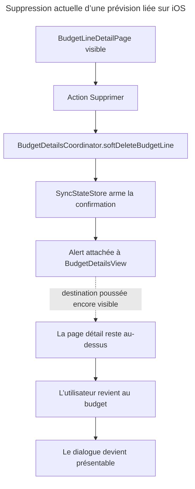

# Debug: dialogue de suppression des prévisions liées iOS

## Source

- **Type** : signalement utilisateur et capture d’écran.
- **Référence** : `Photo 1.jpg`, reçue le 17 août 2026.
- **Symptôme** : depuis le détail d’une prévision liée au parcours « Couvrir ce mois avec mon épargne », plusieurs taps sur « Supprimer » ne montrent rien ; le dialogue apparaît seulement après le retour au budget.
- **Défaut de contenu** : le titre, la phrase signée et les actions « Garder le revenu », « Tout annuler », « Annuler » ne disent pas clairement quelles prévisions seront supprimées.

## Cause racine

Le premier tap arme bien la confirmation, mais son `.alert` est attaché à `BudgetDetailsView`, masquée par la destination poussée `BudgetLineDetailPage`; l’état reste vrai jusqu’au retour, moment où la vue parente peut enfin présenter le dialogue.

## Chemin d’action

## Pourquoi, cinq fois

1. Le dialogue semble ignorer le tap parce qu’aucune confirmation ne devient visible sur la page détail.
2. Elle n’est pas visible parce que le modificateur `.alert` n’appartient pas à `BudgetLineDetailPage`.
3. Il appartient à `BudgetDetailsView`, qui se trouve sous la destination détail dans le `NavigationStack`.
4. L’état de présentation est néanmoins partagé dans `SyncStateStore`, donc il reste armé après le tap.
5. Le retour retire la destination détail et rend la vue parente présentable ; SwiftUI affiche alors l’alerte déjà demandée.

## Outils d’inspection

- Recherche `rg` des textes, états, actions et appelants.
- Lecture du routage SwiftUI, du détail, du coordinateur et du store de synchronisation.
- `git blame` et commit d’introduction `3f20019c3` pour vérifier le seam ajouté.
- Test Swift ciblé sur le simulateur « Pulpe Tests ».
- Capture utilisateur comme preuve du comportement de présentation réel.

## Hypothèses suivies

| État          | Hypothèse                                                                  | Confiance initiale | Preuve                                                                                                                                                                       |
| ------------- | -------------------------------------------------------------------------- | -----------------: | ---------------------------------------------------------------------------------------------------------------------------------------------------------------------------- |
| [x] Validée   | L’alerte est portée par une vue parente masquée par la destination détail. |               9/10 | Le tap part de `BudgetLineDetailPage.swift`, mais l’unique `.alert` concernée se trouve dans `BudgetDetailsView.swift`; le retour utilisateur la rend immédiatement visible. |
| [x] Invalidée | Le tap « Supprimer » ou le menu ne déclenche pas l’action.                 |               4/10 | Le chemin appelle `deleteBudgetLine`, puis `.softDeleteBudgetLine`; le test `softDeleteBudgetLine_linkedLine_raisesChoice_andKeepsLine` passe.                               |
| [x] Invalidée | L’API de suppression est lente ou échoue avant l’affichage.                |               3/10 | Aucun appel réseau n’a lieu avant le choix : le coordinateur ne fait que renseigner `budgetLineToDeleteWithdrawal` et passer le booléen à `true`.                            |
| [x] Invalidée | Les taps répétés créent plusieurs demandes concurrentes.                   |               3/10 | Chaque tap réassigne le même objet et le même booléen déjà vrai ; aucune tâche réseau ni file de mutation n’est démarrée.                                                    |
| [x] Invalidée | L’autre alerte de pointage monopolise la présentation.                     |               2/10 | Les deux alertes utilisent des bindings et payloads indépendants ; aucune branche de suppression ne renseigne l’état de pointage.                                            |

## Validation

Après régénération du projet Xcode ignoré depuis `project.yml`, la suite
`SavingsWithdrawalCoordinatorTests` passe : **8 tests, 0 échec**. Elle confirme que
le seam métier reçoit le premier tap, arme la confirmation sans supprimer la ligne,
et n’appelle le serveur qu’après un choix explicite. Le défaut restant est donc
strictement le propriétaire visuel de l’alerte.

## Prochaines étapes

- Présenter le choix sur la destination visible qui reçoit le geste.
- Conserver le coordinateur comme garde métier unique contre une suppression orpheline.
- Remplacer les libellés ambigus par des actions nommant explicitement les mois supprimés.
- Ajouter un contrôle exécutable qui couvre la présentation immédiate depuis le détail.
