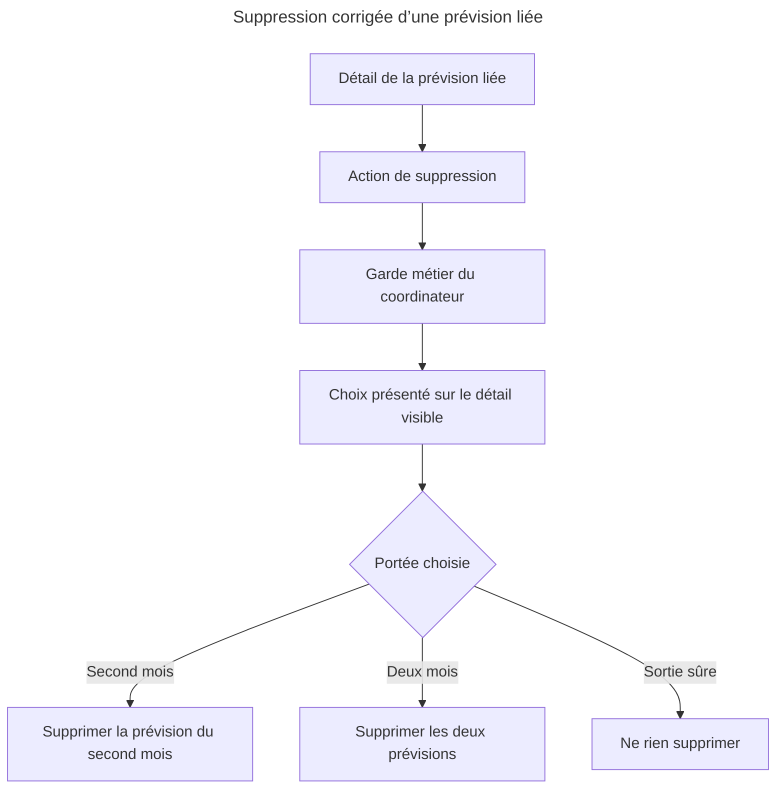
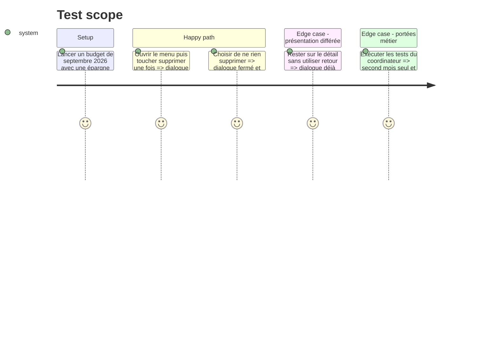

# Instruction: Présenter et verrouiller le choix sur le détail visible

## Architecture projection

> Tree of the final files. ✅ create · ✏️ modify · ❌ delete

```txt
ios/
├── Pulpe/
│   ├── App/
│   │   ├── BudgetLongPressUITestHarness.swift                         ✏️ ajouter une prévision liée déterministe au harness budget existant
│   │   └── PulpeApp.swift                                             ✏️ router le nouveau scénario UI ciblé
│   ├── Features/Budgets/BudgetDetails/
│   │   ├── BudgetDetailsView.swift                                    ✏️ retirer l’alerte portée par la vue parente masquée
│   │   ├── BudgetLineDetailPage.swift                                 ✏️ attacher le choix à la destination visible
│   │   └── SavingsWithdrawal/
│   │       ├── BudgetDetailsView+SavingsWithdrawalDelete.swift        ❌ supprimer le propriétaire devenu faux
│   │       └── BudgetLineDetailPage+SavingsWithdrawalDelete.swift     ✅ conserver les actions et la copie auprès de leur vue
│   └── Resources/Localizable.xcstrings                                ✏️ localiser les nouveaux libellés en français, anglais, allemand et italien
└── PulpeUITests/
    └── BudgetLinkedForecastDeleteUITests.swift                        ✅ couvrir l’affichage immédiat et les trois choix
```

## User Journey



## Test Scope



## Wireframe

```txt
┌──────────────────────────────────────────┐
│ (1) Titre du choix                       │
│                                          │
│ (2) Résumé des deux prévisions           │
│                                          │
│ (3) Action sur le second mois            │
│ (4) Action sur les deux mois             │
│ (5) Sortie sûre                          │
└──────────────────────────────────────────┘
```

1. Titre : annonce qu’une portée de suppression doit être choisie.
2. Résumé : nomme les natures, le montant et les deux mois concernés.
3. Second mois : première portée destructive prise en charge par l’API.
4. Deux mois : seconde portée destructive prise en charge par l’API.
5. Sortie sûre : ferme le dialogue sans mutation.

## Tasks to do

### `1)` Rendre la destination visible propriétaire du dialogue

> Déplacer uniquement le présentateur ; garder le coordinateur comme garde métier unique.

1. Retirer l’alerte de `BudgetDetailsView`, actuellement sous la destination poussée.
2. Attacher le même binding de `SyncStateStore` à `BudgetLineDetailPage`, qui reçoit le geste et reste visible tant qu’aucun choix n’est confirmé.
3. Renommer l’extension de suppression pour refléter son propriétaire réel et réutiliser les environnements déjà injectés ; ne créer ni nouveau routeur, ni nouvel état, ni nouveau composant.
4. Conserver l’interception de `softDeleteBudgetLine`, les scopes `repayment` et `pair`, l’appel serveur direct et l’invalidation cross-mois inchangés.

### `2)` Dire exactement ce qui sera supprimé

> Remplacer les signes et les verbes ambigus par les deux impacts concrets.

1. Utiliser le titre « Quelles prévisions supprimer ? ».
2. Afficher « Tu as pris 477 CHF sur ton épargne en août et prévu de les remettre en septembre. », avec montant non signé, devise et mois dynamiques.
3. Nommer les actions « Supprimer septembre seulement », « Supprimer août et septembre » et « Ne rien supprimer », avec les mois dynamiques dans chaque langue.
4. Donner le rôle destructif aux deux actions qui suppriment au moins une prévision et le rôle d’annulation à la sortie sûre.
5. Mettre à jour les quatre langues du catalogue et retirer les anciennes clés devenues sans appel.

### `3)` Verrouiller la régression au niveau où elle se produit

> Prouver qu’un seul tap présente le dialogue avant tout retour de navigation.

1. Étendre le harness budget existant avec un scénario septembre 2026 contenant une ligne `saving` liée au revenu d’août par `savingsWithdrawalGroupId`.
2. Ajouter un XCUITest français qui ouvre la ligne, touche « Supprimer » une fois, attend le titre et les trois actions sans toucher au bouton retour, puis annule et retrouve le détail.
3. Rejouer `SavingsWithdrawalCoordinatorTests` pour conserver l’interception, les deux scopes, la non-mutation avant choix et le comportement d’erreur.
4. Régénérer le projet avec `xcodegen generate --use-cache`, exécuter le test UI ciblé puis les tests Swift ciblés ; vérifier aussi le catalogue via le build iOS et `pnpm test:lexicon`.

## Test acceptance criteria

| Task | Acceptance criteria                                                                                                                                                                                                         |
| ---- | --------------------------------------------------------------------------------------------------------------------------------------------------------------------------------------------------------------------------- |
| 1    | Depuis `BudgetLineDetailPage`, le premier tap sur « Supprimer » rend le dialogue visible sans pop ni retour manuel ; aucune deuxième alerte concurrente ne reste attachée à `BudgetDetailsView`.                            |
| 1    | Annuler conserve la prévision et le détail ; confirmer continue d’appeler exactement `repayment` ou `pair`, sans permettre une suppression orpheline.                                                                       |
| 2    | Pour l’exemple signalé, le dialogue ne montre plus `+477`/`-477`, « Garder » ou deux sens différents d’« Annuler » : il explique la prise sur l’épargne en août, la remise prévue en septembre et l’effet de chaque bouton. |
| 2    | Les deux suppressions sont annoncées comme destructives, la sortie sûre ne mute rien, et les quatre locales du catalogue possèdent une traduction complète.                                                                 |
| 3    | Le XCUITest échoue avec le propriétaire actuel, passe après déplacement et vérifie l’affichage immédiat avant tout retour ; les 8 tests existants du coordinateur restent verts.                                            |
