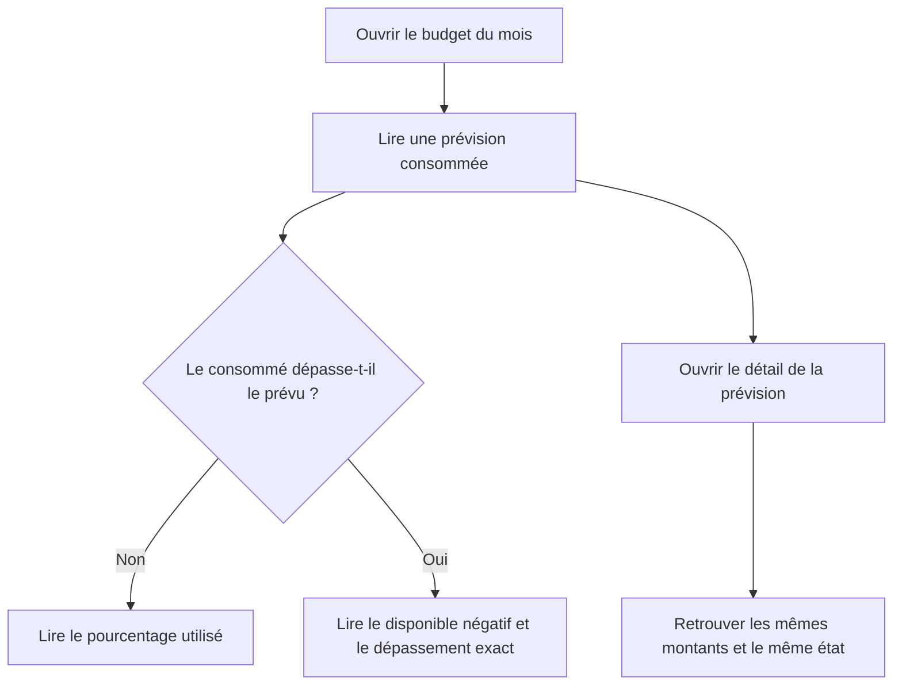
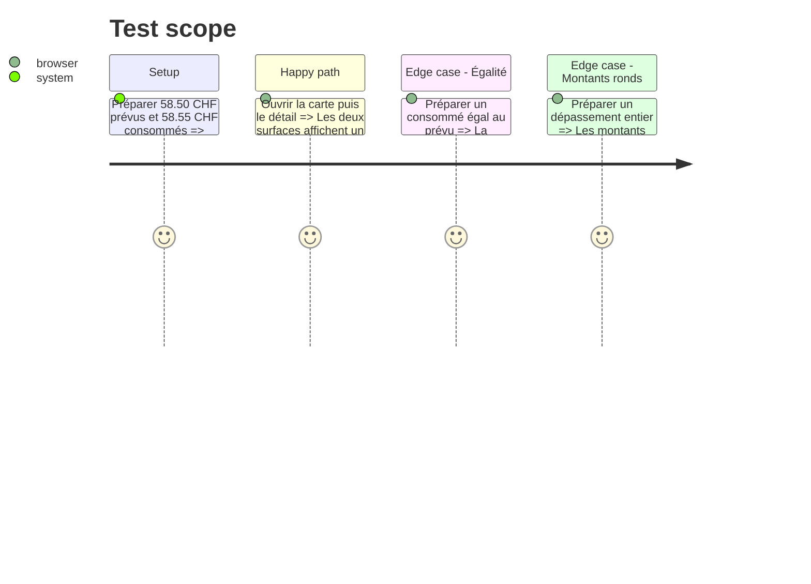

# Instruction: Aligner l'état et la précision des résumés de consommation Web

## Architecture projection

> Tree of the final files. ✅ create · ✏️ modify · ❌ delete

```txt
.
├── .claude/rules/03-frameworks-and-libraries/
│   └── ✏️ webapp-currency-formatting.md
└── frontend/projects/webapp/src/app/feature/budget/budget-details/
    ├── view-models/
    │   ├── ✏️ budget-item-constants.ts
    │   ├── ✏️ budget-item-constants.spec.ts
    │   └── ✏️ budget-item-data-builder.ts
    ├── components/
    │   ├── budget-grid/
    │   │   ├── ✏️ budget-grid-card.ts
    │   │   ├── ✏️ budget-grid-mobile-card.ts
    │   │   ├── ✏️ budget-grid.spec.ts
    │   │   ├── ✏️ budget-detail-panel.ts
    │   │   └── ✏️ budget-detail-panel.spec.ts
    │   └── budget-table/
    │       ├── ✏️ budget-table.ts
    │       └── cells/
    │           └── ✏️ remaining-cell.ts
    └── allocated-transactions/details-dialog/
        ├── ✏️ dialog.ts
        ├── ✏️ bottom-sheet.ts
        └── ✏️ bottom-sheet.spec.ts

# ✅ Aucun fichier d'implémentation à créer.
# ❌ Aucun fichier d'implémentation à supprimer.
```

## User Journey



## Test Scope



## Wireframe

```txt
┌──────────────────────────────────────┐
│ (1) En-tête de la prévision          │
│ (2) Montant disponible               │
│ (3) Progression                      │
│ (4) Consommé · état / dépassement    │
│ (5) Métadonnées · actions            │
└──────────────────────────────────────┘

┌──────────────────────────────────────┐
│ (6) En-tête du détail                │
├──────────────────────────────────────┤
│ (7) Prévu · consommé · disponible    │
│     Progression · état               │
├──────────────────────────────────────┤
│ (8) Liste des mouvements             │
└──────────────────────────────────────┘

1. En-tête : identité de la prévision et menu associé.
2. Montant disponible : solde dérivé principal de la prévision.
3. Progression : repère de consommation de l'enveloppe.
4. Résumé : montant consommé et état financier lisibles ensemble.
5. Métadonnées : cadence, provenance, pointage et actions.
6. En-tête du détail : identité et actions de la prévision ouverte.
7. Synthèse : les trois montants comparables et leur état partagé.
8. Mouvements : valeurs individuelles qui composent le consommé.
```

## Tasks to do

### `1)` Une seule vérité pour l'état de dépassement

> Déduire l'état et le message de dépassement des montants exacts, pas d'un pourcentage déjà arrondi.

1. Faire évoluer le view-model existant pour qu'une dépense soit « dépassée » dès que `consumed > planned`, y compris lorsque le pourcentage arrondi vaut 100.
2. Réutiliser `consumptionProgressMessage` sur les cartes et le détail au lieu de maintenir deux décisions concurrentes.
3. Conserver les formules, les montants source et la logique backend inchangés.

### `2)` Rendre visible toute différence qui porte un état

> Afficher les centimes seulement lorsqu'ils contiennent une information non nulle.

1. Utiliser le format adaptatif existant `'1.0-2'` pour `consumed`, `remaining` et `exceededBy` dans les cartes, la table et les variantes de détail.
2. Garder les montants ronds sans décimales et les mouvements individuels à deux décimales.
3. Documenter cette exception ciblée dans la règle monétaire Web.

### `3)` Verrouiller la régression observée

> Couvrir le cas réel et les seuils voisins avec les tests existants.

1. Ajouter le scénario `58.50` prévu / `58.55` consommé au test du view-model.
2. Vérifier sur la carte et le détail les chaînes `-0.05 CHF` et `Dépassé de 0.05 CHF`, et l'absence de `Dépassé de 0 CHF`.
3. Conserver un scénario d'égalité exacte et un dépassement entier pour protéger les deux branches et l'affichage calme des montants ronds.

## Test acceptance criteria

| Task    | Acceptance criteria                                                                                                                                            |
| ------- | -------------------------------------------------------------------------------------------------------------------------------------------------------------- |
| 1       | Une prévision à `58.50 CHF` consommée à `58.55 CHF` porte le même état « dépassé » sur la carte, la table et le détail, même si le ratio arrondi vaut `100 %`. |
| 2       | Ce scénario affiche `-0.05 CHF` disponible et `Dépassé de 0.05 CHF` ; aucune surface ne rend une différence non nulle sous la forme `0 CHF`.                   |
| 2       | Les montants entiers restent sans décimales et les mouvements individuels conservent deux décimales.                                                           |
| 3       | À consommation exactement égale au prévu, l'interface affiche `100 % utilisé` et aucun dépassement.                                                            |
| 1, 2, 3 | Les calculs métier, les données persistées, le backend et iOS ne sont pas modifiés.                                                                            |
