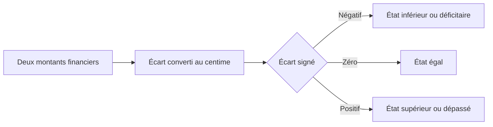
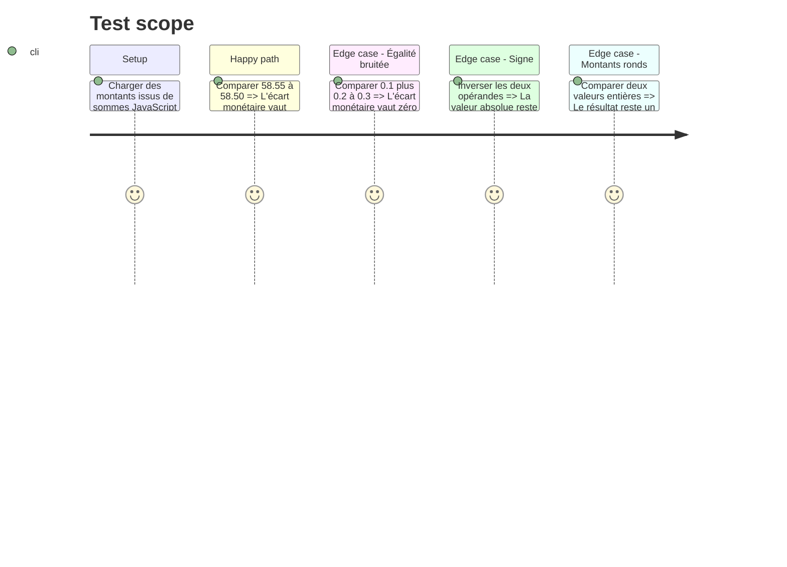

# Instruction: Poser le contrat de comparaison monétaire au centime

## Architecture projection

> Tree of the final files. ✅ create · ✏️ modify · ❌ delete

```txt
.
├── docs/
│   └── ✏️ BUSINESS_RULES.md
└── shared/
    ├── ✏️ index.ts
    └── src/
        ├── ✅ money.ts
        └── ✅ money.spec.ts

# ❌ Aucun fichier d'implémentation à supprimer.
```

## User Journey



## Test Scope



## Tasks to do

### `1)` Fournir une seule primitive monétaire partagée

> Exposer l'écart signé entre deux montants, quantifié à deux décimales.

1. Créer une fonction pure minimale dans `shared/src/money.ts`, basée sur les centimes et sans dépendance externe.
2. Exporter uniquement cette primitive depuis `shared/index.ts` ; les appels décident ensuite avec `< 0`, `=== 0` ou `> 0`.
3. Refuser les helpers redondants `isZero`, `isPositive` ou `compare` tant que la primitive couvre les usages réels.

### `2)` Écrire le contrat produit

> Séparer explicitement précision de décision et précision d'affichage.

1. Ajouter à `docs/BUSINESS_RULES.md` la règle « décision au centime, présentation selon le rôle du montant ».
2. Nommer les arrondis intentionnels à conserver : pourcentages, agrégats de scan, FX, lissage et mensualité arrondie au supérieur.
3. Préciser que les montants persistés et chiffrés ne changent pas.

### `3)` Verrouiller les frontières numériques

> Couvrir le plus petit jeu de valeurs qui distingue poussière binaire et vrai centime.

1. Tester égalité bruitée, écart positif, écart négatif, zéro signé et montants entiers.
2. Ajouter un cas CHF/EUR sans paramétrage de devise : les deux devises prises en charge ont deux décimales.
3. Garder les tests des répartitions et conversions existantes inchangés pour détecter toute dérive involontaire.

## Test acceptance criteria

| Task | Acceptance criteria                                                                                                              |
| ---- | -------------------------------------------------------------------------------------------------------------------------------- |
| 1    | `0.1 + 0.2` et `0.3` sont monétairement égaux ; aucun état ne peut naître de leur seule poussière binaire.                       |
| 1    | `58.55` comparé à `58.50` produit `0.05`, et l'ordre inverse produit `-0.05`.                                                    |
| 2    | La règle distingue sans ambiguïté décision au centime, affichage adaptatif et agrégat compact.                                   |
| 3    | Les tests partagés passent sans nouvelle dépendance et sans changement des résultats de lissage, de conversion ou de mensualité. |
