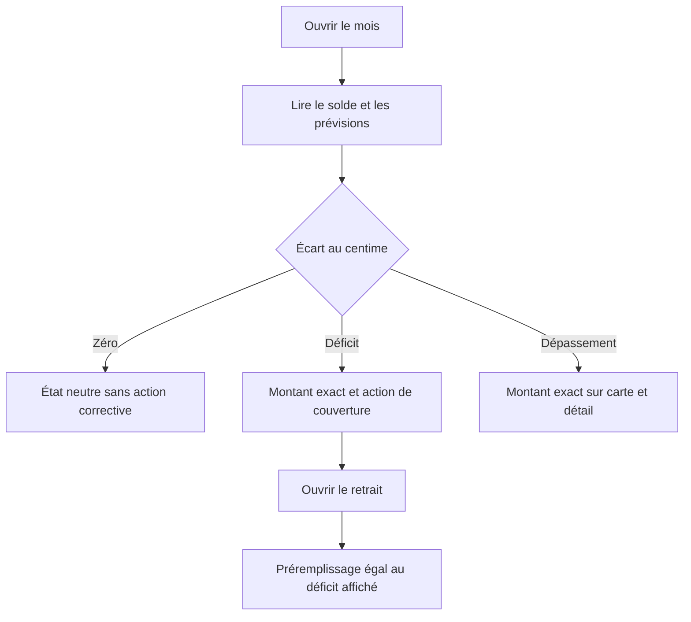
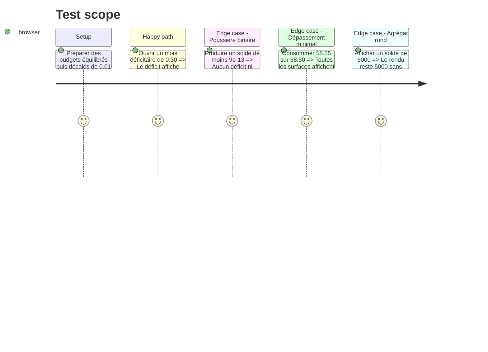

# Instruction: Corriger les états budgétaires et les actions Web

## Architecture projection

> Tree of the final files. ✅ create · ✏️ modify · ❌ delete

```txt
.
├── .claude/rules/03-frameworks-and-libraries/
│   └── ✏️ webapp-currency-formatting.md
└── frontend/projects/webapp/src/app/
    ├── feature/
    │   ├── budget/budget-details/
    │   │   ├── ✏️ budget-details-dialog.service.ts
    │   │   ├── ✏️ budget-details-dialog.service.spec.ts
    │   │   ├── store/
    │   │   │   ├── ✏️ budget-details-store.ts
    │   │   │   └── ✏️ budget-details-store-savings-withdrawal.spec.ts
    │   │   ├── view-models/
    │   │   │   ├── ✏️ budget-item-constants.ts
    │   │   │   └── ✏️ budget-item-constants.spec.ts
    │   │   └── budget-line/savings-withdrawal/
    │   │       ├── ✏️ dialog.ts
    │   │       └── ✅ dialog.spec.ts
    │   ├── complete-profile/
    │   │   ├── ✏️ complete-profile-page.ts
    │   │   └── ✏️ complete-profile-page.spec.ts
    │   └── current-month/
    │       ├── services/
    │       │   ├── ✏️ dashboard-store.ts
    │       │   └── ✏️ dashboard-store.spec.ts
    │       └── components/
    │           ├── ✏️ dashboard-savings-summary.ts
    │           └── ✏️ dashboard-savings-summary.spec.ts
    └── ui/
        ├── budget-financial-overview/
        │   ├── ✏️ budget-financial-overview.ts
        │   └── ✏️ budget-financial-overview.spec.ts
        └── dashboard-hero/
            ├── ✏️ dashboard-hero.ts
            └── ✏️ dashboard-hero.spec.ts

# ❌ Aucun fichier d'implémentation à supprimer.
```

## User Journey



## Test Scope



## Wireframe

```txt
┌─────────────────────────────────────────┐
│ (1) Solde du mois · état                │
│     (2) Montant qui justifie l'état     │
│     (3) Action corrective éventuelle    │
├─────────────────────────────────────────┤
│ (4) Prévisions                          │
│  ┌───────────────────────────────────┐  │
│  │ (5) Disponible · progression      │  │
│  │ (6) Consommé · état exact         │  │
│  └───────────────────────────────────┘  │
└─────────────────────────────────────────┘

┌─────────────────────────────────────────┐
│ (7) Retrait depuis l'épargne            │
│ (8) Déficit exact · appliquer           │
│ (9) Montant · source · aperçu           │
└─────────────────────────────────────────┘

1. Solde : verdict du mois calculé à la précision monétaire.
2. Montant : 0 à 2 décimales selon la valeur réellement portée.
3. Action : visible seulement pour un déficit d'au moins un centime.
4. Prévisions : mêmes décisions sur carte, table et détail.
5. Progression : pourcentage indicatif, jamais arbitre de l'état.
6. État exact : différence au centime, sans faux zéro.
7. Retrait : résolution du déficit courant ou futur.
8. Déficit : valeur affichée, préremplie et envoyée identique.
9. Formulaire : saisie et plafond restent exacts à deux décimales.
```

## Tasks to do

### `1)` Centraliser les décisions budgétaires sur l'écart monétaire

> Remplacer les comparaisons brutes ou les pourcentages arrondis aux points qui décident d'un état.

1. Réutiliser la primitive partagée dans le view-model de consommation, les soldes du dashboard et l'onboarding.
2. Faire dépendre « dépassé », « déficit », « plan trop élevé », « mois terminé » et les tons associés de cet écart.
3. Conserver les pourcentages entiers pour les barres et libellés, sans leur rendre le pouvoir de décision.

### `2)` Rendre les montants d'état visibles au centime

> Appliquer le format Web adaptatif existant, sans modifier les totaux de lecture rapide.

1. Passer à `'1.0-2'` le solde qui porte le verdict, le dépassement et le déficit actionnable.
2. Garder à `'1.0-0'` les pills, reports secondaires et totaux sans branche métier ; conserver les lignes unitaires à deux décimales.
3. Aligner le texte accessible sur la même valeur que le texte visible.

### `3)` Préremplir et envoyer le déficit exact

> Ne plus transformer un déficit de `0.30` en `0` ni un déficit de `197.40` en `197`.

1. Produire `savingsWithdrawalDeficit` au centime et masquer l'action uniquement lorsque l'écart monétaire vaut zéro.
2. Afficher le chip en précision adaptative et copier exactement sa valeur dans le champ.
3. Vérifier que la conversion éventuelle reste arrondie par le service FX existant, une seule fois à sa frontière.

### `4)` Ajouter les régressions Web minimales

> Couvrir chaque producteur central plutôt que chaque template qui le consomme.

1. Étendre les specs du view-model, du store et des deux héros avec `0.01`, `0.05`, `0.30`, poussière binaire et montant rond.
2. Créer le test ciblé du dialogue de retrait pour l'égalité affiché / prérempli.
3. Vérifier CHF et EUR afin de protéger le séparateur localisé autant que la valeur.

## Test acceptance criteria

| Task | Acceptance criteria                                                                                                                   |
| ---- | ------------------------------------------------------------------------------------------------------------------------------------- |
| 1    | Une égalité monétaire bruitée n'active ni dépassement, ni déficit, ni état « plan trop élevé ».                                       |
| 1, 2 | Une différence de `0.01` active l'état attendu et s'affiche `0.01 CHF` ou `0,01 €` sur toute surface qui le justifie.                 |
| 2    | Les agrégats ronds, reports secondaires et pourcentages conservent leur rendu compact actuel.                                         |
| 3    | Le déficit affiché dans le mois, proposé dans le chip, copié dans le champ et envoyé par le formulaire est la même valeur au centime. |
| 4    | Les tests Web ciblés couvrent les deux devises, le cas PUL-335, un vrai petit déficit et un résidu IEEE-754 sans état parasite.       |
