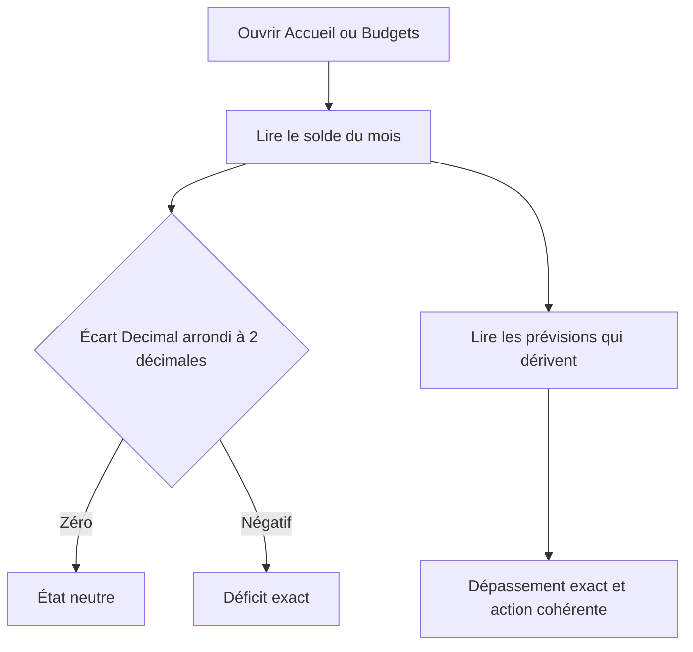
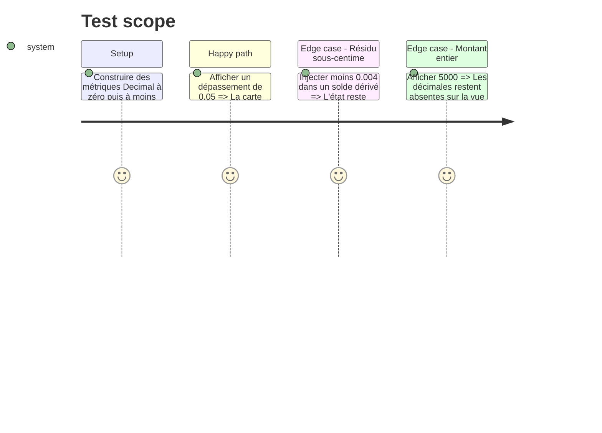

# Instruction: Aligner les états budgétaires iOS et les formules miroirs

## Architecture projection

> Tree of the final files. ✅ create · ✏️ modify · ❌ delete

```txt
.
├── shared/src/calculators/
│   ├── ✏️ budget-formulas.ts
│   └── ✏️ budget-formulas.spec.ts
└── ios/
├── Pulpe/
│   ├── Domain/Formulas/
│   │   └── ✏️ BudgetFormulas.swift
│   └── Features/
│       ├── Budgets/
│       │   ├── BudgetDetails/
│       │   │   ├── ✏️ BudgetDetailHero.swift
│       │   │   └── SavingsWithdrawal/
│       │   │       └── ✏️ TightMonthCard.swift
│       │   └── BudgetList/
│       │       └── ✏️ BudgetListView+Subviews.swift
│       ├── Onboarding/Steps/
│       │   └── ✏️ BudgetPreviewHero.swift
│       └── CurrentMonth/Components/
│           ├── ✏️ BudgetSection.swift
│           ├── ✏️ DriftCard.swift
│           ├── ✏️ HeroBalanceCard.swift
│           ├── ✏️ HomeHeroCard.swift
│           └── ✏️ HomeHeroCard+Chart.swift
└── PulpeTests/
    ├── Domain/Formulas/
    │   └── ✏️ BudgetFormulasExtendedTests.swift
    ├── Features/Budgets/BudgetDetails/
    │   ├── ✏️ BudgetLinePresentationTests.swift
    │   └── ✏️ SavingsWithdrawalCardGateTests.swift
    ├── Features/Budgets/
    │   └── ✏️ BudgetListAccessibilityTests.swift
    ├── Features/CurrentMonth/
    │   └── ✏️ HomeHeroCardTests.swift
    └── Features/Onboarding/
        └── ✏️ OnboardingStateTests.swift

# ✅ Aucun fichier d'implémentation à créer.
# ❌ Aucun fichier d'implémentation à supprimer.
```

## User Journey



## Test Scope



## Wireframe

```txt
┌──────────────────────────────────────┐
│ (1) Solde estimé · état              │
│ (2) Écart par rapport au plan        │
│ (3) Graphique du mois                │
├──────────────────────────────────────┤
│ (4) Carte des prévisions en dérive   │
│ (5) Dépassement par prévision        │
│ (6) Action d'ajustement              │
└──────────────────────────────────────┘

1. Solde : précision adaptative lorsqu'il porte le verdict.
2. Écart : signe et centimes cohérents avec le ton de la carte.
3. Graphique : annotations alignées sur le même montant.
4. Dérive : total exact si un état de dérive est affiché.
5. Ligne : aucun dépassement non nul ne devient zéro.
6. Action : reprend la même valeur que le résumé.
```

## Tasks to do

### `1)` Quantifier les états Decimal à deux décimales

> Utiliser `Decimal.rounded(2)` déjà disponible aux producteurs d'état.

1. Aligner les sorties de `BudgetFormulas` TypeScript et Swift, puis `isDeficit`, l'état émotionnel et la carte de retrait sur le solde quantifié.
2. Quantifier les écarts du hero et du verdict de trajectoire avant de choisir signe, ton ou texte.
3. Ne pas ajouter de second helper Swift tant que `rounded(2)` couvre directement les appels.

### `2)` Afficher adaptativement les montants qui justifient un état

> Réutiliser `asAdaptiveAmount` et `asAdaptiveCurrency` existants.

1. Corriger les soldes déficitaires, dépassements de prévision et écarts au plan dans Accueil, Budgets et la carte « dérive ».
2. Aligner les libellés VoiceOver sur les valeurs visibles.
3. Conserver `asCompactCurrency` pour les cibles et totaux purement contextuels qui ne déclenchent ni état ni action.

### `3)` Verrouiller la parité avec le cas Web

> Rejouer les mêmes fixtures métier dans Swift Testing.

1. Ajouter `58.50 / 58.55`, `-0.01`, `-0.004`, zéro et montant entier aux tests TypeScript et Swift existants.
2. Vérifier que la carte de retrait suit le même seuil que le hero.
3. Vérifier les chaînes CHF et EUR avec le format adaptatif déjà testé par `DecimalCurrencyFormattingTests`.

## Test acceptance criteria

| Task | Acceptance criteria                                                                                                           |
| ---- | ----------------------------------------------------------------------------------------------------------------------------- |
| 1    | Un résidu inférieur au centime n'altère ni `isDeficit`, ni le ton, ni la visibilité de la carte de retrait.                   |
| 1, 2 | Un déficit ou dépassement réel de `0.01` reste visible et porte le même état dans Accueil, la liste des budgets et le détail. |
| 2    | Les valeurs entières restent compactes ; les libellés accessibles et visibles annoncent la même valeur.                       |
| 3    | Les fixtures `58.50 / 58.55` et d'égalité sont présentes sur Web et iOS avec le même verdict.                                 |
