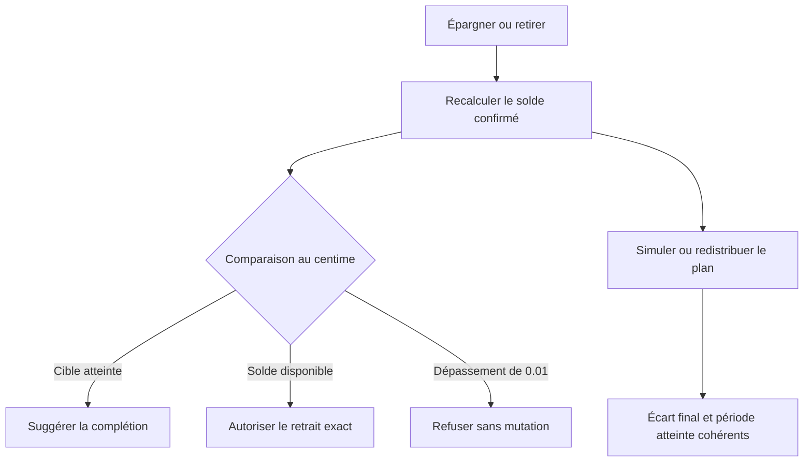
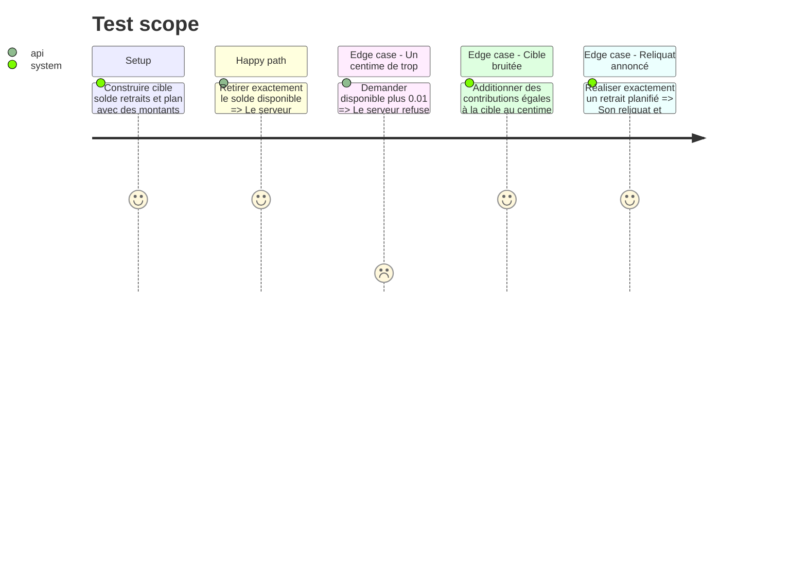

# Instruction: Sécuriser les décisions métier des objectifs et retraits

## Architecture projection

> Tree of the final files. ✅ create · ✏️ modify · ❌ delete

```txt
.
├── docs/
│   └── ✏️ SAVINGS.md
├── shared/
│   ├── ✏️ index.ts
│   └── src/calculators/
│       ├── ✏️ index.ts
│       ├── ✏️ savings-goal-progress.ts
│       ├── ✏️ savings-goal-progress.spec.ts
│       ├── ✏️ savings-goal-plan.ts
│       └── ✏️ savings-goal-plan.spec.ts
├── backend-nest/src/modules/savings-goal/application/
│   ├── ✏️ savings-goal-withdrawal-policy.service.ts
│   ├── ✏️ savings-goal-withdrawal-policy.service.spec.ts
│   ├── ✏️ get-savings-goal-withdrawal-options.use-case.ts
│   ├── ✏️ get-savings-goal-withdrawal-options.use-case.spec.ts
│   ├── ✏️ get-savings-goal-withdrawals.use-case.ts
│   ├── ✏️ get-savings-goal-withdrawals.use-case.spec.ts
│   ├── ✏️ apply-savings-goal-plan.use-case.ts
│   └── ✏️ apply-savings-goal-plan.use-case.spec.ts
└── ios/
    ├── Pulpe/Domain/
    │   ├── Formulas/
    │   │   └── ✏️ SavingsPlanCalculator.swift
    │   └── Models/
    │       └── ✏️ SavingsGoalProgress.swift
    └── PulpeTests/Domain/Formulas/
        ├── ✏️ SavingsPlanCalculatorTests.swift
        ├── ✏️ SavingsPlanCalculatorWithdrawalTests.swift
        └── ✏️ SavingsPlanSuggestedContributionTests.swift

# ✅ Aucun fichier d'implémentation à créer.
# ❌ Aucun fichier d'implémentation à supprimer.
```

## User Journey



## Test Scope



## Tasks to do

### `1)` Remplacer la tolérance flottante par le contrat monétaire

> Utiliser l'écart au centime pour les soldes, reliquats et plafonds de retrait.

1. Faire converger `remainingPlannedWithdrawal`, les options de retrait, la policy serveur et l'application du plan sur la même comparaison.
2. Supprimer `WITHDRAWAL_BALANCE_TOLERANCE` une fois tous ses consommateurs migrés ; ne pas conserver deux seuils concurrents.
3. Garantir qu'un retrait exact est accepté et qu'un centime de trop est refusé.

### `2)` Aligner atteinte de cible et simulation

> Décider `suggestCompletion`, `isTargetMet` et `attainedPeriod` avec la précision monétaire.

1. Quantifier les comparaisons `confirmed / targetAmount` et `simulatedFinal / targetAmount` sans modifier les pourcentages de rythme à ±5 %.
2. Produire `gapToTarget`, reliquats et effort restant au centime avant de les borner à zéro.
3. Conserver la redistribution au plus grand reste et l'arrondi supérieur de `suggestedMonthlyContribution` tels quels.

### `3)` Mirrorer les formules Swift

> Appliquer les mêmes seuils aux calculateurs iOS dans la même phase.

1. Utiliser les opérations `Decimal` existantes à deux décimales pour cible, reliquat et retrait.
2. Ajouter les mêmes valeurs limites aux specs TypeScript et aux tests Swift.
3. Vérifier que chaque formule listée dans la règle de miroir reste sémantiquement identique.

### `4)` Conserver l'autorité et l'atomicité backend

> Ne toucher qu'à la comparaison précédant les mutations.

1. Garder le serveur arbitre du plafond et les RPC atomiques inchangées.
2. Tester l'absence d'écriture au refus et l'acceptation du retrait exact malgré une somme JavaScript bruitée.
3. Ne modifier ni schéma SQL, ni chiffrement, ni DTO.

## Test acceptance criteria

| Task | Acceptance criteria                                                                                                                       |
| ---- | ----------------------------------------------------------------------------------------------------------------------------------------- |
| 1, 4 | Le retrait du solde exact est accepté ; le même montant augmenté de `0.01` est refusé sans mutation partielle.                            |
| 1, 2 | Un retrait planifié entièrement réalisé laisse exactement zéro de reliquat et ne gonfle ni projection ni redistribution.                  |
| 2    | Une cible couverte au centime est atteinte ; une cible à laquelle il manque `0.01` ne l'est pas, même si le pourcentage affiché vaut 100. |
| 2, 3 | `gapToTarget`, `isTargetMet`, `attainedPeriod` et l'effort redistribué ont les mêmes résultats dans les fixtures TypeScript et Swift.     |
| 4    | Aucun fichier de migration, schéma, DTO ou chiffrement n'est modifié.                                                                     |
