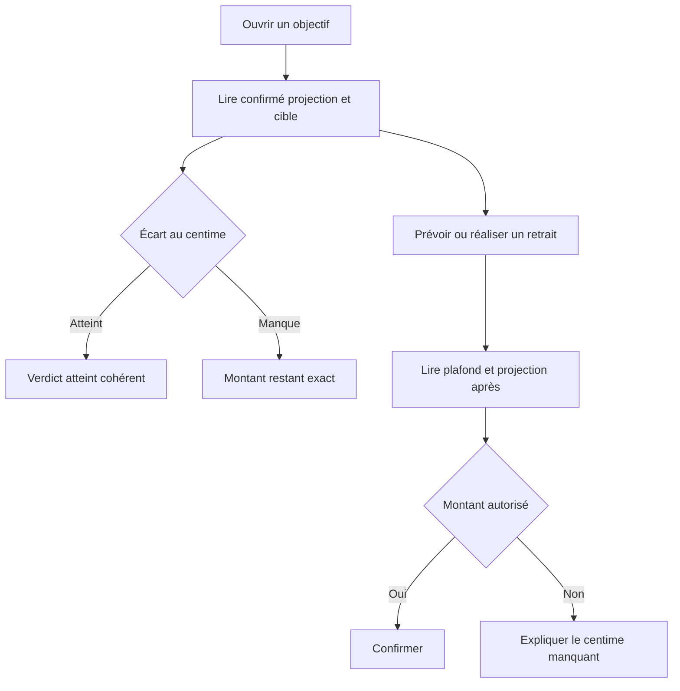
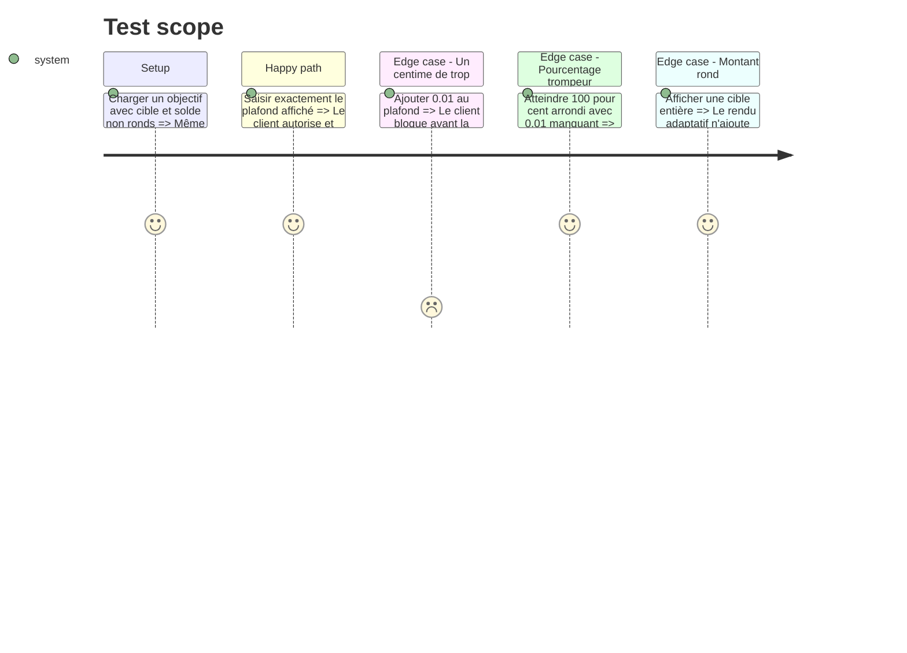

# Instruction: Aligner les parcours objectifs et retraits sur les deux clients

## Architecture projection

> Tree of the final files. ✅ create · ✏️ modify · ❌ delete

```txt
.
├── frontend/projects/webapp/src/app/
│   ├── pattern/savings-goal-picker/
│   │   ├── ✏️ savings-goal-picker-field.ts
│   │   └── ✏️ savings-goal-picker-field.spec.ts
│   └── feature/savings-goals/
│       ├── components/
│       │   ├── ✏️ savings-goal-form-dialog.ts
│       │   └── ✏️ savings-goal-form-dialog.spec.ts
│       └── detail/
│           ├── ✏️ savings-goal-detail-page.ts
│           ├── ✏️ savings-goal-detail-page.spec.ts
│           ├── services/
│           │   ├── ✏️ goal-plan-simulator-store.ts
│           │   └── ✏️ goal-plan-simulator-store.spec.ts
│           └── components/
│               ├── ✏️ goal-plan-apply-dialog.ts
│               ├── ✏️ goal-plan-apply-dialog.spec.ts
│               ├── ✏️ goal-plan-timeline.ts
│               └── ✏️ goal-plan-timeline.spec.ts
└── ios/
    ├── Pulpe/
    │   ├── Shared/Components/
    │   │   ├── ✏️ SavingsGoalPickerField.swift
    │   │   └── ✏️ SavingsGoalPlannedWithdrawalPicker.swift
    │   └── Features/SavingsGoals/
    │       ├── ✏️ SavingsGoalDetailView.swift
│       ├── Components/
│       │   ├── ✏️ GoalProgressCard.swift
│       │   ├── ✏️ GoalProjectionChart.swift
│       │   └── ✏️ GoalPlanMonthRow.swift
    │       └── Simulator/
    │           └── ✏️ GoalPlanSimulatorSheet.swift
    └── PulpeTests/
        ├── Shared/Components/
        │   ├── ✏️ SavingsGoalPickerFieldTests.swift
        │   └── ✏️ SavingsGoalPlannedWithdrawalPickerTests.swift
        └── Features/SavingsGoals/
            ├── ✏️ GoalPlanSimulatorTests.swift
            ├── ✏️ GoalPlanTimelinePresentationTests.swift
            └── ✏️ SavingsGoalDetailViewModelTests.swift

# ✅ Aucun fichier d'implémentation à créer.
# ❌ Aucun fichier d'implémentation à supprimer.
```

## User Journey



## Test Scope



## Wireframe

```txt
┌────────────────────────────────────────┐
│ (1) Objectif · statut                  │
│ (2) Confirmé · projection · cible      │
│ (3) Verdict et écart exact             │
├────────────────────────────────────────┤
│ (4) Plan mensuel                       │
│ (5) Simulation avant / après           │
└────────────────────────────────────────┘

┌────────────────────────────────────────┐
│ (6) Choix de l'objectif                │
│ (7) Solde ou projection disponible     │
│ (8) Montant du retrait                 │
│ (9) Solde après · validation           │
└────────────────────────────────────────┘

1. Statut : dérivé du montant, jamais du seul pourcentage.
2. Synthèse : valeurs comparables avec la même précision.
3. Verdict : le centime manquant ou excédentaire reste visible.
4. Plan : montants mensuels et reliquats exacts.
5. Simulation : avant, après et écart final cohérents.
6. Choix : objectif et plafond actionnable.
7. Disponible : affichage adaptatif réutilisable tel quel.
8. Saisie : maximum identique au serveur.
9. Après : état informatif ou bloquant selon le parcours.
```

## Tasks to do

### `1)` Aligner les validations client sur le serveur

> Utiliser le même écart monétaire pour les retraits réels et planifiés.

1. Remplacer la tolérance locale du picker Web par la primitive partagée.
2. Appliquer le même seuil dans les pickers Swift avec `Decimal.rounded(2)`.
3. Vérifier que plafond affiché, validation, preview et payload décrivent la même valeur.

### `2)` Corriger les verdicts et simulations de présentation

> Ne pas laisser un pourcentage ou une valeur brute contredire les formules de phase 4.

1. Aligner formulaire d'objectif, page détail, simulateur et dialogue d'application sur les résultats monétaires partagés.
2. Traiter un centime manquant comme non atteint et un résidu sous-centime comme zéro.
3. Conserver le statut de rythme à ±5 % et ses pourcentages existants.

### `3)` Afficher adaptativement les écarts actionnables

> Montrer les centimes pour plafonds, manques, excédents et projections qui guident une saisie.

1. Réutiliser `'1.0-2'` sur Web et `asAdaptiveCurrency` sur iOS.
2. Garder les cibles de contexte, axes de graphiques et cumuls de scan compacts quand ils ne portent aucun état contradictoire.
3. Aligner les descriptions accessibles sur les mêmes valeurs.

### `4)` Verrouiller la parité client

> Rejouer le même tableau de cas limites des deux côtés.

1. Couvrir plafond exact, plafond + `0.01`, cible - `0.01`, cible exacte, résidu sous-centime et montant rond.
2. Vérifier que les deux clients envoient le montant saisi sans nouvel arrondi local après validation.
3. Vérifier qu'une erreur serveur de solde reste gérée, même si le pré-contrôle client est aligné.

## Test acceptance criteria

| Task | Acceptance criteria                                                                                                                     |
| ---- | --------------------------------------------------------------------------------------------------------------------------------------- |
| 1    | Web et iOS autorisent le plafond exact, bloquent `+0.01` et conservent le serveur comme autorité finale.                                |
| 2    | Une cible à `0.01` de son but n'est pas annoncée atteinte, même si son pourcentage visuel vaut 100.                                     |
| 3    | Tout manque, plafond ou projection qui guide une action montre jusqu'à deux décimales ; une valeur ronde reste sans décimales inutiles. |
| 4    | Les fixtures jumelles produisent le même verdict, la même valeur après retrait et le même payload normalisé sur les deux clients.       |
