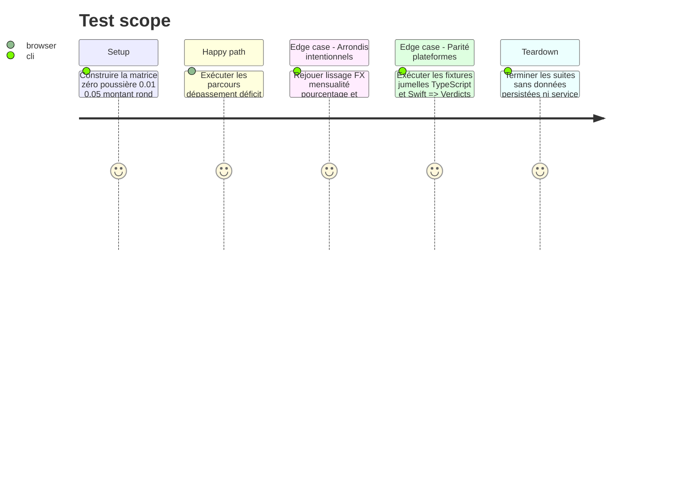

# Instruction: Prouver la non-régression transversale

## Architecture projection

> Tree of the final files. ✅ create · ✏️ modify · ❌ delete

```txt
.
└── frontend/e2e/tests/features/
    ├── ✏️ envelope-overage-reste-impact.spec.ts
    ├── ✏️ savings-goal-withdrawals.spec.ts
    └── ✏️ savings-goals-progress.spec.ts

# ✅ Aucun fichier d'implémentation à créer.
# ❌ Aucun fichier d'implémentation à supprimer.
```

## User Journey


## Test Scope



## Tasks to do

### `1)` Étendre les parcours E2E existants

> Tester les incohérences visibles, pas seulement les helpers.

1. Ajouter au parcours de dépassement `58.50 / 58.55`, égalité exacte et égalité bruitée.
2. Ajouter au parcours de retrait un petit déficit dont le montant affiché, prérempli et soumis est identique.
3. Ajouter au parcours d'objectif une cible exacte et une cible manquée de `0.01`.

### `2)` Rejouer la matrice de non-régression numérique

> Vérifier les branches nouvelles et les arrondis explicitement conservés.

1. Exécuter les specs ciblées shared, frontend, backend et Swift avant les suites complètes.
2. Rejouer lissage à somme conservée, conversion FX, mensualité au centime supérieur, pourcentages et agrégats ronds.
3. Exiger un nombre de tests iOS exécutés non nul et la ligne `** TEST SUCCEEDED **`.

### `3)` Passer les portes qualité complètes

> Détecter les régressions de typage, template, architecture, format et lexique.

1. Construire `shared`, la Webapp et le backend.
2. Exécuter `pnpm test`, `pnpm quality`, les E2E ciblés puis la suite `PulpeTests` sur le simulateur dédié.
3. Vérifier `git diff --check` et l'absence de migration, dépendance ou changement de montant persisté.

### `4)` Contrôler les rendus réels

> Vérifier la lisibilité qui ne se prouve pas entièrement dans les tests de chaînes.

1. Inspecter Web mobile et desktop, puis iOS, pour `0`, `0.01`, `0.05`, `0.30`, entier et grand montant.
2. Rejouer CHF et EUR, masquage des montants et VoiceOver / libellés accessibles.
3. Confirmer qu'aucune surface ne combine un état non nul avec `0 CHF` ou `0 €`, et que les agrégats ronds restent calmes.

## Test acceptance criteria

| Task | Acceptance criteria                                                                                                                                           |
| ---- | ------------------------------------------------------------------------------------------------------------------------------------------------------------- |
| 1    | Les trois parcours E2E échouent si un vrai centime disparaît, si une poussière crée un état ou si un montant affiché diffère du montant soumis.               |
| 2    | Les résultats historiques du lissage, de la conversion FX, de la mensualité, des pourcentages et des agrégats intentionnellement compacts restent identiques. |
| 3    | Builds, tests complets, qualité, E2E ciblés et suite iOS passent ; la suite iOS confirme explicitement qu'elle a exécuté des tests.                           |
| 3    | Le diff ne contient ni dépendance, ni migration, ni modification du chiffrement ou des contrats de persistance.                                               |
| 4    | CHF et EUR restent lisibles sur mobile, desktop et iOS ; visible et accessible annoncent la même valeur ; aucun état financier n'est justifié par zéro.       |
