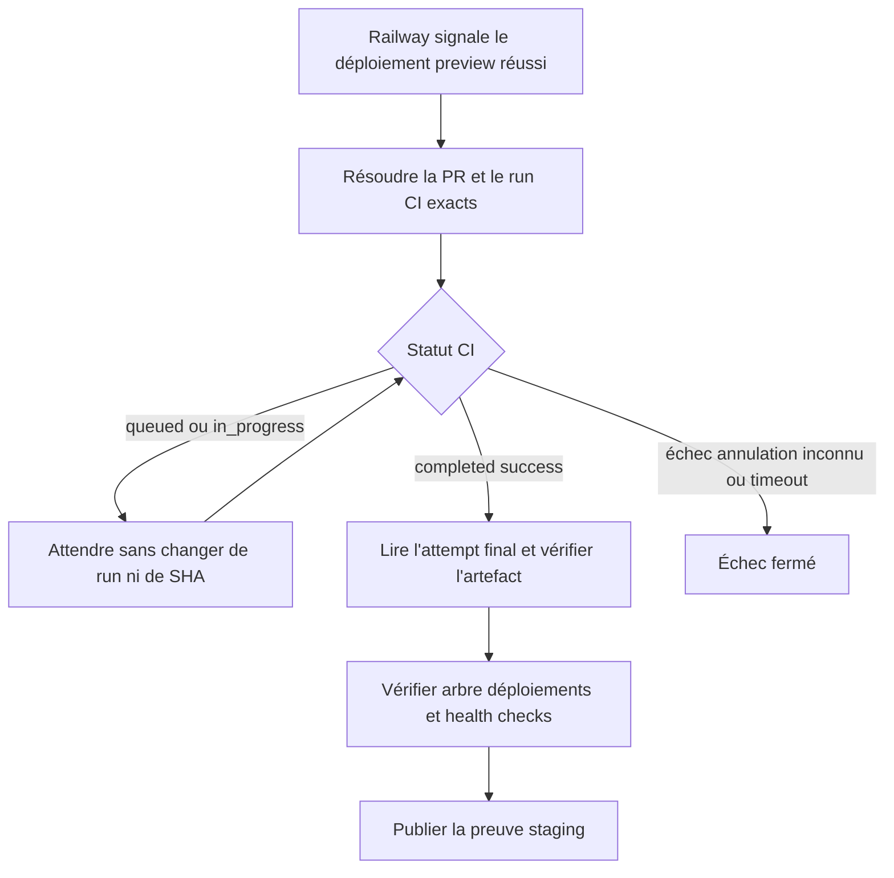
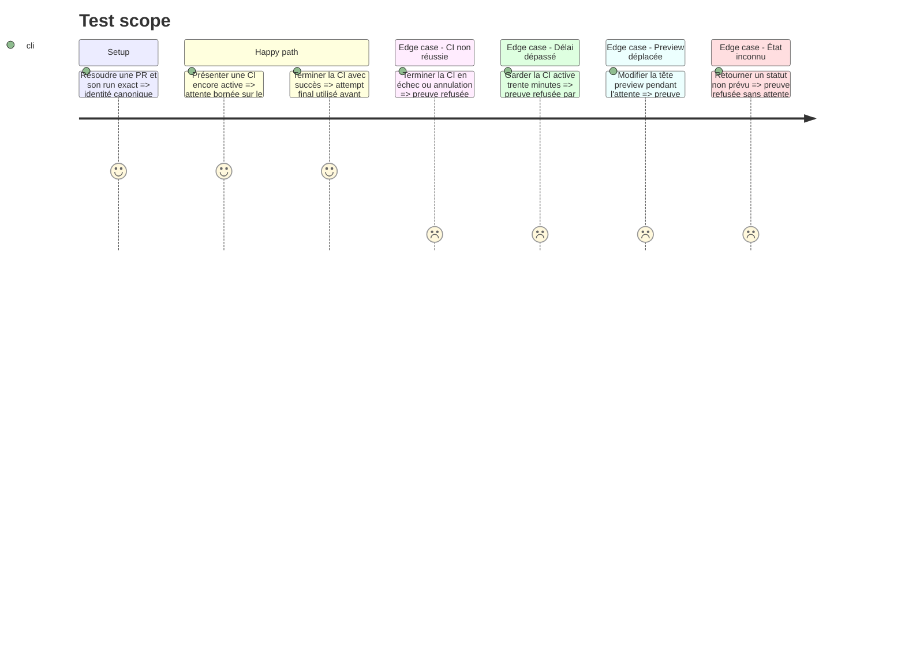

# Instruction: Ajouter l'attente bornée et ses contrats

## Architecture projection

> Tree of the final files. ✅ create · ✏️ modify · ❌ delete

```txt
.
├── .github
│   ├── scripts
│   │   └── ✏️ ci-security.test.mjs
│   └── workflows
│       └── ✏️ staging-proof.yml
├── aidd_docs
│   └── memory
│       └── ✏️ deployment.md
└── docs
    └── ✏️ CI.md
```

## User Journey



## Test Scope



## Tasks to do

### `1)` Attendre le run CI canonique exact

> Résoudre la course sans relancer ni remplacer la CI testée.

1. Conserver les filtres actuels sur workflow, événement, branche, head SHA et dépôt.
2. Écrire le run ID sélectionné dans un fichier temporaire, puis interroger uniquement `actions/runs/<id>` toutes les dix secondes.
3. Attendre au maximum 180 itérations pour les statuts non terminaux explicitement acceptés.
4. Vérifier à chaque attente que `preview` pointe toujours sur `GITHUB_SHA`.
5. Sur `completed`, exiger `conclusion=success` et lire le `run_attempt` depuis la réponse fraîche avant tout téléchargement d'artefact.
6. Échouer sur conclusion non réussie, run absent, état inconnu, erreur API ou délai dépassé.
7. Porter `timeout-minutes` du job de 25 à 55 pour couvrir l'attente CI et la marge fournisseur existante.

### `2)` Verrouiller le comportement par le contrat sécurité

> Faire échouer la qualité si l'attente redevient immédiate, non bornée ou permissive.

1. Adapter le test `Staging Ready` au timeout de 55 minutes.
2. Exiger le polling borné, le rafraîchissement du run exact et le contrôle de `preview` pendant l'attente.
3. Exiger que `conclusion=success` précède le téléchargement de l'artefact et que les états inconnus échouent.
4. Conserver tous les contrats existants d'identité, de déploiement, de permissions et d'actions épinglées.

### `3)` Synchroniser la documentation durable

> Expliquer l'attente sans dupliquer le processus complet de release.

1. Ajouter dans `docs/CI.md` que `Staging Ready` attend la CI canonique lorsqu'un bypass autorisé fusionne une PR encore testée.
2. Ajouter dans `aidd_docs/memory/deployment.md` que cette attente reste bornée et échoue fermée.
3. Ne pas modifier le skill `release` ni `docs/DEPLOYMENT.md`, car l'ordre normal CI puis merge et le contrat de promotion restent inchangés.

### `4)` Vérifier le diff local

> Valider le workflow et ses invariants avant toute mutation distante.

1. Exécuter `actionlint` sur `staging-proof.yml` avec l'exception ShellCheck déjà utilisée par le dépôt.
2. Exécuter `pnpm test:ci-security` puis `pnpm quality`.
3. Vérifier `git diff --check`, l'absence de secret, de nouvelle permission et de changement hors projection.

## Test acceptance criteria

| Task | Acceptance criteria                                                                                                                           |
| ---- | --------------------------------------------------------------------------------------------------------------------------------------------- |
| 1    | Une CI exacte encore active est attendue au plus 30 minutes ; seul son attempt finalement réussi peut alimenter la preuve.                    |
| 1    | Toute CI non réussie, état inconnu, erreur API, timeout ou déplacement de `preview` bloque la preuve.                                         |
| 2    | Le test de sécurité détecte la suppression de la borne, du contrôle de succès, du rafraîchissement d'attempt ou de l'immobilité de `preview`. |
| 3    | La documentation et la mémoire décrivent le bypass toléré sans changer le chemin normal de release.                                           |
| 4    | Actionlint, la sécurité CI, la qualité complète et le contrôle du diff réussissent sans nouvelle dépendance.                                  |
