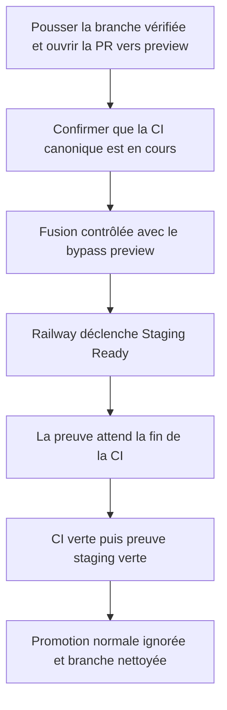
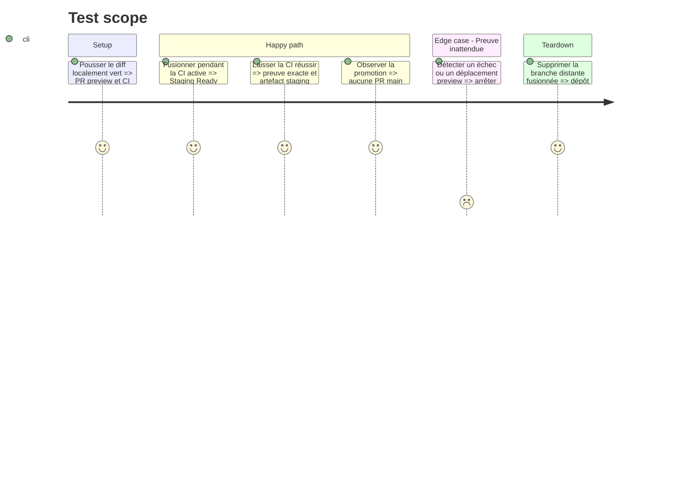

# Instruction: Valider la course réelle et livrer le correctif

## Architecture projection

> Tree of the final files. ✅ create · ✏️ modify · ❌ delete

```txt
.
└── (aucun fichier supplémentaire ; livraison et preuve GitHub uniquement)
```

## User Journey



## Test Scope



## Tasks to do

### `1)` Publier une PR strictement bornée

> Livrer uniquement les quatre fichiers projetés et leurs fichiers de plan déjà présents.

1. Créer un commit conventionnel après les validations locales.
2. Pousser une branche dédiée et ouvrir une PR vers `preview`.
3. Vérifier le diff distant, les permissions du workflow et le démarrage du run CI canonique.

### `2)` Exécuter le canary de la course

> Reproduire volontairement le cas du bypass pour prouver le correctif réel.

1. Après les gates locales vertes, confirmer que la CI distante exacte est encore `queued` ou `in_progress`.
2. Fusionner la PR avec le bypass administrateur limité à `preview`.
3. Vérifier que le nouveau `Staging Ready` reste actif au lieu d'échouer sur `in_progress/None`.
4. Ne fusionner aucune autre PR dans `preview` jusqu'à la conclusion de la preuve.

### `3)` Vérifier les preuves et l'absence d'effet production

> Clore la correction avec des résultats distants observables.

1. Attendre `CI Success`, puis `Staging Ready`, pour le même candidat.
2. Vérifier l'artefact non expiré `staging-proof-<merge-sha>` et l'ordre CI réussie avant preuve.
3. Vérifier que `Release Promotion` termine sans créer de PR vers `main` pour cette branche non-release.
4. Vérifier qu'aucun tag, GitHub Release, workflow production ou mutation de `main` n'a été déclenché.
5. Supprimer la branche distante fusionnée et confirmer que le worktree reste propre.

## Test acceptance criteria

| Task | Acceptance criteria                                                                                                                             |
| ---- | ----------------------------------------------------------------------------------------------------------------------------------------------- |
| 1    | La PR distante ne contient que le workflow, son contrat sécurité, la documentation, la mémoire et les fichiers de plan approuvés.               |
| 2    | Une fusion preview pendant la CI ne produit plus l'échec `in_progress/None` ; la preuve attend le même run exact.                               |
| 3    | Après la CI verte, `Staging Ready` réussit pour le merge SHA exact, publie une preuve non expirée et ne provoque aucune mutation de production. |
