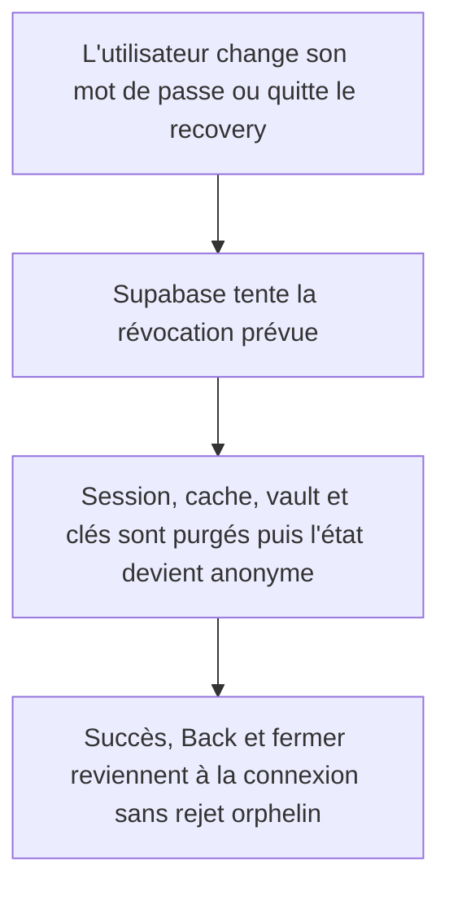
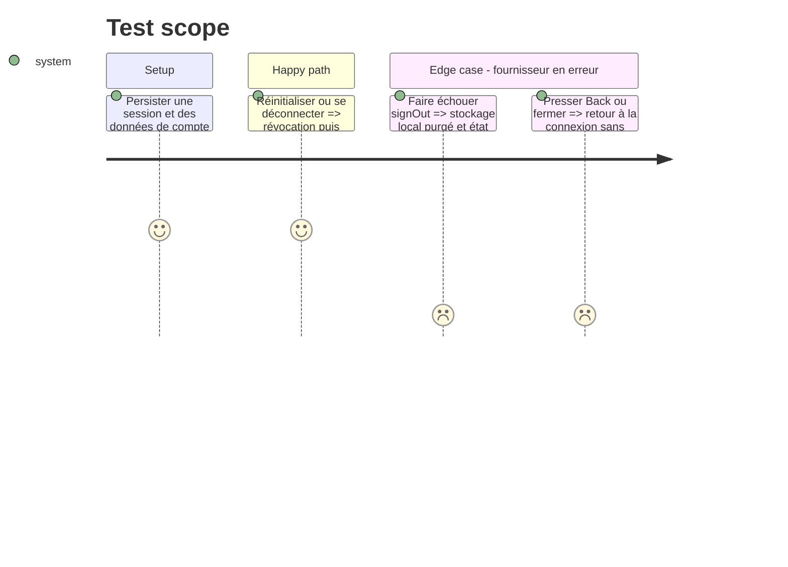

# Instruction: fermer toute session locale de façon déterministe

## Architecture projection

> Tree of the final files. ✅ create · ✏️ modify · ❌ delete

```txt
android/src
├── app/reset-password.tsx ✏️
└── core/auth
    ├── reset-password-route.spec.ts ✏️
    ├── session-store.spec.ts ✏️
    ├── session-store.ts ✏️
    ├── supabase-signout.spec.ts ✅
    └── supabase.ts ✏️
```

## User Journey



## Test Scope



## Tasks to do

### `1)` Garantir le teardown au point commun

1. Faire vérifier à `signOutThisDevice` l'erreur renvoyée par Supabase au lieu de l'ignorer.
2. Dans `signOut` et `endRecoverySession`, exécuter purge du cache, vault, préférences, clés et publication anonyme même si le provider échoue ; conserver l'erreur d'origine sans masquer une erreur locale.
3. Vérifier via l'adaptateur de stockage que la session Supabase persistée est absente avant de considérer le teardown local terminé, sans connaître sa clé interne.

### `2)` Rendre toutes les sorties recovery sûres

1. Sérialiser un seul `endRecoverySession`, et ne solder le marqueur recovery qu'après son teardown local garanti.
2. Attendre ce teardown après `updatePassword` avant l'état `done`; traiter explicitement l'échec de révocation et empêcher une seconde soumission avec un mot de passe déjà changé.
3. Faire consommer le résultat par le bouton fermer, Back Android et le cleanup de lien afin qu'aucun rejet ne soit abandonné pendant la navigation.
4. Couvrir les erreurs retournées/levées, l'effacement du stockage, l'ordre update → teardown → succès et les sorties Back/fermer, puis exécuter la qualité Android.

## Test acceptance criteria

| Task | Acceptance criteria                                                                                                                                     |
| ---- | ------------------------------------------------------------------------------------------------------------------------------------------------------- |
| 1    | Après tout sign-out tenté, aucune session persistée, clé client, donnée vault ou cache du compte ne peut être restauré au prochain lancement.           |
| 2    | Le succès n'apparaît qu'après teardown ; Back, fermer et cleanup aboutissent à la connexion sans rejet non géré ni seconde mise à jour du mot de passe. |
