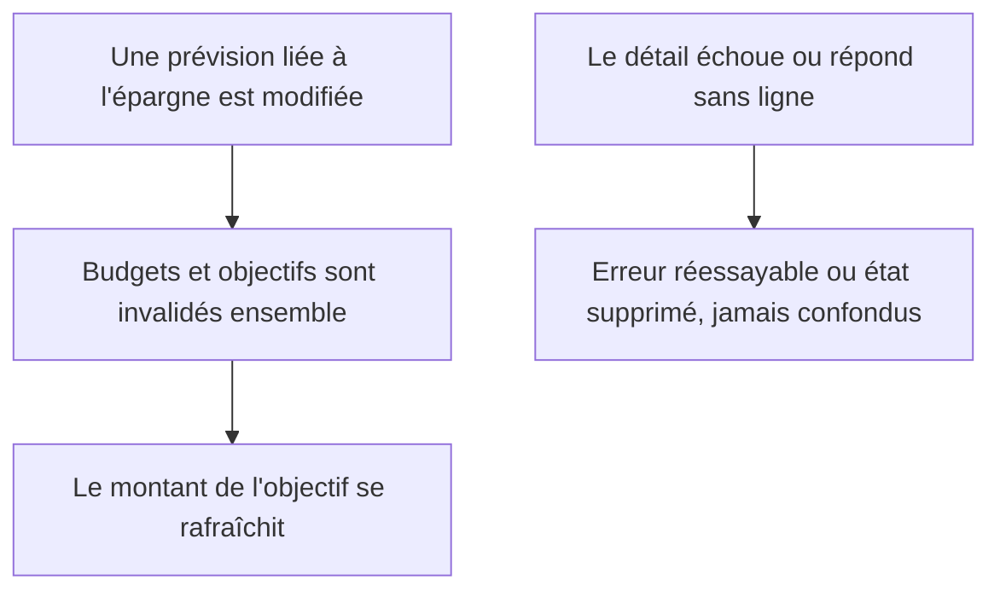
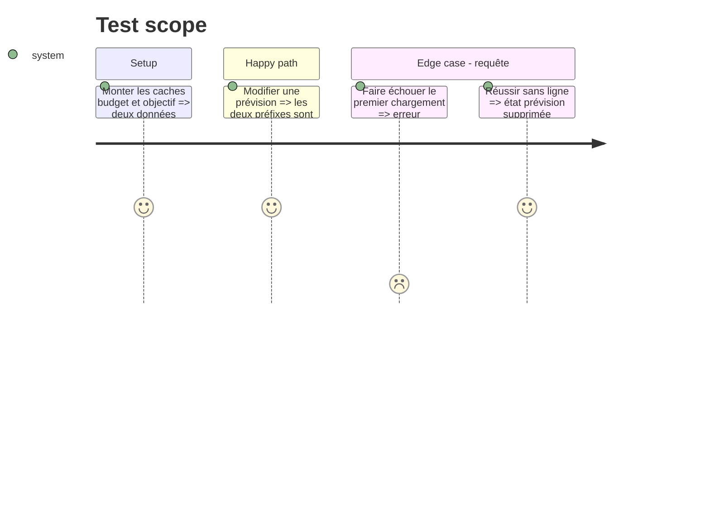

# Instruction: rafraîchir les objectifs et distinguer erreur de donnée absente

## Architecture projection

> Tree of the final files. ✅ create · ✏️ modify · ❌ delete

```txt
android/src
├── app/(main)/budget/[id]/line/[lineId].tsx ✏️
├── core/system/detail-query-states.spec.ts ✏️
└── features
    ├── budget-details/budget-line-mutations.ts ✏️
    └── savings-goals/goal-cache-invalidation.spec.ts ✏️
```

## User Journey



## Test Scope



## Tasks to do

### `1)` Invalider les deux arbres depuis la mutation partagée

1. Ajouter `goalKeys.all` au `onSuccess` commun de `useBudgetDataMutation`, à côté de `budgetKeys.all`.
2. Remplacer le contrat de texte par un test du callback avec le spy `queryClient` existant, couvrant notamment l'édition d'un retrait planifié sans nouvelle bibliothèque.

### `2)` Prioriser l'erreur réseau sur l'absence métier

1. Tester `details.isError` avant de dériver `budget` et `line`.
2. Réutiliser `InlineQueryError` avec `details.refetch`, réserver `PlaceholderScreen` à une réponse réussie, puis étendre `detail-query-states.spec.ts`.

## Test acceptance criteria

| Task | Acceptance criteria                                                                                                                          |
| ---- | -------------------------------------------------------------------------------------------------------------------------------------------- |
| 1    | Toute écriture de prévision invalide `budgetKeys.all` et `goalKeys.all`; le test échoue si l'un des deux préfixes disparaît.                 |
| 2    | Un échec froid affiche « Réessayer » et relance la requête ; seule une réponse réussie sans ligne affiche « Cette prévision n'existe plus ». |
