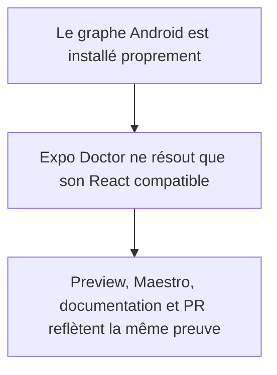
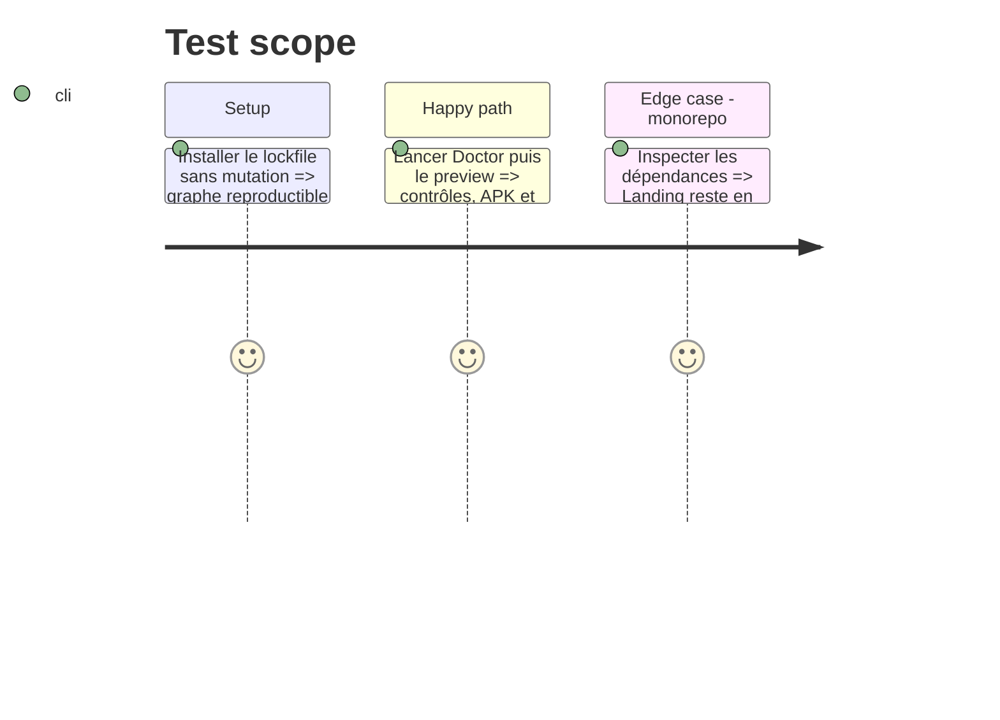

# Instruction: rendre le signal Expo/EAS et la documentation exacts

## Architecture projection

> Tree of the final files. ✅ create · ✏️ modify · ❌ delete

```txt
android
├── docs-android/RELEASE.md ✏️
└── package.json ✏️
pnpm-lock.yaml ✏️
```

## User Journey



## Test Scope



## Tasks to do

### `1)` Isoler la paire React d'Android

1. Reproduire avec la même version d'Expo Doctor que le build EAS et confirmer que `expo-router` emprunte le `react-dom` de Landing pour son contrôle web optionnel.
2. Déclarer dans Android le peer `react-dom` exact compatible Expo/React `19.2.3`, puis régénérer le lockfile ; ne modifier ni React Android ni React/ReactDOM Landing.
3. Après installation propre, vérifier avec `pnpm why`, Expo Doctor et l'autolinking que le graphe Android ne contient qu'une paire React cohérente. Si le peer local ne borne pas le scan, garder la phase ouverte et utiliser uniquement une option de scoping Expo documentée.

### `2)` Prouver et documenter le signal final

1. Exécuter qualité et export Android, puis relancer preview EAS et Maestro sur le même SHA sans finding React.
2. Mettre `RELEASE.md` et le corps de la PR #608 à jour : preview/Maestro réussis, modal native livrée, test Play signé encore absent.

## Test acceptance criteria

| Task | Acceptance criteria                                                                                                                       |
| ---- | ----------------------------------------------------------------------------------------------------------------------------------------- |
| 1    | Expo Doctor est vert sur une installation propre ; Android résout React/ReactDOM 19.2.3 et Landing conserve 19.2.8, sans override racine. |
| 2    | Le SHA final a un preview APK et un smoke Maestro verts, sans annotation Expo Doctor liée à Landing.                                      |
| 2    | `RELEASE.md` et la PR ne prétendent plus que Maestro ou la modal native restent à faire, ni qu'un test Play a déjà eu lieu.               |
