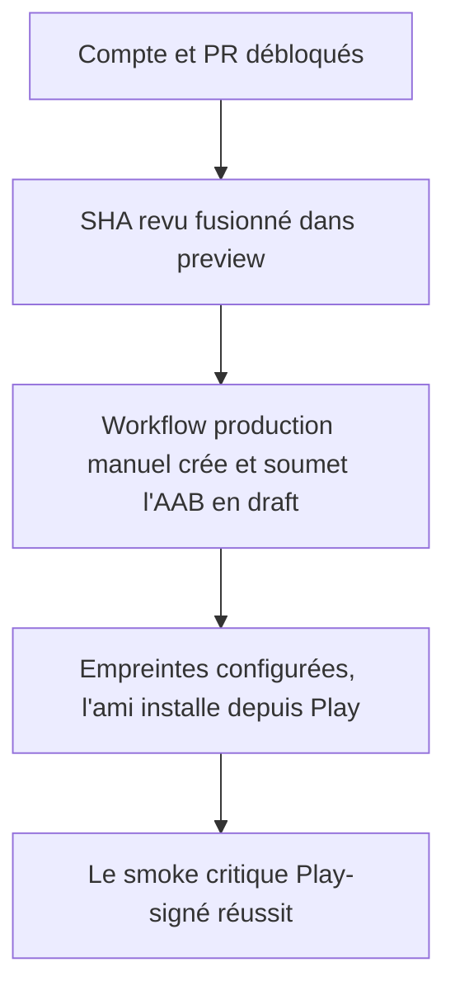
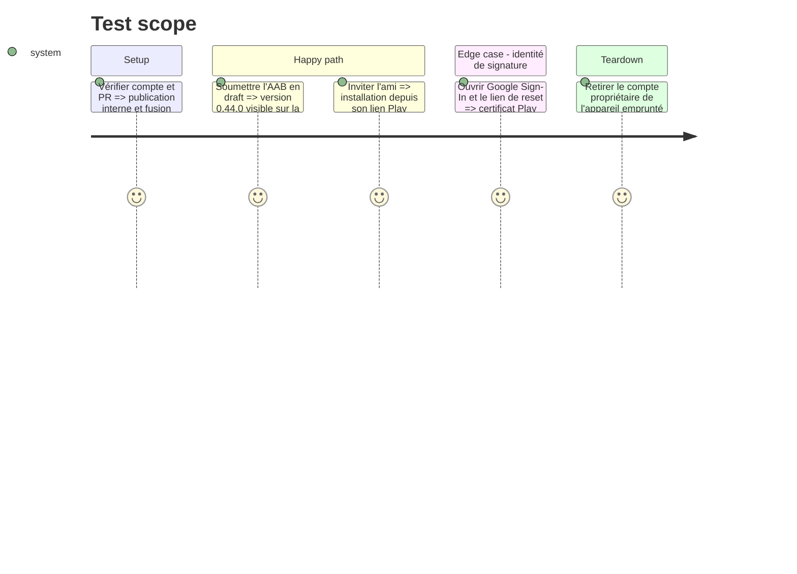

# Instruction: livrer et tester l'AAB signé par Google Play

## Architecture projection

> Tree of the final files. ✅ create · ✏️ modify · ❌ delete

```txt
frontend/projects/webapp/public/.well-known
└── assetlinks.json ✅
```

## User Journey



## Test Scope



## Tasks to do

### `1)` Lever les prérequis humains

1. Sur un appareil physique non rooté Android 10+, installer Play Console, puis laisser le propriétaire du compte se connecter et effectuer la vérification en moins d'une minute ; se déconnecter et retirer ensuite ce compte de l'appareil emprunté.
2. Obtenir l'approbation GitHub externe requise et confirmer que tous les checks portent sur le SHA final corrigé.
3. Créer l'app Play `app.pulpe.android`, activer Play App Signing et configurer le compte de service EAS avec les droits minimaux de soumission interne.

### `2)` Produire et relier le premier AAB interne

1. Fusionner la PR dans `preview`, puis déclencher manuellement `deploy-production.yml` sur ce SHA ; ne pas fusionner `main`.
2. Vérifier dans l'App Bundle Explorer le package, `versionName` 0.44.0, `versionCode` auto-incrémenté et le statut draft sur la piste interne.
3. Copier le SHA-1 App signing dans OAuth et son SHA-256 dans `assetlinks.json`, déployer l'association, puis promouvoir le draft vers la liste de l'ami.

### `3)` Exécuter le smoke Play-signé

1. Depuis l'installation Play, vérifier démarrage, email/mot de passe, Google Sign-In, PIN/vault et lien de reset.
2. Vérifier création/édition/suppression d'une prévision, retrait planifié et rafraîchissement de l'objectif, offline et force-update.
3. Noter SHA, build Play, appareil/version Android et résultat dans l'exécution AIDD, puis passer les critères de la revue initiale à vérifiés.

## Test acceptance criteria

| Task | Acceptance criteria                                                                                                                    |
| ---- | -------------------------------------------------------------------------------------------------------------------------------------- |
| 1    | Le compte Play et la PR ne présentent plus de blocage de vérification, d'approbation ou de service account.                            |
| 2    | L'AAB du SHA fusionné affiche 0.44.0 et reste un draft interne ; aucune promotion de `main` ou production n'a lieu.                    |
| 2    | OAuth accepte le SHA-1 Play, App Links vérifie le SHA-256 Play et l'ami peut installer depuis son opt-in.                              |
| 3    | Le smoke Play-signé passe sur l'appareil de l'ami et les quatre critères encore ouverts dans la revue initiale disposent d'une preuve. |
