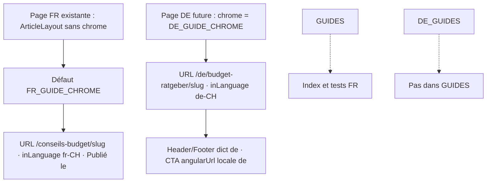

# Instruction: chrome d’article localisable, registre DE à part

## Architecture projection

> Tree of the final files. ✅ create · ✏️ modify · ❌ delete

```txt
.
└── landing
    ├── lib/routes.ts ✏️ constantes DE (chemin section, labels footer) ; commentaire : hors ROUTES
    └── components/guides
        ├── chrome.ts ✅ FR_GUIDE_CHROME (défaut identique au layout actuel) + DE_GUIDE_CHROME
        ├── guides.de.ts ✅ DE_GUIDES + getDeGuide ; type Guide réutilisé
        ├── ArticleLayout.tsx ✏️ chrome optionnel, défaut FR ; Header/Footer/JSON-LD/CTA suivent locale
        ├── ArticleLayout.test.tsx ✏️ défaut FR inchangé ; rendu DE sans chrome FR
        ├── RelatedGuides.tsx ✏️ basePath + locale + resolve ; heading chrome
        └── guides.ts ✏️ guideMetadata accepte locale/basePath/og ; défaut FR inchangé
```

## User Journey



## Wireframe

```txt
┌─────────────────────────────────────────────┐
│ (1) Skip link + Header                      │
├─────────────────────────────────────────────┤
│ (2) Back link                               │
│ (3) Title                                   │
│ (4) Dates + reading time                    │
│ (5) Article body                            │
│ (6) FAQ heading + items                     │
│ (7) Signup CTA                              │
├─────────────────────────────────────────────┤
│ (8) Footer  (route = null)                  │
└─────────────────────────────────────────────┘
```

1. Header : dictionnaire de la locale du chrome, pas toujours FR.
2. Back : index FR sur les pages FR ; Startseite `/de` sur le chrome DE (pas d’index DE).
3. Un seul h1, titre du registre.
4. Dates dans la locale du chrome (`fr-CH` / `de-CH`, UTC).
5. Prose fournie par la page ; inchangée dans cette phase.
6. Titre FAQ du chrome.
7. Un CTA ; `angularUrl` avec la locale du chrome. `data-cta-name` inchangé (`commencer_gratuitement`) pour ne pas casser PostHog.
8. Footer `route={null}` : pas de language switcher vers des sœurs inexistantes.

## Tasks to do

### `1)` Extraire le chrome FR puis le jumeau DE

> Le layout arrête de croire que tout article est français.

1. Module `chrome.ts` : `FR_GUIDE_CHROME` reprend mot pour mot les chaînes actuelles (back « Conseils budget » → `/conseils-budget`, « Publié le », « Mis à jour le », « min de lecture », « Questions fréquentes », CTA FR actuel, `inLanguage: "fr-CH"`, `ogLocale: "fr_CH"`).
2. `DE_GUIDE_CHROME` : **du**. Back « Startseite » → `/de`. « Veröffentlicht am » / « Aktualisiert am » / `{n} Min. Lesezeit`. FAQ « Häufige Fragen ». CTA lead du (« Willst du sehen, wie viel dir jeden Monat bleibt? ») et bouton « Budget kostenlos erstellen ». `inLanguage: "de-CH"`, `ogLocale: "de_CH"`, pas d’`alternateLocale` FR. Guillemets allemands dans la copie plus tard ; pas de Sie ; pas d’espace fine avant `?`.
3. `ArticleLayout` prend `chrome` optionnel, défaut `FR_GUIDE_CHROME`. URL d’article = `SITE_URL` + `localizedPath(locale, sectionPath + "/" + slug)` sauf FR où `localizedPath` laisse la racine. Section DE = `/budget-ratgeber` → `/de/budget-ratgeber/<slug>`.
4. Header `locale={chrome.locale}`, Footer idem, `dict` déjà passé par la page.

### `2)` Registre DE et metadata paramétrable

> Deux sources de vérité, zéro mélange.

1. `guides.de.ts` : deux entrées, slugs `beste-budget-app-schweiz` et `krankenkassenpraemien-budgetieren`. Titres/descriptions allemands (requêtes natives). `publishedAt`/`updatedAt` = `2026-08-18`. `getDeGuide` échoue au build si slug manquant.
2. Ne pas ajouter ces slugs à `GUIDES`. Ne pas créer les pages dans cette phase.
3. `guideMetadata(guide, chrome?)` : chemin, canonical, og locale et vignette suivent le chrome ; défaut = comportement FR actuel (vignette FR, `fr_CH`, pas de `languages` hreflang).
4. `RelatedGuides` : `resolve` + `sectionPath` + `locale` + heading. Défaut = `getGuide` + `/conseils-budget` + « Continue avec… ». Calculatrice seulement si `calculator` et chrome FR (la calculatrice n’existe pas en DE).
5. `routes.ts` : `DE_ADVICE_SECTION_PATH = "/budget-ratgeber"` et labels footer (utilisés en phase 3). Commenter pourquoi hors `ROUTES`.

### `3)` Prouver que le FR ne bouge pas

> Les tests existants restent la barrière.

1. Conserver les assertions URL `https://pulpe.app/conseils-budget/…`, `inLanguage` implicite via URL, « Publié le », index OG inchangés.
2. Rendu `ArticleLayout` + `DE_GUIDE_CHROME` + dict DE : `inLanguage` `de-CH`, URL `/de/budget-ratgeber/…`, pas « Publié le » / « Conseils budget » / « Questions fréquentes », Header/CTA en allemand, aucun « Sie » comme formule d’adresse dans le chrome, aucun mot `Transaktion`.
3. `GUIDES` n’inclut pas les slugs DE.

## Test acceptance criteria

| Task | Acceptance criteria                                                                                          |
| ---- | ------------------------------------------------------------------------------------------------------------ |
| 1    | Un `ArticleLayout` sans `chrome` produit le même HTML contractuel qu’aujourd’hui (URL FR, dates FR, CTA FR). |
| 1    | Avec `DE_GUIDE_CHROME`, JSON-LD `inLanguage` = `de-CH` et `url` contient `/de/budget-ratgeber/`.              |
| 2    | `DE_GUIDES` a deux slugs distincts de tout `GUIDES`. `getDeGuide` d’un slug inconnu jette.                   |
| 2    | `guideMetadata(guide)` sans chrome reste canonical `/conseils-budget/…` et `openGraph.locale` `fr_CH`.       |
| 3    | `ArticleLayout.test.tsx` : « has a page for every registry entry » ne parcourt que `GUIDES`.                 |
