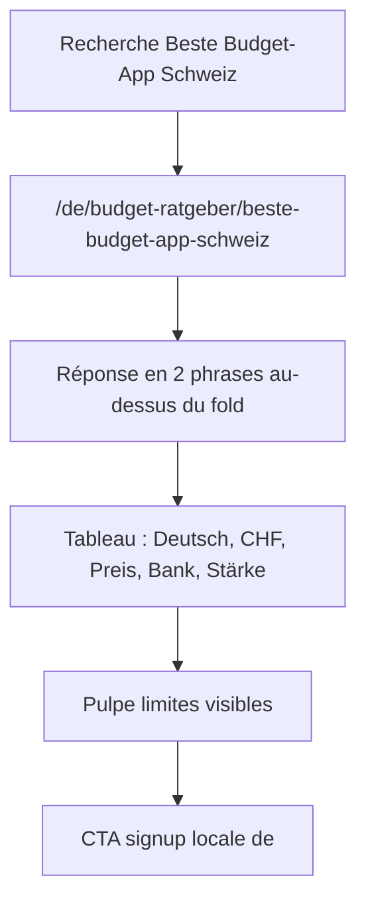

# Instruction: page comparatif Budget-App Schweiz

## Architecture projection

> Tree of the final files. ✅ create · ✏️ modify · ❌ delete

```txt
.
└── landing
    ├── app/[lang]/budget-ratgeber/[slug]/page.tsx ✅ generateStaticParams lang=de only ; comparatif
    ├── package.json ✏️ glob test si nouveau fichier
    └── components/guides
        ├── ComparisonTable.tsx (réutilisé, pas modifié)
        └── ArticleLayout.test.tsx ✏️ la page comparatif existe, JSON-LD de-CH, faiblesses Pulpe visibles
```

## User Journey



## Wireframe

```txt
┌─────────────────────────────────────────────┐
│ (1) Same article chrome as phase 1, locale de│
├─────────────────────────────────────────────┤
│ (2) Two-sentence answer                      │
│ (3) Criteria intro                           │
│ (4) Comparison table                         │
│ (5) Who should pick what + Pulpe limits      │
│ (6) Related (primes slug, if page exists later)│
│ (7) FAQ                                      │
│ (8) CTA                                      │
└─────────────────────────────────────────────┘
```

1. Chrome DE : dates `de-CH`, back Startseite.
2. Réponse directe, pas une intro marketing.
3. Critère langue = **Deutsch**, pas « Français » traduit.
4. `ComparisonTable` existant, caption sr-only allemande.
5. Limites Pulpe dans le corps, pas uniquement en FAQ.
6. Related : omis ou primes si la phase 3 n’est pas encore là — poser le lien primes, la page arrivera phase 3 (slug déjà au registre). Un 404 temporaire entre deux commits de phase est acceptable ; les deux phases se suivent.
7. FAQPage JSON-LD, réponses en allemand.
8. CTA chrome DE, `angularUrl(..., "de")`.

## Tasks to do

### `1)` Route `[lang]/budget-ratgeber/[slug]`

> Une seule page dynamique, deux slugs plus tard, un seul aujourd’hui servi.

1. `generateStaticParams` : si parent `lang !== "de"`, retourner `[]` ; sinon les slugs de `DE_GUIDES` (les deux, même si le corps primes arrive phase 3 — ou seulement le comparatif ici et élargir en phase 3). Préférer n’émettre un slug que lorsque la page a un corps : **cette phase n’émet que `beste-budget-app-schweiz`**.
2. `params.lang` via `assertPrefixedLocale` ; si ce n’est pas `de`, `notFound()`. Slug hors registre → `notFound()`.
3. Metadata via `guideMetadata(guide, DE_GUIDE_CHROME)`. Dict `getDictionary("de")`.
4. Sous `output: 'export'`, ne pas poser `dynamicParams: true`.

### `2)` Rédiger l’article, ne pas traduire le FR

> Requêtes et critères allemands.

1. Titre / h1 du type « Beste Budget-App Schweiz: Vergleich 2026 ». Description : apps utilisables en Suisse, Deutsch, CHF, Preis, Bank — pas un classement payant.
2. Deux phrases d’ouverture : pas de gagnant unique ; ça dépend de planifier l’année, suivre le ménage, ou importer des fichiers.
3. Tableau (mêmes apps que le comparatif FR, critères relus) : Pulpe, BudgetCH, BudgetHub, YNAB, Goodbudget. Colonnes : App, Preis, Deutsch, CHF, Bank, Stärke. Pulpe : gratuit, Deutsch ja, CHF ja, Bank nein, Stärke Jahresplanung.
4. Faiblesses Pulpe **visibles** : keine Bankensynchronisation, kein gemeinsames Haushaltsbudget, junges Produkt.
5. YNAB : anglais, prix en USD. BudgetCH : associatif, Haushaltsführung. BudgetHub : CSV / assistant, palier payant.
6. FAQ en du, 2 questions min (beste App ? Bankanschluss nötig ?).
7. Related : slugs DE uniquement. Pas de lien calculateur FR.
8. Interdit : Sie, dialecte, « Transaktion », calque mot-à-mot des paragraphes FR, « Budget-App Frankreich ».

### `3)` Tests de la page

> Observable, pas un wishlist éditorial flou.

1. HTML : un h1, `inLanguage` `de-CH`, URL canonique `/de/budget-ratgeber/beste-budget-app-schweiz`.
2. Le corps contient une limite Pulpe (Bank ou Haushalt ou junges Produkt).
3. Le tableau a une colonne dont l’en-tête est Deutsch (pas Français).
4. Aucun `Transaktion`. Chrome sans « Publié le ».

## Test acceptance criteria

| Task | Acceptance criteria                                                                                          |
| ---- | ------------------------------------------------------------------------------------------------------------ |
| 1    | `generateStaticParams` pour `lang: "en"` et `"it"` est `[]`. Pour `"de"`, contient `beste-budget-app-schweiz`. |
| 1    | Metadata canonical = `/de/budget-ratgeber/beste-budget-app-schweiz`, sans `alternates.languages` à 4 langues. |
| 2    | H1 / title portent Budget-App et Schweiz. Le tableau compare au moins Pulpe et une autre app, critère Deutsch. |
| 2    | Le HTML de la page contient une phrase de limite Pulpe (pas de synchro bancaire et/ou pas de ménage partagé). |
| 3    | JSON-LD Article `inLanguage` = `de-CH`. Aucune occurrence de `Transaktion` dans le HTML article.             |
