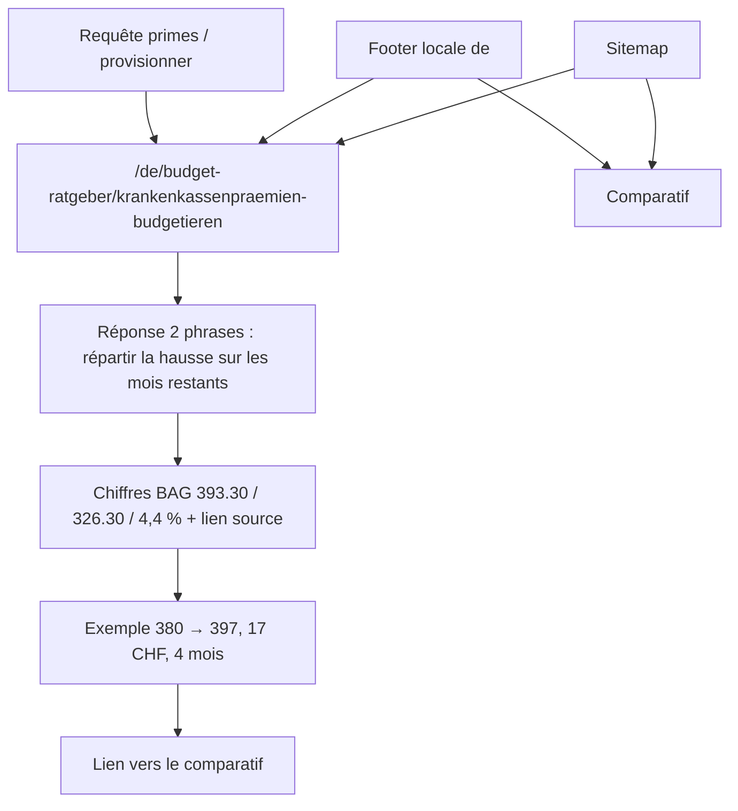

# Instruction: page Prämien + sitemap et footer

## Architecture projection

> Tree of the final files. ✅ create · ✏️ modify · ❌ delete

```txt
.
└── landing
    ├── app
    │   ├── [lang]/budget-ratgeber/[slug]/page.tsx ✏️ second slug : primes
    │   ├── sitemap.ts ✏️ les deux URL DE, lastmod, sans alternates
    │   └── accessibility.test.tsx ✏️ titles accueil sans pays ; footer germanOnly
    ├── lib/routes.ts ✏️ déjà les labels ; href footer
    └── components
        ├── sections/Footer.tsx ✏️ germanOnly, deux liens articles, libellés DE
        └── guides
            ├── ArticleLayout.test.tsx ✏️ chaque DE_GUIDES a un slug émis ; pages sans mélange FR
            └── RelatedGuides ✏️ les deux articles se lient
```

## User Journey



## Wireframe

```txt
┌─────────────────────────────────────────────┐
│ (1) Same article chrome as phase 1, locale de│
├─────────────────────────────────────────────┤
│ (2) Two-sentence answer                      │
│ (3) Official 2026 figures + source link      │
│ (4) Month-by-month provisioning example      │
│ (5) What this page does not cover            │
│ (6) Related → comparatif                     │
│ (7) FAQ                                      │
│ (8) CTA                                      │
└─────────────────────────────────────────────┘
```

1. Chrome DE.
2. Provisionner, pas « wechsle die Kasse ».
3. Chiffres à côté du lien BAG.
4. Même logique que l’exemple FR, mots allemands.
5. Priminfo / changement de caisse = hors sujet, une phrase.
6. Related vers `beste-budget-app-schweiz` seulement (pas la calculatrice FR).
7. FAQ alignée JSON-LD.
8. CTA chrome DE.

## Tasks to do

### `1)` Rédiger la page primes

> Budget, pas comparateur de caisses.

1. Titre registre / h1 du type « Krankenkassenprämien 2026 budgetieren » (Hochdeutsch CH, du).
2. Ouverture : tu répartis la hausse sur les mois avant janvier ; le total ne change pas.
3. Citer, avec lien, [FAQ BAG DE](https://www.bag.admin.ch/de/praemien-und-kosten-antworten-auf-haeufige-fragen) : **4,4 %**, mittlere Prämie **393.30 CHF**/Monat. Jeunes adultes **326.30 CHF** d’après le [communiqué BAG 23.09.2025](https://www.bag.admin.ch/de/newnsb/d2okh_kUK_OFhmMDfpyiy). Montants en `tabular-nums`, espace insécable avant CHF, point décimal comme le reste de la landing (`393.30`), pas une virgule isolée.
4. Méthode : prime actuelle × hausse connue ; écart ÷ mois restants avant janvier ; ce montant devient un Planposten (lexique), comme le loyer.
5. Exemple travaillé : 380 → 397 CHF (+17) ; départ en septembre = 4 mois ; 17×4 = 68 CHF à répartir, ou +17 CHF dès maintenant sur la ligne. Pas de mot Transaktion.
6. Mentionner Prämienverbilligung / Priminfo en une phrase : utiles, mais ce n’est pas le sujet.
7. FAQ : comment provisionner ; quel montant moyen 2026 ; faut-il changer de caisse (non, pas le sujet).
8. `RelatedGuides` vers le comparatif. `getDeGuide`. Pas `calculator`.

### `2)` Câbler découverte : sitemap + footer

> Les URLs existent, Google et le footer DE les voient, les autres langues non.

1. `sitemap.ts` : les deux chemins `/de/budget-ratgeber/<slug>`, `lastModified` = `updatedAt`, **aucun** `alternates`. Commentaire : DE-only, comme les conseils FR.
2. Footer : `germanOnly` parallèle à `frenchOnly`. Deux liens internes `href: "/budget-ratgeber/<slug>"` (sans préfixe `/de` : `localizedPath('de', …)` l’ajoute). Libellés via constantes routes, pas `dict.links`. Absents en FR/EN/IT.
3. Ne pas casser `frenchOnly` des conseils et du calculateur.
4. Accueil : `titleDefault` des quatre catalogues ne contient toujours ni Suisse, ni Schweiz, ni Swiss, ni Svizzera. Élargir le test existant (aujourd’hui FR seulement).

### `3)` Boucler le registre DE

> Un slug, une page générée, zéro chrome FR.

1. `generateStaticParams` émet les deux slugs pour `de`.
2. HTML de chaque page DE : `lang` document déjà `de` via layout ; pas de « Publié le » / « Conseils budget » ; `inLanguage` `de-CH`.
3. Aucun hreflang vers une URL FR.

## Test acceptance criteria

| Task | Acceptance criteria                                                                                          |
| ---- | ------------------------------------------------------------------------------------------------------------ |
| 1    | La page primes cite 393.30, 326.30 et 4,4 % à côté d’un lien bag.admin.ch. Angle = Rückstellung / provisionner. |
| 1    | Exemple 380/397/17/4 mois présent. Aucun `Transaktion`. Registre du.                                         |
| 2    | Sitemap contient les deux URL `https://pulpe.app/de/budget-ratgeber/…` sans clé `alternates`.                |
| 2    | Footer DE montre les deux libellés allemands ; Footer FR/EN/IT ne les montre pas. `frenchOnly` inchangé.     |
| 2    | Les quatre `titleDefault` échouent un match `suisse\|schweiz\|swiss\|svizzera` (insensible à la casse).      |
| 3    | Chaque entrée `DE_GUIDES` est un `slug` de `generateStaticParams` pour `lang: "de"`.                         |
