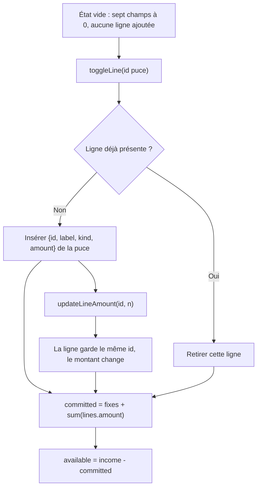

# Instruction: modèle — lignes nommées à la place des seaux

## Architecture projection

> Tree of the final files. ✅ create · ✏️ modify · ❌ delete

```txt
.
└── landing/lib
    ├── budgetCalculator.ts ✏️ extra/savings disparaissent ; BudgetLine[] + toggle/update/remove
    └── budgetCalculator.test.ts ✏️ exemple 5000/2000/400/500 inchangé ; toggle, édition, pas de doublon
```

## User Journey



## Tasks to do

### `1)` Remplacer les seaux par des lignes

> Un poste a un nom. Un seau n’en a pas.

1. Retirer `extra` et `savings` de `BudgetInputs`.
2. Introduire `BudgetLine` (`id`, `label`, `kind: "expense" | "saving"`, `amount`) et `addedLines: BudgetLine[]` sur l’état.
3. `committedExpenses` = somme des champs fixes hors `income` + somme des `addedLines`.
4. `availableToSpend` inchangé : `income - committed`.
5. Garder l’exemple documenté : revenu 5000, loyer 2000, assurance 400, épargne 500 → disponible 2100.

### `2)` Contracter les puces comme l’onboarding

> Même catalogue, même identité, pas d’addition silencieuse.

1. `CALCULATOR_CHIPS` porte un `id` stable, un label, un `kind`, un montant (600, 150, 100, 500, 587).
2. `toggleChip(state, chip, currency)` : absent → insert ; présent (même `id`) → remove.
3. Label du pilier : CHF « 3ème pilier », EUR « Épargne retraite ». L’`id` ne change pas.
4. `updateLineAmount(state, id, amount)` : clamp `>= 0`, ne recrée pas la ligne.
5. Interdire deux lignes avec le même `id`.

### `3)` Couvrir le modèle

> Prouver le bug d’origine et le contrat onboarding, sans UI.

1. Toggle Courses puis retoggle → `addedLines` vide, disponible = revenu.
2. Toggle Courses, passer le montant à 800, retoggle → une seule ligne disparaît, pas un reliquat 600.
3. Deux taps Courses sans édition → une ligne, pas 1200 cachés.
4. Déficit toujours non bloquant (revenu 1000, loyer 2000 → −1000).

## Test acceptance criteria

| Task | Acceptance criteria                                                                                          |
| ---- | ------------------------------------------------------------------------------------------------------------ |
| 1    | `BudgetInputs` n’a plus `extra` ni `savings`. L’exemple 5000 / 2000 / 400 / 500 affiche 2’100 CHF.           |
| 2    | Un `id` de puce est présent au plus une fois. Le second toggle le retire. Une édition d’amount ne change pas l’`id`. |
| 2    | En EUR le chip pilier s’appelle « Épargne retraite » ; en CHF « 3ème pilier » ; même `id`.                   |
| 3    | Les quatre cas ci-dessus passent dans `landing/lib/budgetCalculator.test.ts`.                                |
