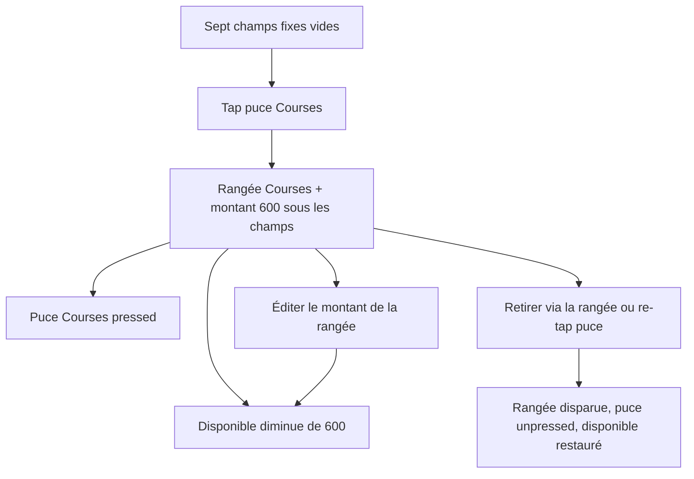

# Instruction: formulaire — rangées visibles et puces toggle

## Architecture projection

> Tree of the final files. ✅ create · ✏️ modify · ❌ delete

```txt
.
└── landing
    ├── components/calculator/BudgetCalculator.tsx ✏️ rangées nommées + puces aria-pressed
    └── app/(fr)/calculateur-budget/page.tsx ✏️ aligner la copie si elle parle encore d’un « bouton » sans ligne
```

## User Journey



## Wireframe

```txt
┌──────────────────────────────────────────┬─────────────────────────┐
│ (1) Champs fixes                         │ (5) Carte Disponible    │
│     revenu · loyer · maladie · …         │     montant             │
│                                          │     détail              │
│ (2) Puces catalogue                      │     CTA 12 mois         │
│                                          │                         │
│ (3) Rangées ajoutées                     │                         │
│     nom · montant · retirer              │                         │
└──────────────────────────────────────────┴─────────────────────────┘
│ (4) Texte éditorial sous le calculateur                            │
```

1. Champs fixes : les sept postes toujours là.
2. Puces : le catalogue, une fois chacune, état pressed si la ligne existe.
3. Rangées : seulement les postes ajoutés ; nom, montant, retrait.
4. Éditorial : inchangé hors mention d’un bouton sans ligne.
5. Carte : agrégat revenu / dépenses / disponible.

## Tasks to do

### `1)` Rendre chaque ligne ajoutée

> Ce qui entre dans le calcul se voit et se manipule.

1. Sous les sept champs, lister `addedLines` : label, input montant, bouton retirer (`aria-label` avec le nom).
2. Input montant : même parseur `>= 0` que les champs fixes ; `formatMoney` uniquement sur la carte, pas dans l’input.
3. Cible tactile `min-h-11` sur input et retrait. Déficit : `text-accent`, pas de rouge, phrase actuelle conservée.
4. Pas de rangée pour un champ fixe. Pas de « ajouter une ligne libre ».

### `2)` Faire des puces un toggle

> Pressed = présent. Unpressed = absent.

1. `aria-pressed` selon présence de l’`id`. Re-tap = `toggleChip`.
2. Visuel pressed via `bg-primary/8` et `border-primary`, pas une nouvelle primitive.
3. Label chip selon `useVisitorCurrency()` (pilier CHF/EUR). La rangée déjà posée garde le label du moment de l’insert.
4. Interdit : additionner le montant de la puce dans un champ caché.

### `3)` Vérifier la page

> Le visiteur voit le poste qu’il vient d’ajouter.

1. Copie de la page : plus de formulation « bouton » si elle nie l’existence d’une ligne.
2. `pnpm test` et `pnpm type-check` dans `landing/`.
3. Pas de mot « transaction » à l’écran.

## Test acceptance criteria

| Task | Acceptance criteria                                                                                                 |
| ---- | ------------------------------------------------------------------------------------------------------------------- |
| 1    | Après un tap Courses, une rangée « Courses / alimentation » affiche 600, l’input et le retrait. Le disponible baisse de 600. |
| 1    | Changer le montant de la rangée met à jour le disponible. Retirer la rangée la fait disparaître et restaure le disponible. |
| 2    | La puce Courses passe `aria-pressed="true"` à l’ajout et `"false"` au retrait. Un second tap ne crée pas une deuxième rangée. |
| 2    | Un visiteur EUR lit « Épargne retraite » sur la puce ; un visiteur CHF lit « 3ème pilier ».                         |
| 3    | Les tests landing passent. Aucun « transaction » dans le markup du calculateur.                                     |
