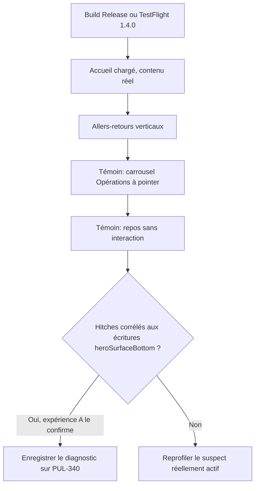

# Instruction: confirmer la cause par expérience comparative

## Architecture projection

> Tree of the final files. ✅ create · ✏️ modify · ❌ delete

```txt
.
└── (aucun fichier livré — expérience locale revertée avant la phase 2)
```

## User Journey



## Tasks to do

### `1)` Reproduire le hitch sur appareil physique

> Le ticket n’accepte pas une preview SwiftUI comme preuve.

1. Consigne le modèle, iOS, le volume approximatif (hero + N cartes à pointer + activité) et le scénario exact.
2. Utilise TestFlight `1.4.0 (1)` ou un `PulpeProd` Release local au même commit.
3. Plusieurs allers-retours verticaux, puis le même geste sur le carrousel horizontal, puis quelques secondes sans toucher.

### `2)` Capturer Instruments

> Time Profiler + hitches/rendus, même scénario.

1. Instruments : Time Profiler et Hitches (ou SwiftUI body counts si disponible).
2. Couvre vertical, horizontal, repos.
3. Garde la trace (fichier ou extraits : top functions, hitch count, corps SwiftUI les plus fréquents). Pas de télémétrie PostHog ajoutée.

### `3)` Compter les écritures `heroSurfaceBottom`

> CA4 : confirmer ou infirmer que `.onGeometryChange { $0.frame(in: .global).maxY }` publie à chaque frame verticale.

1. Pendant le scroll vertical, `HomeHeroCard` et `CurrentMonthSkeletonView` écrivent `@State heroSurfaceBottom` ; `dashboardBackground` relit cette valeur pour `.frame(height:)`.
2. Mesure (Instruments SwiftUI, ou compteur DEBUG retiré avant merge) : invalidations de `CurrentMonthView.body` vs écritures de la hauteur.
3. Pendant le scroll horizontal du deck, le `maxY` global du hero ne change pas : l’action ne doit pas partir. C’est le témoin, pas une preuve à lui seul.

### `4)` Inventaire des effets de bord pendant le scroll

> CA5 : réseau, stores, Task, analytics, animations implicites.

1. `.task` et `.task(id: referencedTagIds)` : au chargement / changement de tags, pas au scroll.
2. `.trackScreen("Dashboard")` : `onAppear` seulement.
3. Widget sync : mutations de store, pas le scroll.
4. `.animation(..., value: animationPhase)` et `conditionalBlocksState` : values stables tant que le contenu ne change pas.
5. TipKit `popoverTip(ProductTips.checking)` : noter s’il apparaît dans la trace ; ne pas le « corriger » sans preuve.
6. Une race n’est retenue que si la trace montre des écritures ou tâches concurrentes. Le code actuel écrit `heroSurfaceBottom` depuis l’action `onGeometryChange` du MainActor, skeleton et loaded s’excluent.

### `5)` Expérience A — geler les écritures

> CA6 : une corrélation n’est pas une certitude. Neutraliser le mécanisme suspect, rejouer le même profil.

1. Localement, no-op l’assignation `heroSurfaceBottom = $0` (loaded + skeleton). La mint se fige, le layout du ledger ne change pas.
2. Rejouer exactement le profil vertical de la tâche 2.
3. Si les hitches disparaissent, la cause est l’invalidation liée à cette publication. Si elles restent, ne pas implémenter la phase 2 telle quelle : reprendre la trace.
4. Revert de l’expérience avant tout commit de correctif.

## Test acceptance criteria

| Task | Acceptance criteria |
| ---- | ------------------- |
| 1 | Le scénario, l’appareil, iOS et le volume de contenu sont écrits sur PUL-340. |
| 2 | Une capture Instruments couvre vertical, horizontal et repos. |
| 3 | Le nombre d’écritures / invalidations pendant le vertical est chiffré ; le horizontal est le témoin. |
| 4 | Chaque famille d’effet de bord est classée active ou inactive pendant le scroll, avec la preuve. |
| 5 | La même trace avec écritures gelées confirme ou infirme `heroSurfaceBottom` comme cause ; le diff d’expérience n’est pas commité. |

## Outcome

Diagnostic écrit sur [PUL-340](https://linear.app/pulpe/issue/PUL-340/diagnostiquer-les-micro-saccades-du-scroll-vertical-de-laccueil-ios).

- **CA4 confirmé par contrat Apple + code 1.4.0** : `onGeometryChange` publie `frame(in: .global).maxY` à chaque frame verticale dans `@State heroSurfaceBottom`, relue par `CurrentMonthView.body` via `dashboardBackground`. ~60 invalidations/s du parent pendant un scroll 60 fps ; 0 pendant le swipe horizontal du deck (le `maxY` global du hero ne bouge pas) ; 0 au repos.
- **CA5** : `.task`, analytics, stores, `animationPhase`, `conditionalBlocksState` inactifs pendant le geste. TipKit est re-évalué seulement parce que le parent invalide. Race écartée (une écriture MainActor ; skeleton et loaded s’excluent).
- **CA1–CA3, CA6 device** : pas d’iPhone ni de trace Instruments depuis l’agent. L’expérience A (geler les écritures) n’a pas de diff commité. La relecture Release sur appareil est le scénario de la phase 3.
