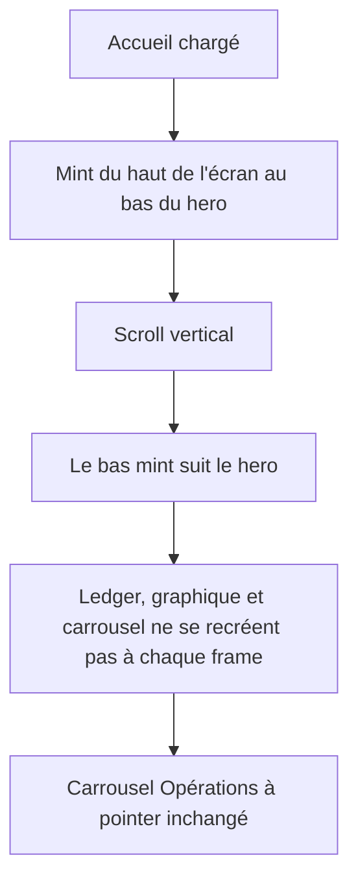

# Instruction: isoler la hauteur mint hors du body de l’accueil

## Architecture projection

> Tree of the final files. ✅ create · ✏️ modify · ❌ delete

```txt
.
└── ios
    ├── Pulpe
    │   └── Features
    │       └── CurrentMonth
    │           ├── CurrentMonthView.swift ✏️ tracker en @State, body ne lit plus la hauteur, fond extrait
    │           ├── HomeHeroSurfaceTracker.swift ✅ @Observable qui publie la hauteur et ignore les no-op
    │           └── Components
    │               ├── CurrentMonthSkeletonView.swift ✏️ le callback écrit le tracker, plus un @State parent
    │               └── HomeHeroSurfaceBackground.swift ✅ mint + ombre, seul lecteur de tracker.height
    └── PulpeTests
        └── Features
            └── CurrentMonth
                └── HomeHeroSurfaceTrackerTests.swift ✅ no-op, update, hauteur clampée
```

## User Journey



## Wireframe

```
┌─────────────────────────────────────┐
│ (1) Nav  mois courant        avatar │
├─────────────────────────────────────┤
│ (2) Mint viewport-fixed             │
│     ┌─────────────────────────────┐ │
│     │ (3) Hero: solde, métriques, │ │
│     │     graphique, verdict      │ │
│     └─────────────────────────────┘ │
│     ╰──────── coins + ombre ───────╯│
│ (4) Ajouter une opération           │
│ (5) Opérations à pointer  [Tout voir]│
│     ┌─────┐ ┌─────────┐ ┌─────┐     │
│     │peek │ │  carte  │ │peek │     │
│     └─────┘ └─────────┘ └─────┘     │
│ (6) Ça dérive / épargne versée      │
│ (7) Activité  7j | Mois             │
└─────────────────────────────────────┘
```

1. Barre native : mois et compte — déjà hors du scroll.
2. Surface mint : hauteur = bas écran du bloc hero ; seul ce calque relit le tracker.
3. Hero : contenu inchangé ; il publie `global.maxY`, il ne relit pas la hauteur.
4. CTA de contenu, hors mint.
5. Carrousel horizontal témoin : hors périmètre sauf preuve Instruments contraire.
6. Blocs conditionnels existants.
7. Activité : ne plus se retrier à chaque frame de scroll.

## Tasks to do

### `1)` Tracker observable, copie du détail budget

> `BudgetDetailsScrollTracker` isole déjà une géométrie de scroll pour ne pas invalider le parent.

1. `HomeHeroSurfaceTracker` : `@Observable @MainActor`, `height: CGFloat`, `update(_ newHeight:)`.
2. `guard newHeight != height` (ou delta sous le pixel) avant d’écrire, comme le pager saute les no-op hors de la fenêtre de fade.
3. Le parent `CurrentMonthView` possède le tracker en `@State` et n’accède jamais à `height` dans son `body`.

### `2)` Extraire le calque mint

> Tant que `dashboardBackground` reste une computed property du parent, le body relit `height` et l’isolation est nulle.

1. `HomeHeroSurfaceBackground` lit `tracker.height`, peint le gradient, clip les coins `zone`, pose `Shadow.zoneBoundary`.
2. `CurrentMonthView` attache `.background { HomeHeroSurfaceBackground(tracker:) }` selon `contentState` (loading/loaded seulement).
3. Loaded : `.onGeometryChange(for: CGFloat.self) { $0.frame(in: .global).maxY }` appelle `tracker.update`.
4. Skeleton : le callback existant appelle `tracker.update` au lieu d’un `@State` du parent.
5. Ne pas toucher `HomeHeroCard`, le `Chart`, `UncheckedOperationsCard`, `ActivityCard`, TipKit.

### `3)` Tests du tracker

> La géométrie SwiftUI ne se teste pas ici ; la politique d’écriture oui.

1. `update` identique n’écrit pas (égalité, pas une deuxième notification).
2. `update` d’une nouvelle hauteur publie cette valeur.
3. `max(0, _)` : une hauteur négative ne produit pas un frame inversé.

## Test acceptance criteria

| Task | Acceptance criteria |
| ---- | ------------------- |
| 1 | Aucune lecture de `tracker.height` (ni d’un `@State` équivalent) dans `CurrentMonthView.body`. |
| 2 | Au scroll, la mint s’arrête toujours au bas du hero, coins et ombre inchangés ; le carrousel n’est pas modifié. |
| 3 | Les tests du tracker passent sous `PulpeTests`. |
