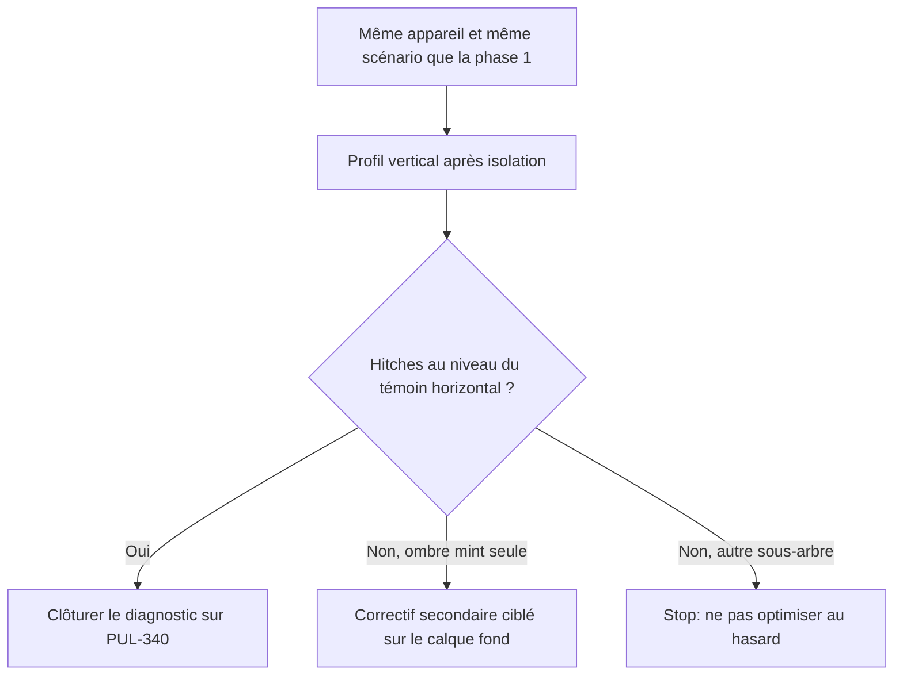

# Instruction: vérifier l’absence de hitch et consigner le non-régression

## Architecture projection

> Tree of the final files. ✅ create · ✏️ modify · ❌ delete

```txt
.
└── (pas de nouveau fichier — traces et résumé sur PUL-340 / PR uniquement)
```

## User Journey



## Tasks to do

### `1)` Rejouer le profil de la phase 1

> Même appareil, même volume, mêmes allers-retours.

1. Build Release (`PulpeProd` ou TestFlight de la branche).
2. Time Profiler + Hitches : vertical, horizontal, repos.
3. Compare hitch count / temps de body `CurrentMonthView` / `HomeHeroCard` / `ActivityCard` vs la baseline phase 1.
4. Succès : le vertical rejoint le témoin horizontal ; `HomeHeroSurfaceBackground` peut encore se relayout, pas le hero ni l’activité.

### `2)` Résiduel uniquement si la trace le nomme

> Le ticket interdit d’optimiser des composants non identifiés par le profilage.

1. Si l’ombre `zoneBoundary` recastée à chaque frame reste le top hitch : rasteriser ou alléger **ce calque seulement**.
2. Si le `Chart` ou le deck 3D apparaissent encore à chaque frame verticale : l’isolation a fuité (le parent relit encore la hauteur) — corriger la fuite, ne pas « optimiser » le graphique.
3. Race : seulement si la nouvelle trace montre des tâches concurrentes. Sinon la laisser écartée.

### `3)` Non-régression mesurable et clôture ticket

> CA7 : résumé, traces, correctif minimal, scénario rejouable. Pas d’event PostHog ajouté pour diagnostiquer.

1. Scénario : accueil loaded, N opérations à pointer visibles, allers-retours verticaux 5×, puis 3 swipes horizontaux, puis 3 s de repos.
2. Attendu : pas de micro-saccade verticale perceptible ; mint collée au bas du hero ; carrousel identique.
3. Coller le résumé et les extraits Instruments sur PUL-340 (et la PR). Retirer tout compteur DEBUG restant de la phase 1.

## Test acceptance criteria

| Task | Acceptance criteria |
| ---- | ------------------- |
| 1 | La trace Release post-fix montre le vertical au niveau du témoin horizontal, sur le même scénario qu’en phase 1. |
| 2 | Aucun changement hors du calque mint / tracker sauf si Instruments le désigne nommément. |
| 3 | PUL-340 contient le diagnostic, le correctif retenu et le scénario de non-régression ; aucune télémétrie permanente n’a été ajoutée. |
