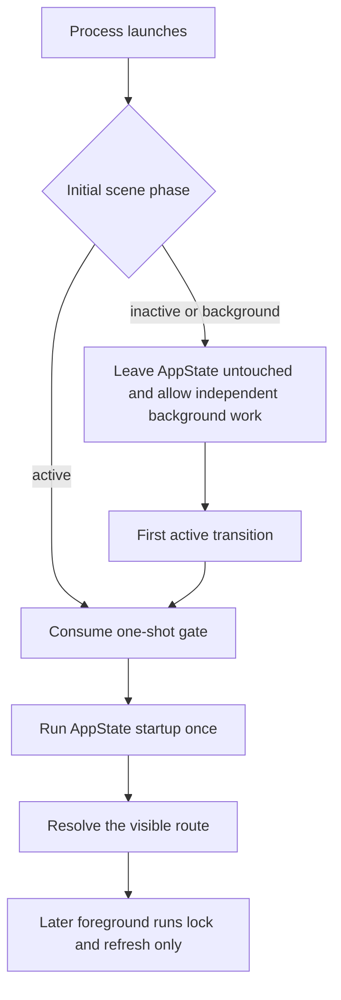
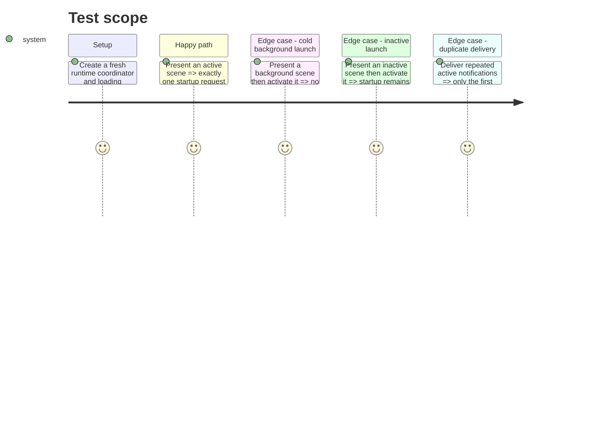

# Instruction: Start UI authentication once, on the first active scene

## Architecture projection

> Tree of the final files. ✅ create · ✏️ modify · ❌ delete

```txt
ios/
├── Pulpe/App/
│   ├── RootViewModifiers.swift                              ✏️ defer root authentication until active and retry only on the first activation
│   └── Runtime/AppRuntimeCoordinator.swift                  ✏️ own the process-lifetime one-shot startup gate
└── PulpeTests/App/Runtime/AppRuntimeCoordinatorTests.swift  ✏️ cover the complete scene-phase/startup matrix
```

## User Journey



## Test Scope



## Tasks to do

### `1)` Make visible startup a process-lifetime decision

1. Add a private, non-observed flag that records whether visible UI startup has been requested.
2. Add one synchronous MainActor method that consumes the flag and returns `true` only for the first `.active` phase; return `false` for other phases and later requests.
3. Keep explicit `retryStartup()` paths outside this gate so maintenance, timeout, and network retry buttons remain repeatable.

### `2)` Wire both initial render and first activation without phase-bound cancellation

1. Keep the existing non-ID `.task`, but call `onAppStart` only when the coordinator accepts the current phase.
2. Extend the existing phase-change handler: preserve `handleScenePhaseChange`, consume the gate synchronously, then run accepted startup in a regular `Task` so later phase changes neither duplicate nor cancel it.
3. Leave `BackgroundTaskService` unchanged and keep deep links pending for the existing auth-state observer; widget entry changes the destination, never the auth classification.

### `3)` Record only actionable startup diagnostics

1. Emit one `source=ui_startup`, `outcome=deferred_background` or `deferred_inactive` diagnostic from the initial root task when startup cannot run yet.
2. Emit one `source=ui_startup`, `outcome=started_active` when the gate is consumed; mirror both decisions in `Logger.auth` with stable codes and no user data.
3. Do not emit later skip events; `app_opened` already measures foreground returns.

### `4)` Lock the lifecycle matrix with Swift Testing

1. Cover initial `.active`, `.inactive`, and `.background`, both deferred-to-active transitions, and repeated `.active` requests.
2. Cover a warm `.active → .background → .active` cycle and prove privacy shield, foreground lock, widget scheduling, and store refresh remain separate from cold startup.
3. Run the targeted coordinator suite, then `PulpeTests`; require `** TEST SUCCEEDED **` and a non-zero test count.

## Test acceptance criteria

| Task | Acceptance criteria |
| ---- | ------------------- |
| 1 | The gate accepts exactly one `.active` request per `AppRuntimeCoordinator` lifetime and never consumes itself for `.inactive` or `.background`. |
| 2 | Background cold launch leaves auth untouched until active; normal cold launch starts immediately; later foregrounds run only lock/refresh and never clear the client-key session as another cold start. |
| 2 | Widget refresh remains independent, and a widget deep link received before activation is processed after auth without opening onboarding prematurely. |
| 3-4 | Diagnostics reconstruct the launch without sensitive data, and the full scene/privacy/foreground matrix passes under `PulpeTests`. |
