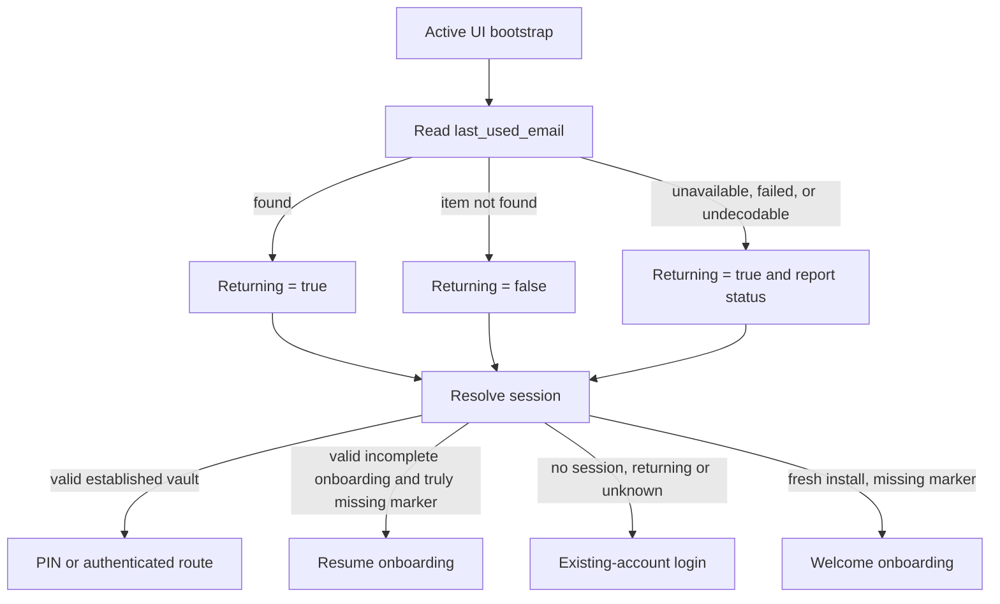
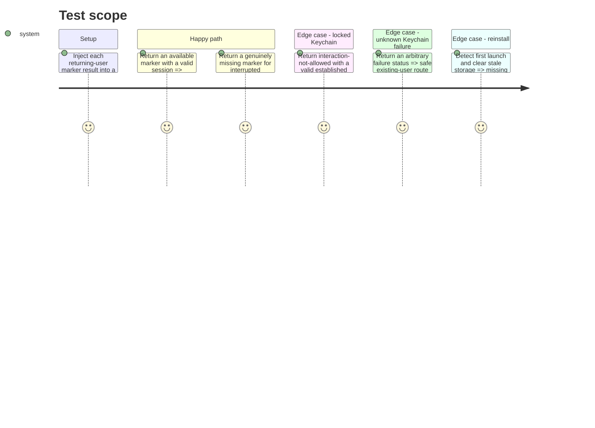

# Instruction: Preserve returning-user identity when Keychain is unavailable

## Architecture projection

> Tree of the final files. ✅ create · ✏️ modify · ❌ delete

```txt
ios/
├── Pulpe/
│   ├── App/AppState+Bootstrap.swift                         ✏️ load the marker once with conservative unavailable/error handling
│   └── Core/Auth/
│       ├── KeychainEmailStoring.swift                       ✏️ add an explicit last-used-email read result while preserving test defaults
│       └── KeychainManager.swift                            ✏️ distinguish found, missing, interaction-not-allowed, and failed reads
└── PulpeTests/
    ├── App/
    │   ├── AppStateBiometricColdStartTests.swift            ✏️ prove unavailable marker plus valid session routes to PIN
    │   └── AppStateReinstallTests.swift                     ✏️ preserve genuine fresh-install and missing-marker behavior
    └── Helpers/AppStateTestDoubles.swift                    ✏️ inject all marker read outcomes without real Keychain access
```

## User Journey



## Test Scope



## Tasks to do

### `1)` Represent Keychain truth instead of collapsing it to an optional

1. Add a small `Sendable` and `Equatable` last-used-email read result with cases for available value, missing item, temporarily unavailable status, and other failure status.
2. Add a typed protocol read with an optional-based default for existing test doubles; override it in `KeychainManager` by mapping `SecItemCopyMatching` success, not-found, interaction-not-allowed, invalid data, and other statuses.
3. Keep `last_used_email` at `WhenUnlockedThisDeviceOnly`; do not modify Supabase session or client-key accessibility.

### `2)` Apply one conservative routing policy from both bootstrap call sites

1. Replace the duplicated optional checks in `bootstrap()` and `ensureReturningUserFlagLoaded()` with one idempotent loader.
2. Map available to `true`, confirmed missing to `false`, and unavailable/failed to conservative `true`; set `returningUserFlagLoaded` only after handling the result.
3. Preserve reinstall detection, `shouldRedirectToOnboarding` for confirmed missing markers, and terminal Supabase session handling unchanged.

### `3)` Report the marker outcome without reporting the marker

1. Emit one `auth_session_observed` diagnostic per bootstrap marker load with `source=returning_user_marker`.
2. Use bounded outcomes `available`, `missing`, `interaction_not_allowed`, and `read_failed`, attaching OSStatus only to failures; mirror them in `Logger.auth` without values.
3. Preserve analytics opt-out by using `captureAuthSessionDiagnostic`.

### `4)` Cover legitimate and pathological routing combinations

1. Extend the shared Keychain double so tests can inject available, missing, interaction-not-allowed, and arbitrary failure results while existing `lastUsedEmail` initializers keep working.
2. Cover valid session plus unavailable marker → PIN, no session plus unavailable marker → Login, and arbitrary failure → the same conservative returning-user policy.
3. Preserve genuine missing-marker onboarding recovery and reinstall behavior.
4. Run cold-start, reinstall, transition-matrix, and signup-abandon suites, then complete `PulpeTests`.

## Test acceptance criteria

| Task | Acceptance criteria |
| ---- | ------------------- |
| 1 | Only `errSecItemNotFound` produces the semantic `missing` result; locked, failed, and undecodable reads remain distinguishable with their status. |
| 2 | A valid established session can never enter `OnboardingFlow` solely because the returning-user marker was temporarily unreadable. |
| 2 | Confirmed missing markers still support fresh installation and interrupted-onboarding recovery; terminal session failures still use the existing login path. |
| 3 | PostHog receives one bounded marker outcome with OSStatus where relevant and receives no email, Keychain payload, auth token, or client key. |
| 4 | The locked-marker regression fails under the old optional behavior, passes after the change, and all existing auth transition/reinstall tests remain green. |
