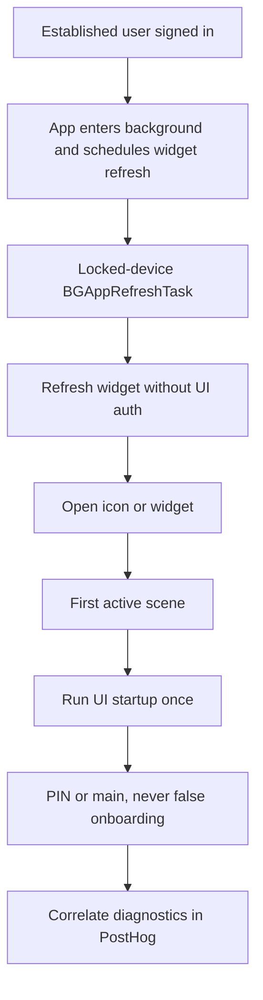
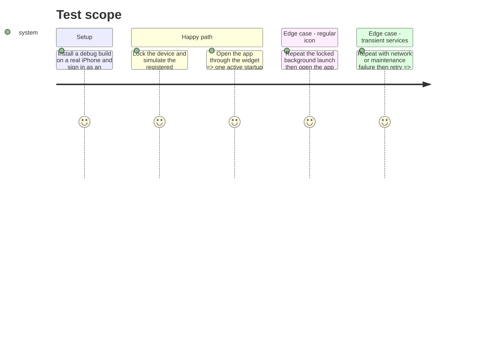

# Instruction: Prove the locked-device path and install production reporting

## Architecture projection

> Tree of the final files. ✅ create · ✏️ modify · ❌ delete

```txt
.
└── (no repository files — real-device evidence and PostHog saved reporting only)
```

## User Journey



## Test Scope



## Tasks to do

### `1)` Reproduce the OS path deterministically on a physical iPhone

1. Use a Local debug build on a real iPhone; record device model, iOS version, app version/build, and commit.
2. Sign in as an established user, allow the app to schedule `app.pulpe.ios.widget-refresh`, background it, and lock the device.
3. Use Apple’s documented LLDB command to simulate the task, never shipped source; require widget completion plus `ui_startup/deferred_background` and no UI-auth events while locked.
4. Unlock and open through widget and icon; require one `started_active`, PIN/main, correct deep link, and textual/anonymized evidence under ignored `evidence/`.

### `2)` Exercise the release-risk matrix

1. Verify cold active launch, cold background-to-active launch, and warm background-to-active return below and above the grace period.
2. Cross biometric enabled/disabled/stale with valid session, terminal loss, transient network, maintenance, returning-without-session, fresh install, and interrupted email/social onboarding.
3. Exercise icon and widget entry, recording final route and diagnostic sequence; screenshots alone are insufficient.

### `3)` Create one focused PostHog auth-health report

1. In project `87621`, create or update a saved report named `iOS — Auth startup health`, filtered to `platform=ios` and broken down by app version/build and environment.
2. Add startup and marker trends with the bounded outcomes defined above and OSStatus inspection for marker failures.
3. Add a false-routing query for `pending_user` resumes after `needs_pin_entry`/`vault_check_failed` in the same session, split pre-fix/fixed; exclude genuine `needs_pin_setup` and compare terminal Supabase outcomes separately.
4. Record the report URL; do not enable Slack or external notifications without separate authorization.

### `4)` Validate the fixed build after rollout

1. Filter the report to the first build containing the fix.
2. For every sampled background deferral, require at most one next `started_active` and no false route; investigate every marker `interaction_not_allowed` as an unexpected reader.
3. Keep terminal outcomes correlated with `logout_completed`/Login, and complete only after device proof plus one fixed-build PostHog sequence.

## Test acceptance criteria

| Task | Acceptance criteria |
| ---- | ------------------- |
| 1 | A real locked-device background refresh completes without running UI auth; opening by widget or icon starts auth once and reaches PIN/main without Login or onboarding. |
| 2 | Normal cold start, warm foreground lock, retries, real terminal logout, fresh install, and genuine interrupted onboarding retain their intended routes. |
| 3 | One saved PostHog report separates lifecycle deferral, marker-read outcomes, false onboarding routing, and true terminal session failures by version/build without PII. |
| 4 | The fixed build has a captured background-to-active event sequence with no false-routing sentinel, while any genuine logout remains attributable to a terminal auth outcome. |
