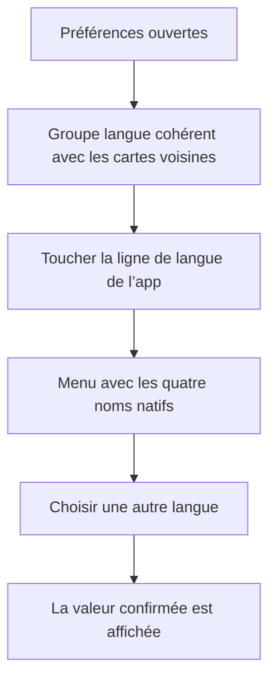
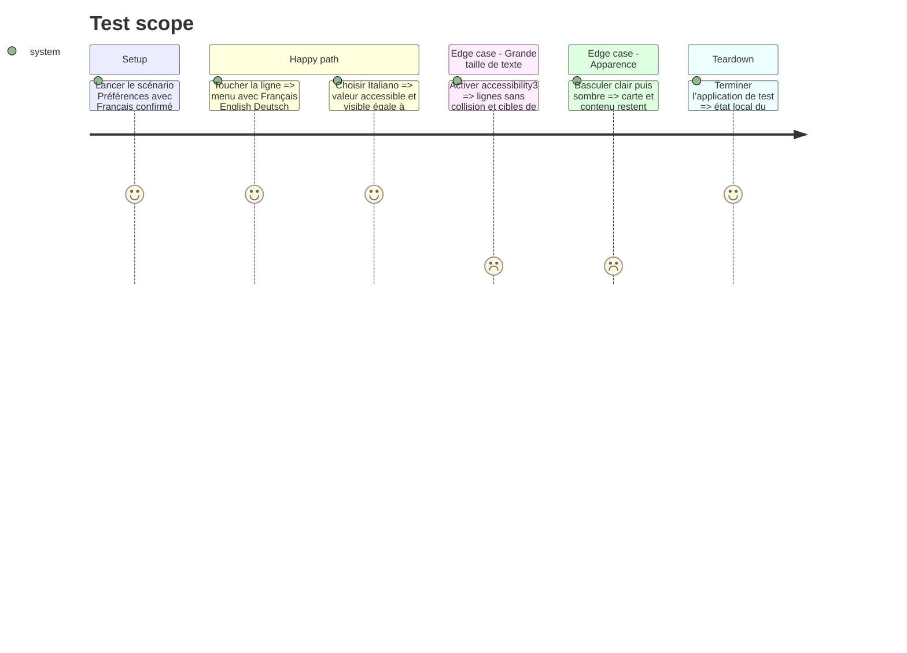

# Instruction: harmoniser et verrouiller le sélecteur de langue

## Architecture projection

> Tree of the final files. ✅ create · ✏️ modify · ❌ delete

```txt
.
└── ios
    ├── Pulpe
    │   ├── App
    │   │   ├── BudgetLongPressUITestHarness.swift ✏️ enregistrer le scénario Préférences dans le routeur UI test existant
    │   │   ├── PreferencesUITestHarness.swift ✅ rendre l’écran réel avec des préférences locales déterministes
    │   │   ├── PulpeApp.swift ✏️ router le scénario vers son harness
    │   │   └── SavingsGoalIntervalUITestHarness.swift ✏️ accepter le scénario additionnel dans le switch exhaustif
    │   ├── Features
    │   │   └── Account
    │   │       └── LanguageSettingView.swift ✏️ surface commune, Menu + Picker natifs adaptatifs et accessibilité
    │   └── Resources
    │       └── Localizable.xcstrings ✏️ traduire les indications VoiceOver du sélecteur
    └── PulpeUITests
        └── LanguageSettingUITests.swift ✅ verrouiller le menu, la sélection, les cibles et la matrice visuelle
```

## User Journey



## Test Scope



## Wireframe

```txt
┌─────────────────────────────────────┐
│ (1) Navigation                     │
├─────────────────────────────────────┤
│ (2) Section précédente             │
│ ┌─────────────────────────────────┐ │
│ │ Réglages existants              │ │
│ └─────────────────────────────────┘ │
│                                     │
│ (3) En-tête de section             │
│ ┌─────────────────────────────────┐ │
│ │ (4) Libellé       Valeur     ›  │ │
│ ├─────────────────────────────────┤ │
│ │ (5) Libellé système          ›  │ │
│ └─────────────────────────────────┘ │
│ (6) Texte d’aide                    │
│                                     │
│ (7) Sections suivantes             │
└─────────────────────────────────────┘
```

1. Navigation : contexte de l’écran Préférences.
2. Section précédente : référence structurelle des cartes existantes.
3. En-tête : identifie le groupe de réglages.
4. Première ligne : libellé, valeur active et affordance unique.
5. Deuxième ligne : réglage système distinct dans la même carte.
6. Aide : explique la différence entre les deux réglages.
7. Suite : conserve la structure actuelle de l’écran.

## Tasks to do

### `1)` Poser la régression UI avant le correctif

> Reproduire le défaut et tester le contrôle réel sans authentification ni backend.

1. Ajouter un scénario `languageSettings` au registre `UITestLaunchScenario` et le router dans `PulpeApp`.
2. Créer `PreferencesUITestHarness` autour de `PreferencesView`, avec `UserSettingsStore` alimenté par un service local qui confirme la langue envoyée.
3. Respecter `UITEST_DYNAMIC_TYPE` et `UITEST_COLOR_SCHEME`, comme les harness existants.
4. Créer `LanguageSettingUITests` : attendre l’identifiant du contrôle, vérifier sa cible, ouvrir le menu, trouver les quatre noms natifs, choisir Italiano et attendre la valeur confirmée.
5. Capturer l’état actuel puis le résultat en clair, sombre et `accessibility3`; garder les images dans `evidence/`.

### `2)` Corriger la carte et la ligne de sélection

> Réutiliser les primitives déjà présentes, sans nouveau composant partagé.

1. Remplacer le fond spécifique par `.listRowSettingsBackground()` afin de laisser `List(.insetGrouped)` fournir la même carte, le même rayon et le même séparateur que les sections voisines.
2. Garder le sélecteur iOS natif `Menu + Picker`, adapté aux quatre langues, mais faire du `Menu` la ligne entière avec une cible minimale `DesignTokens.TapTarget.minimum` et une zone rectangulaire.
3. Afficher la valeur à droite avec un seul `chevron.down`; masquer l’icône décorative de VoiceOver.
4. Utiliser une disposition horizontale avec repli vertical via `ViewThatFits` pour éviter collision et troncature sur petit écran et avec Dynamic Type.
5. Donner au contrôle un identifiant stable, un libellé, la valeur native sélectionnée et une indication accessible; garantir aussi 44 pt au lien de langue système.
6. Ne pas modifier `languageBinding`, `SupportedLocale`, `UserSettingsStore`, l’analytics ni l’ouverture des réglages iOS.

### `3)` Vérifier les critères et les non-régressions

> Une vérification ciblée suffit; le changement ne touche ni calcul, ni API, ni schéma.

1. Générer le projet Xcode si nécessaire puis exécuter `LanguageSettingUITests` sur le plus petit simulateur iPhone supporté; exiger `** TEST SUCCEEDED **`.
2. Rejouer les captures clair/sombre en taille standard et `accessibility3`; comparer la carte aux sections voisines.
3. Exécuter les suites iOS ciblées `UserSettingsStoreLocaleTests` et `AppLocaleTests` pour confirmer la persistance, le rollback et les quatre noms natifs.
4. Vérifier dans le diff l’absence de `chevron.up.chevron.down` dans `LanguageSettingView` et l’absence de changement hors projection mise à jour.

## Test acceptance criteria

| Task | Acceptance criteria |
| ---- | ------------------- |
| 1 | Le scénario UI ouvre l’écran réel sans backend, expose le contrôle de langue, ses quatre choix natifs et une sélection confirmée reproductible. |
| 2 | Le groupe utilise la surface commune; le contrôle reste un `Menu + Picker` iOS natif adapté aux langues; les deux lignes restent dans une carte; la ligne entière ouvre le menu; une seule affordance est visible; VoiceOver annonce libellé, valeur et rôle; chaque action mesure au moins 44 × 44 pt. |
| 3 | Sur le plus petit iPhone, clair/sombre et `accessibility3`, aucun texte ne collisionne, ne tronque ni ne sort de la carte; les tests ciblés confirment sélection, persistance et rollback sans changement d’analytics ou de redémarrage. |
