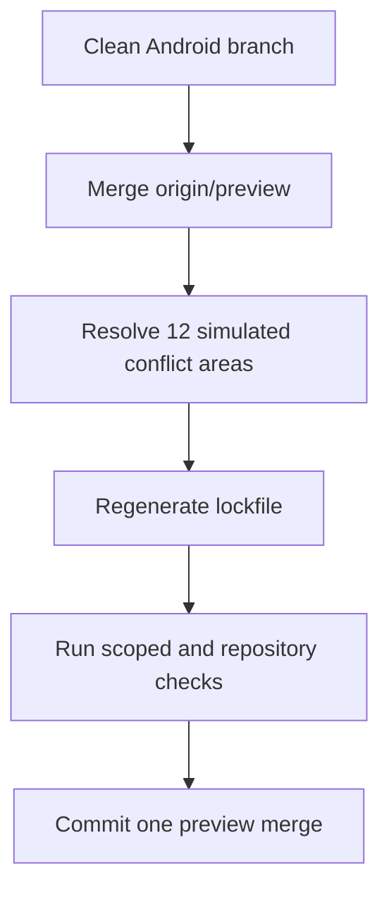
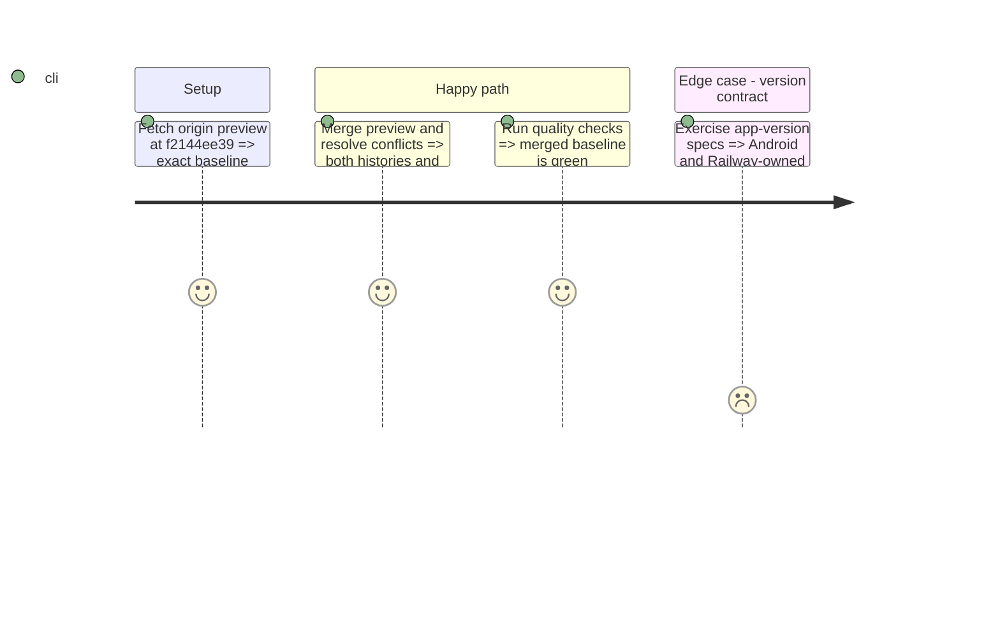

# Instruction: Merge the current preview baseline

## Architecture projection

```txt
.
├── .github/scripts/ci-security.test.mjs                         ✏️ retain Android checks and preview hardening
├── backend-nest/.env.example                                    ✏️ combine Android version gates with preview deployment variables
├── backend-nest/src/config/{environment.ts,environment.spec.ts} ✏️ preserve both version contracts
├── backend-nest/src/main.ts                                     ✏️ preserve Android config and preview product version wiring
├── backend-nest/src/modules/app-version/                        ✏️ merge Android payload with the current backend-owned version
├── backend-nest/src/modules/whats-new/domain/releases-data.ts   ✏️ retain Android releases and preview localized releases
├── docs/VERSIONING.md                                           ✏️ describe the combined release contract
├── package.json                                                 ✏️ retain Android workspace scripts with preview dependency versions
└── pnpm-lock.yaml                                               ✏️ regenerate from the merged manifests
```

## User Journey



## Test Scope



## Tasks to do

### `1)` Merge without rewriting history

1. Create a recoverable branch ref, then merge `origin/preview` with a merge commit.
2. Resolve each conflict semantically; never choose one side for the backend version files wholesale.
3. Regenerate `pnpm-lock.yaml` from manifests instead of editing conflict blocks by hand.

### `2)` Verify the merged baseline

1. Run shared build, backend version/config specs, Android quality/tests, and repository security/lexicon checks.
2. Confirm `git diff --check`, Android package/version metadata, and the absence of unresolved markers.

## Test acceptance criteria

| Task | Acceptance criteria                                                                                                            |
| ---- | ------------------------------------------------------------------------------------------------------------------------------ |
| 1    | Git contains one merge from current `origin/preview`; no branch commits were rewritten; the full Android tree remains present. |
| 2    | Version/config specs, Android unit tests and quality, security checks, lexicon checks, and `git diff --check` pass.            |
