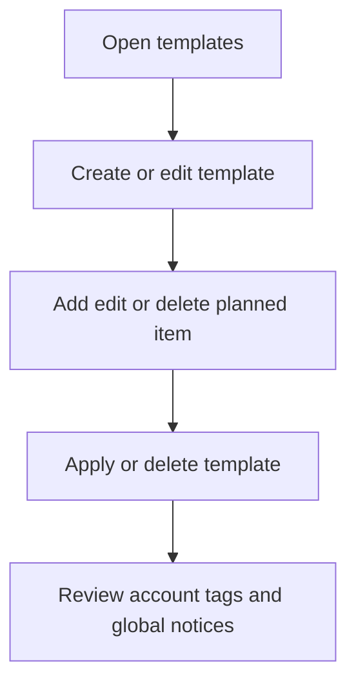
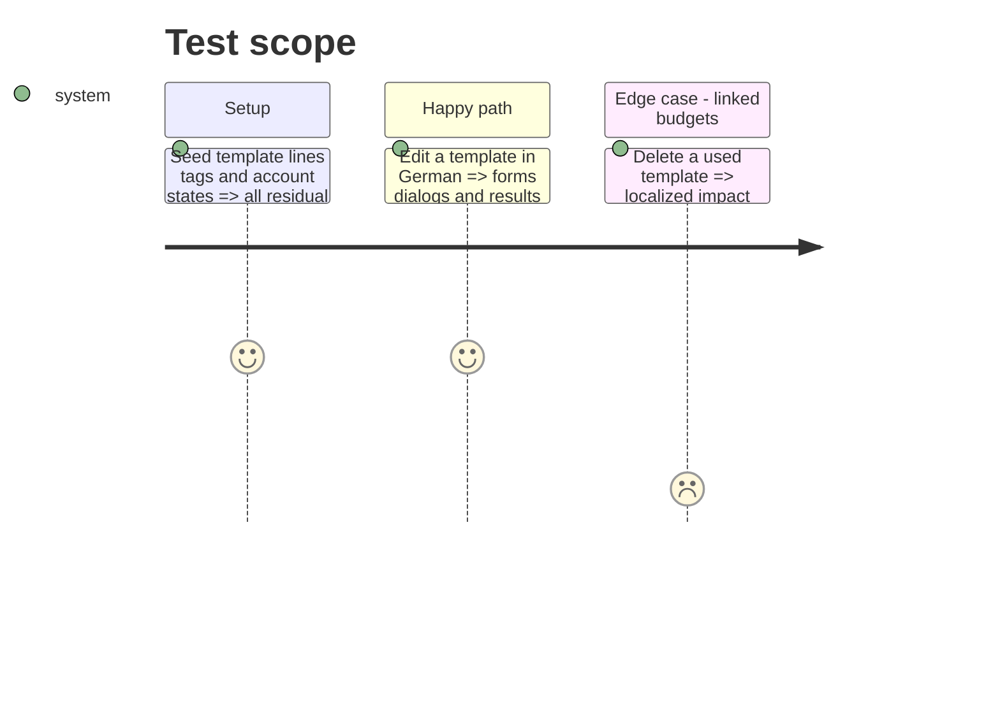

# Instruction: Localize templates and residual account surfaces

## Architecture projection

```txt
android/src/
├── app/(main)/(tabs)/templates.tsx                         ✏️ localized template overview
├── app/(main)/template/[id].tsx                            ✏️ localized template detail and destructive dialogs
├── features/templates/{template-vm.ts,components/*.tsx}    ✏️ semantic groups and localized forms
├── features/{tags,account}/**                              ✏️ scan and close residual visible copy only
├── ui/recovery-key-notice.tsx                              ✏️ verify global notice coverage
└── core/i18n/{catalogs/*.json,phase10-templates-i18n.spec.ts} ✏️ equal keys and focused coverage
```

## User Journey



## Test Scope



## Tasks to do

### `1)` Localize templates

1. Translate overview, detail, forms, line management, linked-budget status, dialogs, and accessibility copy.
2. Replace static French grouping labels with render-time translations.

### `2)` Close residual surfaces

1. Scan tags, account, and the global recovery notice for literals missed by completed phase 3 work.
2. Change only confirmed user-facing gaps; keep already-reviewed behavior untouched.

## Test acceptance criteria

| Task | Acceptance criteria                                                                                               |
| ---- | ----------------------------------------------------------------------------------------------------------------- |
| 1    | Template list/detail/create/edit/apply/delete journeys render wholly in all four locales with unchanged payloads. |
| 2    | Tags, account, and recovery notice contain no remaining user-facing French outside the French catalog.            |
