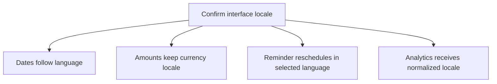
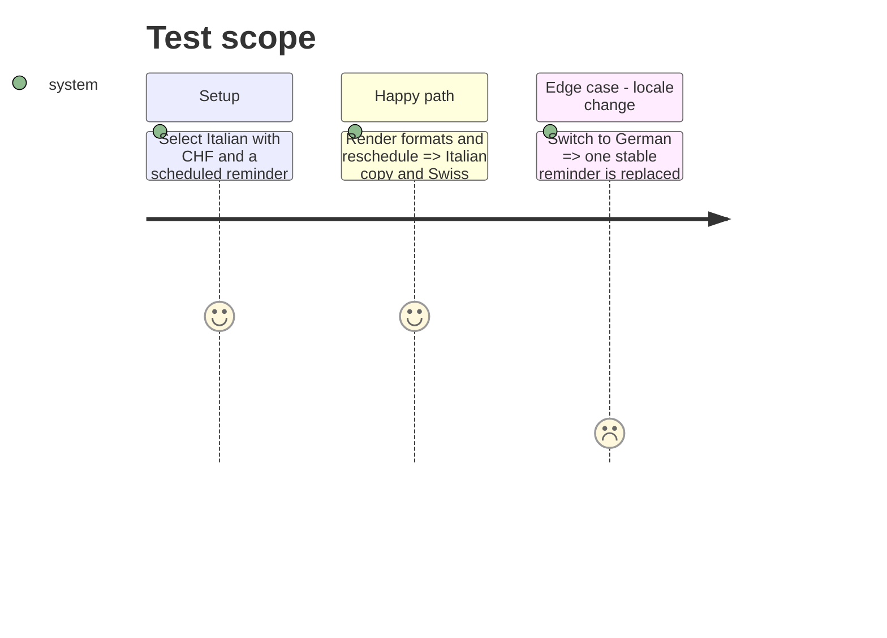

# Instruction: Close background, notification, and catalog gaps

## Architecture projection

```txt
android/src/
├── core/notifications/{scheduler,use-reminder-priming,monthly-reminder}.{ts,tsx,spec.ts} ✏️ localized stable reminder
├── core/observability/analytics.ts                     ✏️ normalized confirmed locale property
├── core/{api,auth,crypto,system,vault}/**              ✏️ close imperative user-message gaps
├── core/ui/{date-format,amount-format}.{ts,spec.ts}    ✏️ verify language and currency axes
└── core/i18n/{catalogs/*.json,catalog-parity.spec.ts}  ✏️ complete and parity-safe catalogs
```

## User Journey



## Test Scope



## Tasks to do

### `1)` Complete non-visual localization

1. Translate imperative errors and scheduled notification content at their presentation or scheduling boundary.
2. Reschedule the stable monthly reminder after a confirmed locale change.

### `2)` Prove independent locale axes

1. Keep amounts driven by currency metadata and dates driven by interface language.
2. Sync only the normalized supported locale to PostHog; never send raw device locale or sensitive URL data.

## Test acceptance criteria

| Task | Acceptance criteria                                                                                             |
| ---- | --------------------------------------------------------------------------------------------------------------- |
| 1    | Imperative messages and the single monthly reminder resolve in the selected locale with no duplicate schedule.  |
| 2    | Existing amount snapshots remain unchanged; dates follow FR/EN/DE/IT; analytics receives only a supported code. |
