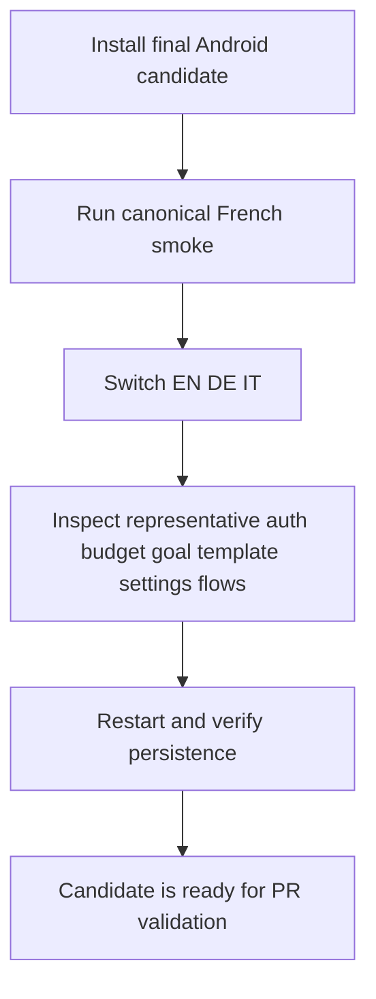
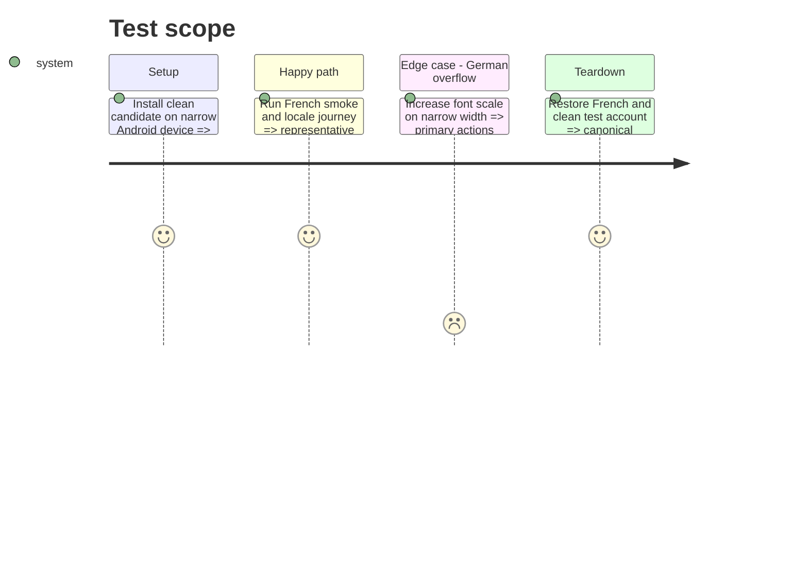

# Instruction: Prove Android release-candidate readiness

## Architecture projection

```txt
.
├── .github/scripts/lexicon.test.mjs                 ✏️ enforce Android vocabulary in every catalog
├── android/maestro/{smoke,i18n}.yaml                ✏️ canonical French and locale-switch journeys
├── android/src/core/i18n/catalog-parity.spec.ts     ✏️ reject key/value drift and raw fallback output
├── android/docs-android/RELEASE.md                  ✏️ document locale-enabled native build requirement
└── android/app.json                                 ✏️ verify supported native locales
```

## User Journey



## Test Scope



## Tasks to do

### `1)` Enforce static completeness

1. Reject missing, extra, blank, type-mismatched, or raw catalog output.
2. Extend the multilingual product lexicon gate to Android catalogs.

### `2)` Validate the candidate

1. Run Android quality, unit tests, export or native generation, canonical Maestro smoke, and locale journey on one exact head.
2. Inspect German narrow layout, restart and sign-out persistence, offline rollback, notification, and TalkBack labels.

## Test acceptance criteria

| Task | Acceptance criteria                                                                                                                  |
| ---- | ------------------------------------------------------------------------------------------------------------------------------------ |
| 1    | Static gates fail on any catalog drift or banned product word in any Android locale.                                                 |
| 2    | Quality, tests, export or native generation, Maestro, persistence, rollback, German layout, and accessibility pass on one candidate. |
