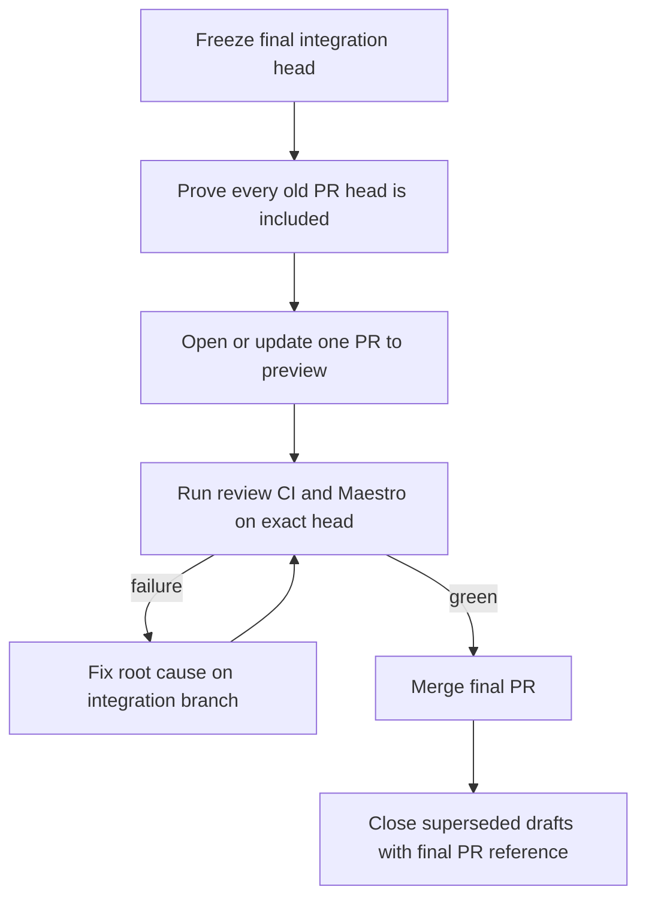
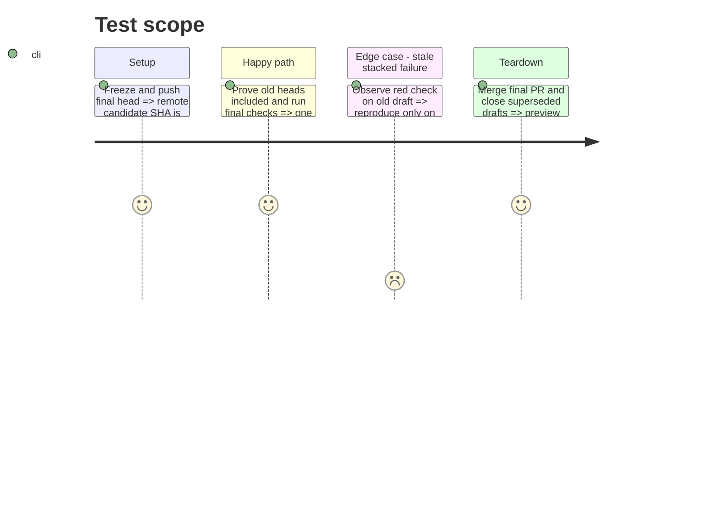

# Instruction: Consolidate Android PRs and merge into preview

## Architecture projection

```txt
GitHub
├── codex/android-i18n-settings-preferences                         ✏️ sole final integration branch
├── one Android integration PR -> preview                           ✅ reviewed merge unit
├── PRs #608 #657 #659 #660 #661 #663 #664 #665 #666 #667          ❌ close after inclusion proof
└── final-head CI and Android Maestro checks                         ✏️ required green evidence
```

## User Journey



## Test Scope



## Tasks to do

### `1)` Prove consolidation

1. Verify the head commit or effective diff of PRs #608, #657, #659, #660, #661, #663, #664, #665, #666, and #667 is contained in the final branch.
2. Record any genuine missing diff as a bounded integration fix; do not merge a stacked draft individually.

### `2)` Validate one final PR

1. Open or update one non-draft PR from the integration branch to `preview` with the complete scope and test evidence.
2. Run required CI, security review, Android build, and Maestro on its exact head; fix only failures reproducible there.

### `3)` Merge and clean the stack

1. Merge the final PR only after required checks and review are green.
2. Confirm `preview` contains the merged head, then close superseded Android drafts with a link to the final PR.

## Test acceptance criteria

| Task | Acceptance criteria                                                                                                            |
| ---- | ------------------------------------------------------------------------------------------------------------------------------ |
| 1    | Every listed Android PR is either proven included or its missing effective diff is integrated and checked on the final branch. |
| 2    | One non-draft PR to `preview` is reviewed and required checks, including Android Maestro, pass on its exact head.              |
| 3    | The final PR is merged, `preview` contains its head, and all superseded Android drafts are closed with no Android work lost.   |
