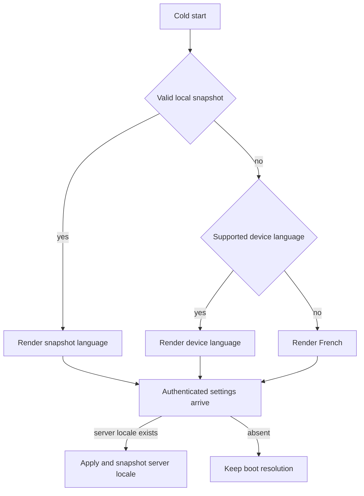
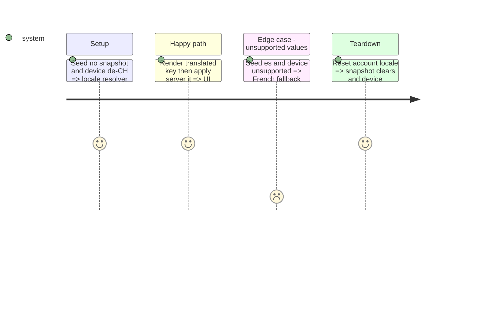

# Instruction: Add the Android localization runtime

## Architecture projection

```txt
android/
├── app.json                                      ✏️ declare fr/en/de/it through the expo-localization plugin
├── package.json                                  ✏️ add i18n-js
└── src/core/i18n/
    ├── catalogs/{fr,en,de,it}.json               ✅ Android-only catalogs with equal keys
    ├── i18n.ts                                    ✅ configured singleton, French fallback, translate helper
    ├── locale-store.ts                            ✅ MMKV snapshot, ordered device resolution, reactive locale
    ├── locale-sync.tsx                            ✅ apply the server preference after vault unlock
    ├── locale-store.spec.ts                       ✅ precedence, unsupported locale, and account reset
    └── catalog-parity.spec.ts                     ✅ equal/non-empty keys and French fallback
```

## User Journey



## Test Scope



## Tasks to do

### `1)` Configure the minimal Expo runtime

1. Install `i18n-js`; reuse `expo-localization`, MMKV, Zustand, and the shared `SupportedLocale` contract.
2. Expose one reactive `useTranslation()` hook and one imperative `translate()` helper for services outside React.
3. Configure `defaultLocale = fr` and fallback lookup; never infer region from the interface language.

### `2)` Synchronize local and server preference

1. Resolve boot locale synchronously: valid snapshot, ordered supported device locale, then French.
2. Apply a present server locale after settings load; preserve boot resolution when the server has none.
3. Clear the account snapshot on session teardown so a second account never flashes the first account's language.

## Test acceptance criteria

| Task | Acceptance criteria                                                                                                                  |
| ---- | ------------------------------------------------------------------------------------------------------------------------------------ |
| 1    | A component subscribed through `useTranslation()` rerenders on locale change; missing non-French keys resolve to French.             |
| 2    | Snapshot, device, server, unsupported-value, and sign-out precedence match the journey; all four catalogs have equal non-empty keys. |
