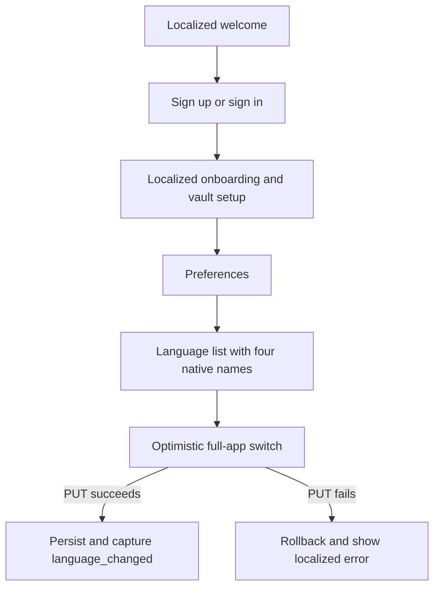
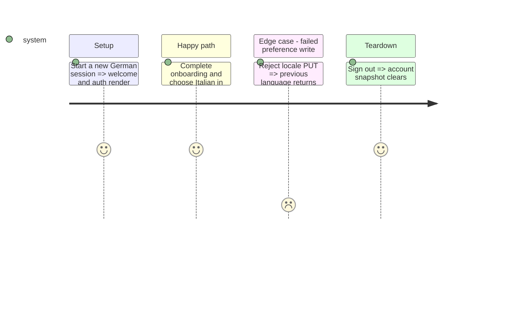

# Instruction: Localize startup, auth, vault, onboarding, and settings

## Architecture projection

```txt
android/src/
├── app/{index.tsx,reset-password.tsx,(auth)/**,(vault)/**,(onboarding)/**} ✏️ translate entry flows
├── app/(main)/settings/{index,preferences,language,security,change-pin,pay-day,tags}.tsx ✏️ translated settings and language screen
├── core/{api,auth,crypto,navigation,system,user-settings,vault}/**          ✏️ translate user-facing errors and gates
├── features/onboarding/**                                                  ✏️ translate every onboarding step and suggestion
├── features/account/components/**                                          ✏️ translate account sheets
└── core/i18n/catalogs/{fr,en,de,it}.json                                   ✏️ add phase keys in lockstep
```

## User Journey



## Test Scope



## Wireframe

```txt
┌─────────────────────────────────────┐
│ (1) Preferences header              │
├─────────────────────────────────────┤
│ (2) Language section                │
│     Current language row        ›   │
├─────────────────────────────────────┤
│ (3) Existing preference sections    │
└─────────────────────────────────────┘

┌─────────────────────────────────────┐
│ (1) Language screen header          │
├─────────────────────────────────────┤
│ (2) Four-language radio list        │
│     ○ Native language name          │
│     ● Native language name          │
└─────────────────────────────────────┘
```

1. Header: existing navigation structure.
2. Language entry/list: discoverable selection without squeezing four labels into one row.
3. Existing sections: retain their current order and controls.

## Tasks to do

### `1)` Translate the complete pre-main journey

1. Move visible copy, accessibility labels, validation errors, alerts, and notices into semantic catalog keys.
2. Keep API/domain codes stable; translate only at the presentation boundary.

### `2)` Add immediate language selection

1. Add a preferences row and a dedicated four-option screen using `LOCALE_METADATA.nativeName` verbatim.
2. Update optimistically, serialize rapid choices, rollback only the latest failed write, and capture `language_changed` after confirmation.

## Test acceptance criteria

| Task | Acceptance criteria                                                                                                                       |
| ---- | ----------------------------------------------------------------------------------------------------------------------------------------- |
| 1    | Welcome, auth, recovery, vault, onboarding, system gates, and settings contain no user-facing French literals outside the French catalog. |
| 2    | A confirmed choice persists locally/server-side and captures safe analytics; a failed choice rolls back without mixed-language UI.        |
