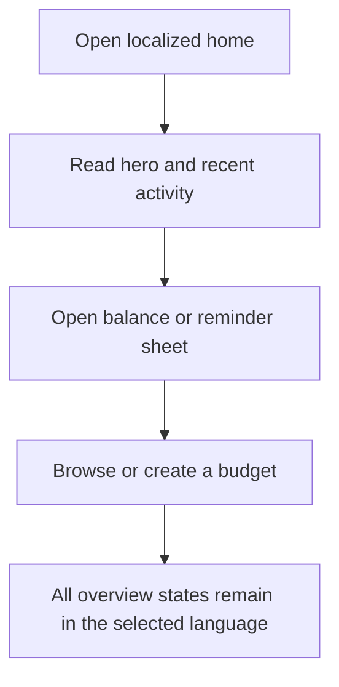
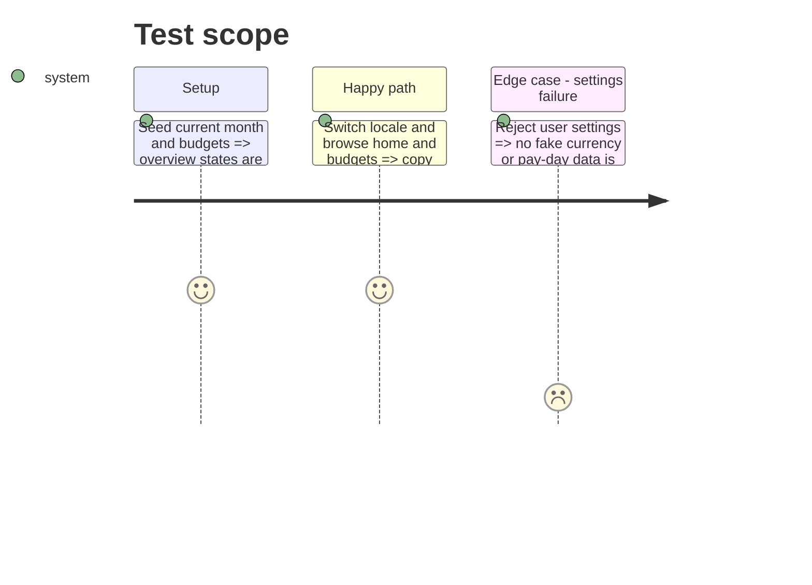

# Instruction: Finish the shell, current month, and budget overview

## Architecture projection

```txt
android/src/
├── app/(main)/(tabs)/{_layout,home,budgets}.tsx       ✏️ localized navigation and overview states
├── app/(main)/budget/create.tsx                      ✏️ localized budget creation boundary
├── features/current-month/**                         ✏️ localized hero, activity, balance, and reminder sheets
├── features/budgets/month-subtitle.ts                ✏️ locale-aware month subtitle
├── core/ui/{date-format,vocabulary}.{ts,spec.ts}     ✏️ render-time dates and vocabulary
└── core/i18n/{catalogs/*.json,phase4-*.spec.ts}       ✏️ equal catalogs and focused coverage
```

## User Journey



## Test Scope



## Tasks to do

### `1)` Complete overview localization

1. Finish the already bounded shell, budgets, hero, activity, and secondary-sheet commits.
2. Remove only review findings that affect correctness; avoid unrelated refactors.

### `2)` Lock the overview checkpoint

1. Run focused tests, Android quality, catalog parity, lexicon, and diff checks.
2. Commit and push the final isolated cleanup before moving to budget details.

## Test acceptance criteria

| Task | Acceptance criteria                                                                                                      |
| ---- | ------------------------------------------------------------------------------------------------------------------------ |
| 1    | Home, navigation, current-month cards and sheets, budget overview, and creation states render in FR/EN/DE/IT.            |
| 2    | Settings failures never produce invented financial data; the checkpoint is committed, pushed, and independently checked. |
