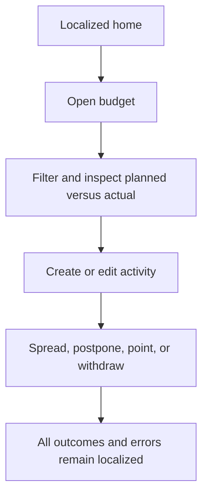
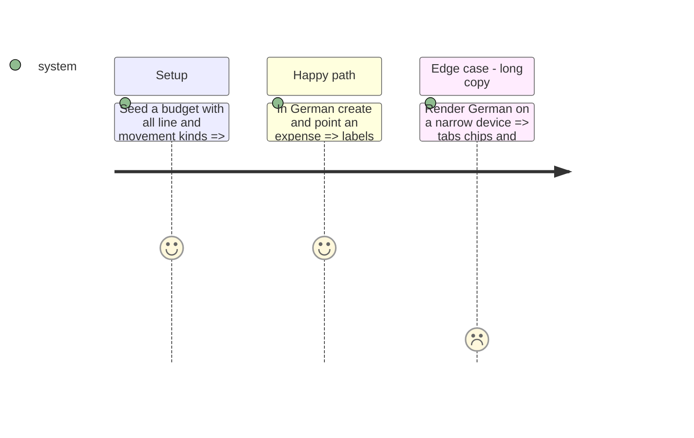

# Instruction: Localize the main shell, current month, budgets, and activity

## Architecture projection

```txt
android/src/
├── app/(main)/(tabs)/**                              ✏️ navigation and list screens
├── app/(main)/budget/**                              ✏️ budget creation and detail routes
├── features/current-month/**                         ✏️ hero, drift, savings, unchecked activity
├── features/budgets/**                               ✏️ creation errors and month subtitles
├── features/budget-details/**                        ✏️ rows, sheets, filters, spread, postpone, withdrawals
├── features/transactions/**                          ✏️ create/edit/delete movement copy
├── core/ui/vocabulary.ts                             ✏️ derive recurrence/nature labels from translation keys
└── core/i18n/catalogs/{fr,en,de,it}.json             ✏️ add phase keys in lockstep
```

## User Journey



## Test Scope



## Tasks to do

### `1)` Translate budget and activity surfaces

1. Translate screen copy, empty/error/loading states, sheets, menus, accessibility labels, and confirmation dialogs.
2. Replace static vocabulary maps with functions resolved at render time so a live language change cannot leave cached French labels.

### `2)` Protect product meaning

1. Use the arrested lexicon in `docs/I18N.md`; never surface the banned banking noun in any language.
2. Use explicit short navigation keys where German copy cannot fit; do not truncate with layout hacks.

## Test acceptance criteria

| Task | Acceptance criteria                                                                                                                                        |
| ---- | ---------------------------------------------------------------------------------------------------------------------------------------------------------- |
| 1    | Main navigation, current month, budgets, budget details, movements, spread, postpone, point, and withdrawal flows render wholly in each selected language. |
| 2    | Live locale changes refresh vocabulary maps; German remains readable at the narrow supported width; product lexicon checks stay green.                     |
