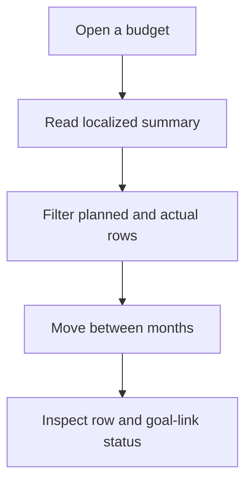
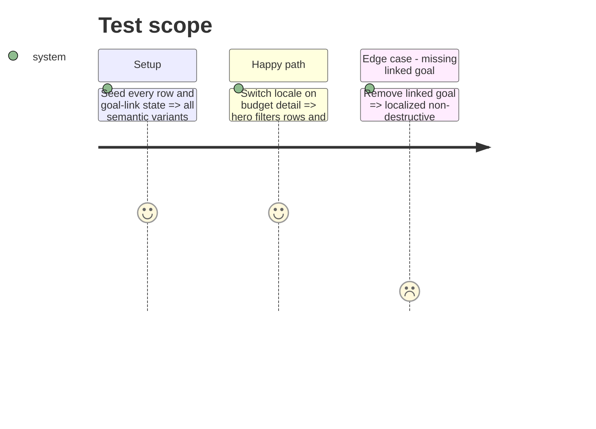

# Instruction: Localize budget detail reading surfaces

## Architecture projection

```txt
android/src/
├── app/(main)/budget/[id]/index.tsx                              ✏️ localized detail loading and error shell
├── features/budget-details/budget-details-selectors.{ts,spec.ts} ✏️ semantic presentation variants, no copy
├── features/budget-details/components/{budget-detail-hero,details-filter-bar,month-pager}.tsx ✏️ localized summary controls
├── features/budget-details/components/{budget-line-row,transaction-row,point-circle}.tsx ✏️ localized rows and accessibility
├── features/budget-details/components/savings-goal-links.tsx     ✏️ localized linked-goal states
└── core/i18n/{catalogs/*.json,phase5-budget-detail-i18n.spec.ts}  ✏️ equal keys and focused coverage
```

## User Journey



## Test Scope



## Tasks to do

### `1)` Separate semantics from copy

1. Make selectors return stable variants and values, never French sentences.
2. Translate variants at the row and screen presentation boundary.

### `2)` Localize read-only controls

1. Translate hero, filters, pager, row metadata, linked-goal states, and accessibility labels.
2. Preserve calculations, filter identifiers, query keys, and navigation payloads.

## Test acceptance criteria

| Task | Acceptance criteria                                                                                           |
| ---- | ------------------------------------------------------------------------------------------------------------- |
| 1    | Selectors expose language-neutral variants and retain the same amounts, statuses, ordering, and filtering.    |
| 2    | Every budget-detail reading state and accessibility label renders in the active locale without cached French. |
